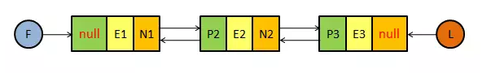
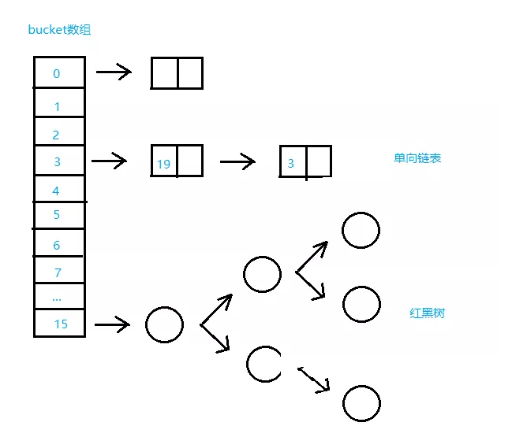
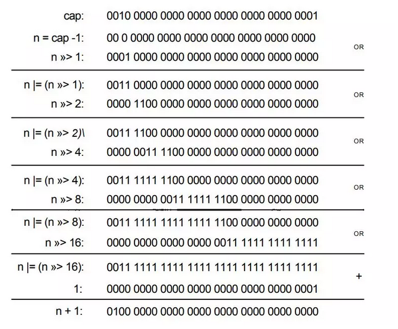

* [ArrayList](#ArrayList)
    * [ArrayList源码分析](#ArrayList源码分析)
* [LinkedList](#LinkedList)
    * [LinkedList源码分析](#LinkedList源码分析)
* [HashMap](#HashMap)
    * [1 HashMap的数据结构](#HashMap的数据结构)
    * [2 HashMap源码分析](#HashMap源码分析)
    * [3 疑问和进阶](#疑问和进阶)
* [LinkedHashMap](#LinkedHashMap)
    * [LinkedHashMap源码分析](#LinkedHashMap源码分析)

-------------------------------------------

# ArrayList
ArrayList底层基于数组实现，并对数组进行了封装。

## ArrayList源码分析

### 类定义
```java
public class ArrayList<E> extends AbstractList<E>
        implements List<E>, RandomAccess, Cloneable, java.io.Serializable {}
```
### 变量
```java
//默认初始化容量
private static final int DEFAULT_CAPACITY = 10;

//空对象数组
private static final Object[] EMPTY_ELEMENTDATA = {};

//对象数组
private transient Object[] elementData;

//集合元素个数
private int size;
```

### 构造器
```java
//传入初始容量的构造方法
public ArrayList(int initialCapacity) {
   super();
   if (initialCapacity < 0) {
       throw new IllegalArgumentException("Illegal Capacity: "+ initialCapacity);
   }
   //新建指定容量的Object类型数组
   this.elementData = new Object[initialCapacity];
}

//不带参数的构造方法
public ArrayList() {
   super();
   //将空的数组实例传给elementData
   this.elementData = EMPTY_ELEMENTDATA;
}

//传入外部集合的构造方法
public ArrayList(Collection<? extends E> c) {
   //持有传入集合的内部数组的引用
   elementData = c.toArray();
   //更新集合元素个数大小
   size = elementData.length;
   //判断引用的数组类型, 并将引用转换成Object数组引用
   if (elementData.getClass() != Object[].class) {
       elementData = Arrays.copyOf(elementData, size, Object[].class);
   }
}
```
如果没有设置初始大小，它将不会分配内存空间。

### 增删改查
```java
/增(添加)
public boolean add(E e) {
   //添加前先检查是否需要拓展数组, 此时数组长度最小为size+1
   ensureCapacityInternal(size + 1);
   //将元素添加到数组末尾
   elementData[size++] = e;
   return true;
}


//增(插入)
public void add(int index, E element) {
   //插入位置范围检查
   rangeCheckForAdd(index);
   //检查是否需要扩容
   ensureCapacityInternal(size + 1);
   //挪动插入位置后面的元素
   System.arraycopy(elementData, index, elementData, index + 1, size - index);
   //在要插入的位置赋上新值
   elementData[index] = element;
   size++;
}

//删
public E remove(int index) {
   //index不能大于size
   rangeCheck(index);
   modCount++;
   E oldValue = elementData(index);
   int numMoved = size - index - 1;
   if (numMoved > 0) {
       //将index后面的元素向前挪动一位
       System.arraycopy(elementData, index+1, elementData, index, numMoved);
   }
   //置空引用
   elementData[--size] = null;
   return oldValue;
}

//改
public E set(int index, E element) {
   //index不能大于size
   rangeCheck(index);
   E oldValue = elementData(index);
   //替换成新元素
   elementData[index] = element;
   return oldValue;
}

//查
public E get(int index) {
   //index不能大于size
   rangeCheck(index);
   //返回指定位置元素
   return elementData(index);
}
```
每次添加一个元素到集合中都会先检查容量是否足够，否则就进行扩容。下面是增删改查需要注意的地方：
- **增(添加)：** 仅仅将元素添加到末尾。操作快。
- **增(插入)：** 需要移动到插入位置，复制后面的数组，操作慢。
- **删：** 同样涉及数组复制，操作慢。
- **改：** 直接对指定位置元素进行修改，不涉及元素挪动和数组复制，操作快速。
- **查：** 直接返回指定下标的数组元素，操作快速。

### 扩容机制
```java
private void ensureCapacityInternal(int minCapacity) {
   //如果此时还是空数组
   if (elementData == EMPTY_ELEMENTDATA) {
       //和默认容量比较, 取较大值
       minCapacity = Math.max(DEFAULT_CAPACITY, minCapacity);
   }
   //数组已经初始化过就执行这一步
   ensureExplicitCapacity(minCapacity);
}

private void ensureExplicitCapacity(int minCapacity) {
   modCount++;
   //如果最小容量大于数组长度就扩增数组
   if (minCapacity - elementData.length > 0) {
       grow(minCapacity);
   }
}

//集合最大容量
private static final int MAX_ARRAY_SIZE = Integer.MAX_VALUE - 8;

//增加数组长度
private void grow(int minCapacity) {
   //获取数组原先的容量
   int oldCapacity = elementData.length;
   //新数组的容量, 在原来的基础上增加一半
   int newCapacity = oldCapacity + (oldCapacity >> 1);
   //检验新的容量是否小于最小容量
   if (newCapacity - minCapacity < 0) {
       newCapacity = minCapacity;
   }
   //检验新的容量是否超过最大数组容量
   if (newCapacity - MAX_ARRAY_SIZE > 0) {
       newCapacity = hugeCapacity(minCapacity);
   }
   //拷贝原来的数组到新数组
   elementData = Arrays.copyOf(elementData, newCapacity);
}
```
每次添加元素前会调用ensureCapacityInternal这个方法进行集合容量检查。在这个方法内部会检查当前集合的内部数组是否还是个空数组，如果是就新建默认大小为10的Object数组。如果不是则证明当前集合已经被初始化过，那么就调用ensureExplicitCapacity方法检查当前数组的容量是否满足这个最小所需容量，不满足的话就调用grow方法进行扩容。

在grow方法内部可以看到，每次扩容都是增加原来数组长度的一半，扩容实际上是新建一个容量更大的数组，将原先数组的元素全部复制到新的数组上，然后再抛弃原先的数组转而使用新的数组。

--------------------------------------------

# LinkedList
LinkedList是List接口的另一种实现，它的底层是基于**双向链**表实现的，因此它具有插入删除快而查找修改慢的特点，此外，通过对双向链表的操作还可以实现队列和栈的功能。
<div align="center"></div>

F表示头结点，L表示尾结点。链表的每个结点都有三个元素，分别是前继结点引用(P)，结点元素的值(E)，后继结点的引用(N)。结点由内部类Node表示。

## LinkedList源码分析
### 类定义
```java
public class LinkedList<E>
    extends AbstractSequentialList<E>
    implements List<E>, Deque<E>, Cloneable, java.io.Serializable {}
```

### 变量
```java
//集合元素个数
transient int size = 0;

//头结点引用
transient Node<E> first;

//尾节点引用
transient Node<E> last;
```

### 构造器
与[ArrayList](https://github.com/MinheZ/Notes/blob/master/note/Java%E5%AE%B9%E5%99%A8.md#%E6%9E%84%E9%80%A0%E5%99%A8)不同的是LinkedList没有指定初始大小的构造器。
```java
//无参构造器
public LinkedList() {}

//传入外部集合的构造器
public LinkedList(Collection<? extends E> c) {
   this();
   addAll(c);
}
```

节点内部类：
```java
private static class Node<E> {
    E item; // 元素
    Node<E> next;   // 下一个节点
    Node<E> prev;   // 上一个节点

    Node(Node<E> prev, E element, Node<E> next) {
        this.item = element;
        this.next = next;
        this.prev = prev;
    }
}
```

### 增删改查方法
```java
//增(添加)
public boolean add(E e) {
   //在链表尾部添加
   linkLast(e);
   return true;
}

//增(插入)
public void add(int index, E element) {
   checkPositionIndex(index);
   if (index == size) {
       //在链表尾部添加
       linkLast(element);
   } else {
       //在链表中部插入
       linkBefore(element, node(index));
   }
}

//删(给定下标)
public E remove(int index) {
   //检查下标是否合法
   checkElementIndex(index);
   return unlink(node(index));
}

//删(给定元素)
public boolean remove(Object o) {
   if (o == null) {
       for (Node<E> x = first; x != null; x = x.next) {
           if (x.item == null) {
               unlink(x);
               return true;
           }
       }
   } else {
       //遍历链表
       for (Node<E> x = first; x != null; x = x.next) {
           if (o.equals(x.item)) {
               //找到了就删除
               unlink(x);
               return true;
           }
       }
   }
   return false;
}

//改
public E set(int index, E element) {
   //检查下标是否合法
   checkElementIndex(index);
   //获取指定下标的结点引用
   Node<E> x = node(index);
   //获取指定下标结点的值
   E oldVal = x.item;
   //将结点元素设置为新的值
   x.item = element;
   //返回之前的值
   return oldVal;
}

//查
public E get(int index) {
   //检查下标是否合法
   checkElementIndex(index);
   //返回指定下标的结点的值
   return node(index).item;
}
```
LinkedList的添加元素的方法主要是调用linkLast和linkBefore两个方法，linkLast方法是在链表后面链接一个元素，linkBefore方法是在链表中间插入一个元素。LinkedList的删除方法通过调用unlink方法将某个元素从链表中移除。下面我们看看链表的插入和删除操作的核心代码。
```java
//链接到指定结点之前
void linkBefore(E e, Node<E> succ) {
   //获取给定结点的上一个结点引用
   final Node<E> pred = succ.prev;
   //创建新结点, 新结点的上一个结点引用指向给定结点的上一个结点
   //新结点的下一个结点的引用指向给定的结点
   final Node<E> newNode = new Node<>(pred, e, succ);
   //将给定结点的上一个结点引用指向新结点
   succ.prev = newNode;
   //如果给定结点的上一个结点为空, 表明给定结点为头结点
   if (pred == null) {
       //将头结点引用指向新结点
       first = newNode;
   } else {
       //否则, 将给定结点的上一个结点的下一个结点引用指向新结点
       pred.next = newNode;
   }
   //集合元素个数加一
   size++;
   //修改次数加一
   modCount++;
}

//卸载指定结点
E unlink(Node<E> x) {
   //获取给定结点的元素
   final E element = x.item;
   //获取给定结点的下一个结点的引用
   final Node<E> next = x.next;
   //获取给定结点的上一个结点的引用
   final Node<E> prev = x.prev;

   //如果给定结点的上一个结点为空, 说明给定结点为头结点
   if (prev == null) {
       //将头结点引用指向给定结点的下一个结点
       first = next;
   } else {
       //将上一个结点的后继结点引用指向给定结点的后继结点
       prev.next = next;
       //将给定结点的上一个结点置空
       x.prev = null;
   }

   //如果给定结点的下一个结点为空, 说明给定结点为尾结点
   if (next == null) {
       //将尾结点引用指向给定结点的上一个结点
       last = prev;
   } else {
       //将下一个结点的前继结点引用指向给定结点的前继结点
       next.prev = prev;
       x.next = null;
   }

   //将给定结点的元素置空
   x.item = null;
   //集合元素个数减一
   size--;
   //修改次数加一
   modCount++;
   return element;
}
```
通过上面图示看到对链表的插入和删除操作的时间复杂度都是`O(1)`，而对链表的查找和修改操作都需要遍历链表进行元素的定位，这两个操作都是调用的`node(int index)`方法定位元素：
```java
Node<E> node(int index) {
    // assert isElementIndex(index);
    // 如果下标在链表的前半部分，则从头开始查
    if (index < (size >> 1)) {
        Node<E> x = first;
        for (int i = 0; i < index; i++)
            x = x.next;
        return x;
    } else {    // 如果下标在链表的后半部分，则从尾开始查
        Node<E> x = last;
        for (int i = size - 1; i > index; i--)
            x = x.prev;
        return x;
    }
}
```

### 总结
- LinkedList是基于双向链表实现的，不论是增删改查方法还是队列和栈的实现，都可通过操作结点实现
- LinkedList无需提前指定容量，因为基于链表操作，集合的容量随着元素的加入自动增加
- LinkedList删除元素后集合占用的内存自动缩小，无需像ArrayList一样调用trimToSize()方法
- LinkedList的所有方法没有进行同步，因此它也不是线程安全的，应该避免在多线程环境下使用

---------------------------------

# HashMap
`HashMap`基于哈希表的`Map`接口的实现。此实现提供所有可选的映射操作，并允许使用 `null`值和`null`键。除了不同步和允许使用`null`之外，`HashMap`类与`Hashtable`大致相同。此类不保证映射的顺序，特别是它不保证该顺序恒久不变。

值得注意的是HashMap不是线程安全的，如果想要线程安全的`HashMap`，可以通过`Collections`类的静态方法`synchronizedMap`获得线程安全的`HashMap`。

## HashMap的数据结构
HashMap的底层主要是基于数组和链表来实现的，它是通过计算散列码来决定存储的位置，HashMap底层是通过[链地址法](https://github.com/MinheZ/Notes/blob/master/note/%E6%95%B0%E6%8D%AE%E7%BB%93%E6%9E%84.md#%E9%93%BE%E5%9C%B0%E5%9D%80%E6%B3%95)来处理hash冲突的。

<div align="center"></div>

**默认链表长度大于8的时候，转成红黑树**

首先HashMap里面实现一个静态内部类Entry，其重要的属性有key, value, next，从属性key, value我们就能很明显的看出来Entry就是HashMap键值对实现的一个基础bean，我们上面说到HashMap的基础就是一个线性数组，这个数组就是`Entry[]`，Map里面的内容都保存在`Entry[]`里面。
```java
static class Node<K,V> implements Map.Entry<K,V> {
    final int hash;
    final K key;
    V value;
    Node<K,V> next;

    Node(int hash, K key, V value, Node<K,V> next) {
        this.hash = hash;
        this.key = key;
        this.value = value;
        this.next = next;
    }

    public final K getKey()        { return key; }
    public final V getValue()      { return value; }
    public final String toString() { return key + "=" + value; }
    // 实现hashCode
    public final int hashCode() {
        return Objects.hashCode(key) ^ Objects.hashCode(value);
    }

    public final V setValue(V newValue) {
        V oldValue = value;
        value = newValue;
        return oldValue;
    }

    public final boolean equals(Object o) {
        if (o == this)
            return true;
        if (o instanceof Map.Entry) {
            Map.Entry<?,?> e = (Map.Entry<?,?>)o;
            if (Objects.equals(key, e.getKey()) &&
                Objects.equals(value, e.getValue()))
                return true;
        }
        return false;
    }
}
```
TreeNode 是红黑树的数据结构。
```java
static final class TreeNode<K,V> extends LinkedHashMap.Entry<K,V> {
    TreeNode<K,V> parent;  // red-black tree links
    TreeNode<K,V> left;
    TreeNode<K,V> right;
    TreeNode<K,V> prev;    // needed to unlink next upon deletion
    boolean red;
    TreeNode(int hash, K key, V val, Node<K,V> next) {
        super(hash, key, val, next);
    }

    /**
     * Returns root of tree containing this node.
     */
    final TreeNode<K,V> root() {
        for (TreeNode<K,V> r = this, p;;) {
            if ((p = r.parent) == null)
                return r;
            r = p;
        }
    }
}
```

## HashMap源码分析
### 类定义
```java
public class HashMap<K,V> extends AbstractMap<K,V> implements Map<K,V>, Cloneable, Serializable {}
```

### 变量
```java
/**
 * 默认初始容量16(必须是2的幂次方)
 */
static final int DEFAULT_INITIAL_CAPACITY = 1 << 4;

/**
 * 最大容量，2的30次方
 */
static final int MAXIMUM_CAPACITY = 1 << 30;

/**
 * 默认加载因子，用来计算threshold
 */
static final float DEFAULT_LOAD_FACTOR = 0.75f;

/**
 * 链表转成树的阈值，当桶中链表长度大于8时转成树
 */
static final int TREEIFY_THRESHOLD = 8;

/**
 * 进行resize操作时，若桶中数量少于6则从树转成链表
 */
static final int UNTREEIFY_THRESHOLD = 6;

/**
 * 桶中结构转化为红黑树对应的table的最小大小

 当需要将解决 hash 冲突的链表转变为红黑树时，
 需要判断下此时数组容量，
 若是由于数组容量太小（小于　MIN_TREEIFY_CAPACITY　）
 导致的 hash 冲突太多，则不进行链表转变为红黑树操作，
 转为利用　resize() 函数对　hashMap 扩容
 */
static final int MIN_TREEIFY_CAPACITY = 64;
/**
 保存Node<K,V>节点的数组
 该表在首次使用时初始化，并根据需要调整大小。 分配时，
 长度始终是2的幂。
 */
transient Node<K,V>[] table;

/**
 * 存放具体元素的集
 */
transient Set<Map.Entry<K,V>> entrySet;

/**
 * 记录 hashMap 当前存储的元素的数量
 */
transient int size;

/**
 * 每次更改map结构的计数器
 */
transient int modCount;

/**
 * 临界值 当实际大小(容量*填充因子)超过临界值时，会进行扩容
 * threshold = capacity * loadFactor
 */
int threshold;

/**
 * 负载因子：要调整大小的下一个大小值（容量*加载因子）。
 */
final float loadFactor;
```
其中，[负载因子](https://github.com/MinheZ/Notes/blob/master/note/%E6%95%B0%E6%8D%AE%E7%BB%93%E6%9E%84.md#%E4%BA%8C%E6%AC%A1%E6%8E%A2%E6%B5%8B)

### 构造方法
下面为HashMap的几个构造方法
```java
/**
 * 传入初始容量大小，使用默认负载因子值 来初始化HashMap对象
 */
public HashMap(int initialCapacity) {
    this(initialCapacity, DEFAULT_LOAD_FACTOR);
}

/**
 * 默认容量和负载因子
 */
public HashMap() {
    this.loadFactor = DEFAULT_LOAD_FACTOR; // all other fields defaulted
}
/**
 * 传入初始容量大小和负载因子 来初始化HashMap对象
 */
public HashMap(int initialCapacity, float loadFactor) {
    // 初始容量不能小于0，否则报错
    if (initialCapacity < 0)
        throw new IllegalArgumentException("Illegal initial capacity: " +
                                           initialCapacity);
    // 初始容量不能大于最大值，否则为最大值
    if (initialCapacity > MAXIMUM_CAPACITY)
        initialCapacity = MAXIMUM_CAPACITY;
    //负载因子不能小于或等于0，不能为非数字
    if (loadFactor <= 0 || Float.isNaN(loadFactor))
        throw new IllegalArgumentException("Illegal load factor: " +
                                           loadFactor);
    // 初始化负载因子
    this.loadFactor = loadFactor;
    // 初始化threshold大小
    this.threshold = tableSizeFor(initialCapacity);
}
/**
 * 找到大于或等于 cap 的最小2的整数次幂的数。
 */
static final int tableSizeFor(int cap) {
    int n = cap - 1;
    n |= n >>> 1;
    n |= n >>> 2;
    n |= n >>> 4;
    n |= n >>> 8;
    n |= n >>> 16;
    return (n < 0) ? 1 : (n >= MAXIMUM_CAPACITY) ? MAXIMUM_CAPACITY : n + 1;
}
```
Note: >> 为有符号位移， >>> 为无符号位移(高位总补零)。

`tableSizeFor`方法：

用位运算找到大于或等于 cap 的最小2的整数次幂的数。例如： cap = 10, 返回 16 。

1. 让`cap - 1`再赋值给 n 的目的是使得找到的目标值大于或等于原值。例如二进制`0100`，十进制是 4， 若不减 1 而直接操作， 答案是 `0001 0000`， 明显不符合预期。
2. 对n右移1位：001xx…xxx，再位或：011xx…xxx
3. 对n右移2位：00011…xxx，再位或：01111…xxx
4. 对n右移4位…
5. 对n右移8位…
6. 对n右移16位,因为int最大就2^32所以移动1、2、4、8、16位并取位或,会将最高位的1后面的位全变为1。
7. 再让结果n+1，即得到了2的整数次幂的值了。

举例如下：
<div align="center"></div>

**LoadFactor 负载因子：**

对 HashMap 来说，负载因子是个很重要的参数，该参数反应了 HashMap 桶数组的使用情况。通过调节负载因子，可使 HashMap 时间和空间复杂度上有不同的表现。

当我们调低负载因子时，HashMap 所能容纳的键值对数量变少。扩容时，重新将键值对存储新的桶数组里，键的键之间产生的碰撞会下降，链表长度变短。此时，HashMap 的增删改查等操作的效率将会变高，这里是典型的拿空间换时间。

相反，如果增加负载因子（负载因子可以大于1），HashMap 所能容纳的键值对数量变多，空间利用率高，但碰撞率也高。这意味着链表长度变长，效率也随之降低，这种情况是拿时间换空间。至于负载因子怎么调节，这个看使用场景了。

一般情况下，我们用默认值就可以了。大多数情况下0.75在时间跟空间代价上达到了平衡所以不建议修改。

### 数据操作
#### 查找
```java
public V get(Object key) {
    Node<K,V> e;
    return (e = getNode(hash(key), key)) == null ? null : e.value;
}
// 获取hash值
static final int hash(Object key) {
    int h;
    // 拿到key的hash值后与其无符号右移16位取与
    // 通过这种方式，让高位数据与低位数据进行异或，以此加大低位信息的随机性，变相的让高位数据参与到计算中。
    return (key == null) ? 0 : (h = key.hashCode()) ^ (h >>> 16);
}

final Node<K,V> getNode(int hash, Object key) {
    Node<K,V>[] tab;
    Node<K,V> first, e;
    int n; K k;
    // 定位键值对所在桶的位置，(n-1) & hash 等价于对length取余
    if ((tab = table) != null && (n = tab.length) > 0 &&
        (first = tab[(n - 1) & hash]) != null) {
        // 判断桶中第一项(数组元素)相等
        if (first.hash == hash && // always check first node
            ((k = first.key) == key || (key != null && key.equals(k))))
            return first;
        // 桶中不止一个结点
        if ((e = first.next) != null) {
            // 是否是红黑树，是的话调用getTreeNode方法
            if (first instanceof TreeNode)
                return ((TreeNode<K,V>)first).getTreeNode(hash, key);
            // 不是红黑树的话，在链表中遍历查找
            do {
                if (e.hash == hash &&
                    ((k = e.key) == key || (key != null && key.equals(k))))
                    return e;
            } while ((e = e.next) != null);
        }
    }
    return null;
}
```
#### 插入数据
```java
public V put(K key, V value) {
    // 调用hash(key)方法来计算hash
    return putVal(hash(key), key, value, false, true);
}

final V putVal(int hash, K key, V value, boolean onlyIfAbsent,
               boolean evict) {
    Node<K,V>[] tab;
    Node<K,V> p;
    int n, i;
    // 容量初始化：当table为空，则调用resize()方法来初始化容器
    if ((tab = table) == null || (n = tab.length) == 0)
        n = (tab = resize()).length;
    //确定元素存放在哪个桶中，桶为空，新生成结点放入桶中
    if ((p = tab[i = (n - 1) & hash]) == null)
        tab[i] = newNode(hash, key, value, null);
    else {
        Node<K,V> e; K k;
        // 比较桶中第一个元素(数组中的结点)的hash值相等，key相等
        if (p.hash == hash &&
            ((k = p.key) == key || (key != null && key.equals(k))))
            //如果键的值以及节点 hash 等于链表中的第一个键值对节点时，则将 e 指向该键值对
            e = p;
        // 如果桶中的引用类型为 TreeNode，则调用红黑树的插入方法
        else if (p instanceof TreeNode)
            // 放入树中
            e = ((TreeNode<K,V>)p).putTreeVal(this, tab, hash, key, value);
        else {
            //对链表进行遍历，并统计链表长度
            for (int binCount = 0; ; ++binCount) {
                // 到达链表的尾部
                if ((e = p.next) == null) {
                    //在尾部插入新结点
                    p.next = newNode(hash, key, value, null);
                    // 如果结点数量达到阈值，转化为红黑树
                    if (binCount >= TREEIFY_THRESHOLD - 1) // -1 for 1st
                        treeifyBin(tab, hash);
                    break;
                }
                // 判断链表中结点的key值与插入的元素的key值是否相等
                if (e.hash == hash &&
                    ((k = e.key) == key || (key != null && key.equals(k))))
                    break;
                p = e;
            }
        }
        //判断要插入的键值对是否存在 HashMap 中
        if (e != null) { // existing mapping for key
            V oldValue = e.value;
            // onlyIfAbsent 表示是否仅在 oldValue 为 null 的情况下更新键值对的值
            if (!onlyIfAbsent || oldValue == null)
                e.value = value;
            afterNodeAccess(e);
            return oldValue;
        }
    }
    ++modCount;
    // 键值对数量超过阈值时，则进行扩容
    if (++size > threshold)
        resize();
    afterNodeInsertion(evict);
    return null;
}
```
在`new HashMap();`完成后，如果没有进行`put`操作，是不会分配存储空间的。

1. 当桶数组 table 为空时，通过扩容的方式初始化 table
2. 查找要插入的键值对是否已经存在，存在的话根据条件判断是否用新值替换旧值
3. 如果不存在，则将键值对链入链表中，并根据链表长度决定是否将链表转为红黑树
4. 判断键值对数量是否大于阈值，大于的话则进行扩容操作

### 扩容机制
在 HashMap 中，桶数组的长度均是2的幂，阈值大小为桶数组长度与负载因子的乘积。当 HashMap 中的键值对数量超过阈值时，进行扩容。

HashMap 按当前桶数组长度的2倍进行扩容，阈值也变为原来的2倍（如果计算过程中，阈值溢出归零，则按阈值公式重新计算）。扩容之后，要重新计算键值对的位置，并把它们移动到合适的位置上去(rehash)。
```java
final Node<K,V>[] resize() {
    // 拿到数组桶
    Node<K,V>[] oldTab = table;
    int oldCap = (oldTab == null) ? 0 : oldTab.length;
    int oldThr = threshold;
    int newCap, newThr = 0;
    // 如果数组桶的容量大与0
    if (oldCap > 0) {
        // 如果比最大值还大，则赋值为最大值
        if (oldCap >= MAXIMUM_CAPACITY) {
            threshold = Integer.MAX_VALUE;
            return oldTab;
        }
        // 如果扩容后小于最大值 而且 旧数组桶大于初始容量16， 阈值左移1(扩大2倍)
        else if ((newCap = oldCap << 1) < MAXIMUM_CAPACITY &&
                 oldCap >= DEFAULT_INITIAL_CAPACITY)
            newThr = oldThr << 1; // double threshold
    }
    // 如果数组桶容量<=0 且 旧阈值 >0
    else if (oldThr > 0) // initial capacity was placed in threshold
        // 新容量=旧阈值
        newCap = oldThr;
    // 如果数组桶容量<=0 且 旧阈值 <=0
    else {               // zero initial threshold signifies using defaults
        // 新容量=默认容量
        newCap = DEFAULT_INITIAL_CAPACITY;
        // 新阈值= 负载因子*默认容量
        newThr = (int)(DEFAULT_LOAD_FACTOR * DEFAULT_INITIAL_CAPACITY);
    }
    // 如果新阈值为0
    if (newThr == 0) {
        // 重新计算阈值
        float ft = (float)newCap * loadFactor;
        newThr = (newCap < MAXIMUM_CAPACITY && ft < (float)MAXIMUM_CAPACITY ?
                  (int)ft : Integer.MAX_VALUE);
    }
    // 更新阈值
    threshold = newThr;
    @SuppressWarnings({"rawtypes","unchecked"})
        // 创建新数组
        Node<K,V>[] newTab = (Node<K,V>[])new Node[newCap];
    // 覆盖数组桶
    table = newTab;
    // 如果旧数组桶不是空，则遍历桶数组，并将键值对映射到新的桶数组中
    if (oldTab != null) {
        for (int j = 0; j < oldCap; ++j) {
            Node<K,V> e;
            if ((e = oldTab[j]) != null) {
                oldTab[j] = null;
                if (e.next == null)
                    newTab[e.hash & (newCap - 1)] = e;
                // 如果是红黑树
                else if (e instanceof TreeNode)
                    // 重新映射时，需要对红黑树进行拆分
                    ((TreeNode<K,V>)e).split(this, newTab, j, oldCap);
                else { // preserve order
                    // 如果不是红黑树，则按链表处理
                    Node<K,V> loHead = null, loTail = null;
                    Node<K,V> hiHead = null, hiTail = null;
                    Node<K,V> next;
                    // 遍历链表，并将链表节点按原顺序进行分组
                    do {
                        next = e.next;
                        if ((e.hash & oldCap) == 0) {
                            if (loTail == null)
                                loHead = e;
                            else
                                loTail.next = e;
                            loTail = e;
                        }
                        else {
                            if (hiTail == null)
                                hiHead = e;
                            else
                                hiTail.next = e;
                            hiTail = e;
                        }
                    } while ((e = next) != null);
                    // 将分组后的链表映射到新桶中
                    if (loTail != null) {
                        loTail.next = null;
                        newTab[j] = loHead;
                    }
                    if (hiTail != null) {
                        hiTail.next = null;
                        newTab[j + oldCap] = hiHead;
                    }
                }
            }
        }
    }
    return newTab;
}
```
整体步骤如下：
1. 计算新桶数组的容量 newCap 和新阈值 newThr
2. 根据计算出的 newCap 创建新的桶数组，桶数组 table 也是在这里进行初始化的
3. 将键值对节点重新映射到新的桶数组里。如果节点是 TreeNode 类型，则需要拆分红黑树。如果是普通节点，则节点按原顺序进行分组。

总结起来，一共有**3种扩容方式**：
1. 使用默认构造方法初始化HashMap。从前文可以知道HashMap在一开始初始化的时候会返回一个空的table，并且thershold为0。因此第一次扩容的容量为默认值DEFAULT_INITIAL_CAPACITY也就是16。同时threshold = DEFAULT_INITIAL_CAPACITY * DEFAULT_LOAD_FACTOR = 12。
2. 指定初始容量的构造方法初始化HashMap。那么从下面源码可以看到初始容量会等于threshold，接着threshold = 当前的容量（threshold） * DEFAULT_LOAD_FACTOR。
3. HashMap不是第一次扩容。如果HashMap已经扩容过的话，那么每次table的容量以及threshold量为原有的两倍。

## 疑问和进阶
1. JDK1.7是基于数组+单链表实现（为什么不用双链表）

    用链表是为了解决hash冲突。双链表需要更大的存储空间。

2.  为什么要用红黑树，而不用平衡二叉树？

    插入效率比平衡二叉树高，查询效率比普通二叉树高。所以选择性能相对折中的红黑树。

3. 重写对象的Equals方法时，要重写hashCode方法，为什么？跟HashMap有什么关系？

    equals与hashcode间的关系:
    - 如果两个对象相同（即用equals比较返回true），那么它们的hashCode值一定要相同；
    - 如果两个对象的hashCode相同，它们并不一定相同(即用equals比较返回false)

    因为在 HashMap 的链表结构中遍历判断的时候，特定情况下重写的 equals 方法比较对象是否相等的业务逻辑比较复杂，循环下来更是影响查找效率。所以这里把 hashcode 的判断放在前面，只要 hashcode 不相等就跳过，不用再去调用复杂的 equals 了。很多程度地提升 HashMap 的使用效率。

    所以重写 hashcode 方法是为了让我们能够正常使用 HashMap 等集合类，因为 HashMap 判断对象是否相等既要比较 hashcode 又要使用 equals 比较。而这样的实现是为了提高 HashMap 的效率。

4. HashMap为什么不直接使用对象的原始hash值呢?

```java
static final int hash(Object key) {
int h;
return (key == null) ? 0 : (h = key.hashCode()) ^ (h >>> 16);
}
```
    我们发现，HashMap的哈希值是通过上面的方式获取，而不是通过key.hashCode()方法获取。
    原因：通过移位和异或运算，可以让 hash 变得更复杂，进而影响 hash 的分布性。

5. 既然红黑树那么好，为啥hashmap不直接采用红黑树，而是当大于8个的时候才转换红黑树？

    因为红黑树需要进行左旋，右旋操作，而单链表不需要。

    以下都是单链表与红黑树结构对比。

    如果元素小于8个，查询成本高，新增成本低。如果元素大于8个，查询成本低，新增成本高。至于为什么选数字8，是大佬折中衡量的结果-.-，就像loadFactor默认值0.75一样。

本块转载于[面试必会之HashMap源码分析](https://mp.weixin.qq.com/s/vRvMvNktoDSQKMMlnj5T0g)

另见参考文章[HashMap 源码详细分析(JDK1.8)](http://www.tianxiaobo.com/2018/01/18/HashMap-%E6%BA%90%E7%A0%81%E8%AF%A6%E7%BB%86%E5%88%86%E6%9E%90-JDK1-8/)

---------------------------

# LinkedHashMap

## LinkedHashMap源码分析
LinkedHashMap继承自HashMap，他们也有着类似的数据结构：
<div align="center"></div>

[图片引用于](https://www.imooc.com/article/22931#)
### 类定义
```java
public class LinkedHashMap<K,V> extends HashMap<K,V> implements Map<K,V> {}
```
没有实现`Serializable`接口，无法网络传输。

### 变量
LinkedHashMap的节点`Entry<K,V>`继承自`HashMap.Node<K,V>`，在其基础上扩展了一下。在原来`HashMap`的`Entry`上添加了2个成员变量，分别是前继节点引用和后继节点引用。改成了一个双向链表。
```java
static class Entry<K,V> extends HashMap.Node<K,V> {
    Entry<K,V> before, after;
    Entry(int hash, K key, V value, Node<K,V> next) {
        // 直接使用HashMap的构造函数
        super(hash, key, value, next);
    }
}
```
```java
// 双向链表的头结点
transient LinkedHashMap.Entry<K,V> head;
// 双向链表的尾结点
transient LinkedHashMap.Entry<K,V> tail;
// 控制LinkedHashMap的迭代顺序。true为访问顺序；false为插入顺序
final boolean accessOrder;
```

### 构造函数
```java
//默认是false，则迭代时输出的顺序是插入节点的顺序。若为true，则输出的顺序是按照访问节点的顺序。
//为true时，可以在这基础之上构建一个LruCach
final boolean accessOrder;

public LinkedHashMap() {
    super();
    accessOrder = false;
}
//指定初始化时的容量，
public LinkedHashMap(int initialCapacity) {
    super(initialCapacity);
    accessOrder = false;
}
//指定初始化时的容量，和扩容的加载因子
public LinkedHashMap(int initialCapacity, float loadFactor) {
    super(initialCapacity, loadFactor);
    accessOrder = false;
}
//指定初始化时的容量，和扩容的加载因子，以及迭代输出节点的顺序
public LinkedHashMap(int initialCapacity,
                     float loadFactor,
                     boolean accessOrder) {
    super(initialCapacity, loadFactor);
    this.accessOrder = accessOrder;
}
//利用另一个Map 来构建，
public LinkedHashMap(Map<? extends K, ? extends V> m) {
    super();
    accessOrder = false;
    //该方法上文分析过，批量插入一个map中的所有数据到 本集合中。
    putMapEntries(m, false);
}
```
构造函数和`HashMap`相比，就是增加了一个`accessOrder`参数。用于控制迭代时的节点顺序。

### 数据操作
#### 增
`LinkedHashMap`没有重写`put`方法。但是重写了构建新节点的`newNode()`方法.

`newNode()`会在`HashMap`的`putVal()`方法里被调用，`putVal()`方法会在批量插入数据`putMapEntries(Map<? extends K, ? extends V> m, boolean evict)`或者插入单个数据`public V put(K key, V value)`时被调用。

`LinkedHashMap`重写了`newNode()`,在每次构建新节点时，通过`linkNodeLast(p);`将新节点链接在内部双向链表的尾部。

------------------------
