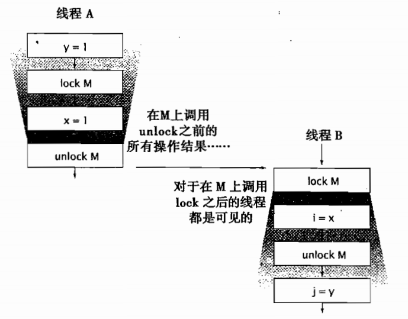
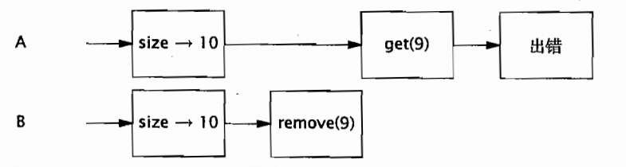
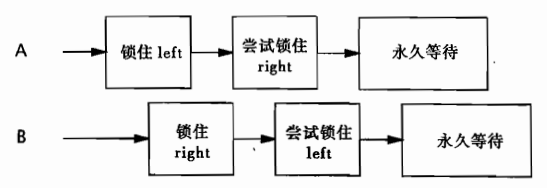
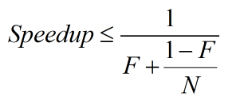

<!-- GFM-TOC -->
* [一、线程安全性](#线程安全性)
    * [1 什么是线程安全](#什么是线程安全)
    * [2 原子性](#原子性)
    * [3 加锁机制](#加锁机制)
* [二、对象的共享](#对象的共享)
	* [1 可见性](#可见性)
	* [2 发布与逸出](#发布与逸出)
	* [3 线程封闭](#线程封闭)
    * [4 安全发布](#安全发布)
* [三、对象的组合](#对象的组合)
    * [1 设计线程安全的类](#设计线程安全的类)
    * [2 实例封闭](#实例封闭)
    * [3 线程安全性的委托](#线程安全性的委托)
    * [4 在现有的线程安全类中添加功能](#在现有的线程安全类中添加功能)
* [四、基础构建模块](#基础构建模块)
    * [1 同步容器类](#同步容器类)
    * [2 并发容器](#并发容器)
    * [3 阻塞队列和生产者-消费者模式](#阻塞队列和生产者-消费者模式)
    * [4 阻塞方法与中断方法](#阻塞方法与中断方法)
    * [5 同步工具类](#同步工具类)
* [五、任务执行](#任务执行)
    * [1 Executor框架](#Executor框架)
* [六、取消与关闭](#取消与关闭)
    * [1 任务取消](#任务取消)
    * [2 停止基于线程的服务](#停止基于线程的服务)
* [七、线程池的使用](#线程池的使用)
    * [1 在任务与执行策略之间的隐形耦合](#在任务与执行策略之间的隐形耦合)
    * [2 设置线程池的大小](#设置线程池的大小)
    * [3 配置ThreadPoolExecutor](#配置ThreadPoolExecutor)
* [八、避免活跃性危险](#避免活跃性危险)
    * [1 死锁](#死锁)
    * [2 死锁的避免与诊断](#死锁的避免与诊断)
    * [3 其它活跃性危险](#其它活跃性危险)
* [九、性能与可伸缩性](#性能与可伸缩性)
    * [1 对性能的思考](#对性能的思考)
    * [2 Amdahl定律](#Amdahl定律)
    * [3 线程引入的开销](#线程引入的开销)
    * [4 减少锁的竞争](#减少锁的竞争)
----------


# 线程安全性

## 什么是线程安全
线程安全性：当多个线程访问某个类时，这个类始终都能表现出正常的行为，那么就称这个类是线程安全的。（无状态的对象一定是线程安全的）

## 原子性
原子性指的是整个程序中的所有操作，要么全部完成，要么全部不完成，不可能停滞在中间的某个环节
```java
++count;  // 非原子操作
```
实际上，++count包含了3个独立的操作：读取count的值，将值+1，然后将计算结果写入count，这是一个“读取——修改——写入”的操作序列，并且其结果状态依赖于之前的状态。

要保持状态的一致性，就需要在单个原子操作中更新所有相关的状态变量。

## 竞态条件
由于不恰当的执行时序而出现的不正确的结果叫作**竞态条件**

## 加锁机制
### 内置锁
Java提供了一种内置的锁机制来支持原子性：同步代码块(Synchronized Block)，其包含两个部分
- 一个作为锁的对象引用
- 一个作为由这个锁保护的代码块，其中该同步代码块的锁就是方法调用所在的对象。
静态的synchronize方法以Class对象作为锁。
``` java
synchronized (lock){
// 访问或修改锁保护的共享状态
}
```
每一个Java对象都可以用作一个实现同步的锁，这些锁被称为**内置锁(Intrinsic Lock)**或**监视器锁(Monitor Locl)**。
线程在进入同步代码块之前会自动获得锁，并且在退出同步代码块时会自动释放锁，而无论是通过正常的路径退出，还是通过从代码块中抛出异常退出。

**获得内置锁的唯一途径** 就是进入由这个锁保护的同步代码块或者方法。
Java的内置锁相当于一种**互斥体(或互斥锁)** ，这意味着同时最多只有一个线程能持有这种锁。当线程A尝试获得由线程B持有的锁时，线程A必须等待或者阻塞，等到B释放锁之后才有可能获得这个锁，如果B永远不释放锁，则A永远等待下去。

### 重入
当某个线程请求一个由其他线程持有的锁时，发出请求的线程就会阻塞。然而，由于内置锁是可以**重入**的，因此某个线程试图获得一个已由它自己持有的锁，那么这个请求就会成功。

重入进一步提升了加锁行为的封装性，因此简化了面向对象并发代码的开发
```java
public class Widget{
    public synchronized void doSomething(){
        ...
    }
}
public class LoggingWidget extends Widget{
    public synchronized void doSomething(){
        System.out.println(toString() + ": calling doSomething");
        super.doSomething();
    }
}
```
上述程序清单中，子类重写了父类的synchronized方法，然后调用父类中的方法，由于Widget和loggingWidget中的doSomething方法在执行前都会获得Widget上的锁，此时如果没有可重入的锁，子类调用父类的doSomething方法时，将永远无法获得Widget上的锁，因此这段代码将产生死锁。

### 用锁来保护状态
如果在复合操作的执行过程中持有一个锁，则会使复合操作变成原子操作。对于可能被多个线程同时访问的可变状态变量，在访问它们的时候都需要持有一个锁，我们称这个状态变量是由这个锁保护的。

一种常见的加锁约定是，把所有可变的状态都封装到对象的内部。

如果只是将每个方法作为同步方法，例如Vector，那么并不足以确保Vector上的复合操作都是原子的，例如：
```java
if(!vector.contains(element))
	vector.add(element);
```
虽然contains和add 方法都是原子的，假设contains方法由A线程占有，add方法由B线程占有，但是在执行完if判断条件之后，被其它线程C抢先执行了一次add方法，之后线程B再执行add方法，也就是if之后执行了2次add，显然与目标程序设计不符。

虽然synchronized方法可以确保单个操作的原子性，但如果要把多个操作合并为一个复合操作，还需要额外的加锁机制(了解如何在线程安全对象中添加原子操作的方法)，否则仍然会产生**竞态条件**。

----------

# 对象的共享

## 可见性
为了确保多个线程之间对内存写入操作的可见性，必须使用同步机制。

### 加锁与可见性
内置锁可以用于确保某个线程以一种可预测的方式来查看另一个线程的执行结果。
<div align="center">  </div><br>
访问某个共享且可变的变量时，要求所有的线程都在同一个锁上同步，就是为了确保某个线程写入该变量的值对于其它线程来说是可见的。否则，如果一个线程在未持有正确的锁的情况下读取某个变量，则读取到的值可能是实效值。

加锁的含义不仅仅局限于互斥行为，还包括内存可见性。为了确保所有的线程都能看到共享变量的最新值，所有执行读操作或者写操作的线程都必须在同一个锁上同步。

### Volatile变量
Java语言提供了一种稍弱的同步机制，即volatile变量，用来确保将变量的更新操作通知其它线程。当把一个变量声明为volatile类型后，编译器与运行时都会注意到这个变量是共享的，因此不会将该变量上的操作与其它内存操作一起重排序。volatile不会被缓存在寄存器或者对其它处理器不可见的地方，因此在读取volatile类型的变量时，总会返回最新写入的值。

volatile变量是一种比synchronized关键字更轻量级的同步机制。

volatile变量的一种经典用法：检查某个状态变量以标记是否退出循环。
```java
volatile boolean asleep;
...
while(!asleep)
	countSomeSheep();
```
为了使这个实例能正确执行，asleep必须设置为volatile类型，否则其它线程修改了asleep后，执行判断的线程缺发现不了。


**局限性：** volatile变量通常用作某个操作完成、发生或中断的状态标志。volatile的语义不足以确保递增操作(count++)的原子性。

**当且仅当** 满足以下条件时，才应该使用volatile关键字：
- 对变量的写入操作不依赖于变量的当前值，或者你能确保只有单个线程对变量进行更新。
- 该变量不会与其它状态变量一起纳入[不变性条件](#不变性)中。
- 在访问变量时不需要加锁。

## 发布与逸出
**发布(Publish)** 一个对象的意思是指，使对象能够在当前作用域之外的代码中使用。当某个不应该发布的对象被发布时，这种情况叫作 **逸出(Escape)**。
```java
class UnsafeStates{
    /*虽然states是私有方法，但是提供了共有访问的方法，也就是说任何调用者都可以
    修改 states的内容，因此数组states已经逸出了它的作用范围*/
    private String[] states = new String[] {"states","will","escape"};
    public String[] getStates(){
        return states;
    }
}
```

发布对象对简单的方法是将对象的引用保存到一个公有的静态变量中。
```java
public static Set<secret> knowScrets;
public void initialize(){
	knowScrets = new HashSet<>();
}
```
当发布一个对象时，该对象的非私有域中引用的所有对象同样会被发布。

发布对象或者其内部状态的机制就是发布一个内部的类实例，例如：
```java
public class ThisEscape{
	public ThisEscape(EventSource source){
		source.registerListener(new EventListener(){
			public void onEvent(Event e){
				doSomething(e);
			}
		})
	}
}
```
ThisEscape发布EventListener时，也隐含的发布了ThisEscape本身，因为在这个内部类实例中包含了对ThisEscape实例的隐含引用。但是不推荐这么做。

## 线程封闭
访问共享的可变数据时，通常需要使用同步。一种避免使用同步的方式就是不共享数据。如果仅在单线程内访问数据，就不需要同步。这种技术称为 **线程封闭(Thread Confinement)**，它是实现线程安全性的最简单方式之一。常见的应用有JDBC(Java Database Connectivity)的Connection对象。

### Ad-hoc线程封闭
Ad-hoc线程封闭是指，维护线程封闭性的职责完全由程序来实现。由于Ad-hoc线程封闭技术的脆弱性，因此在程序中要尽量少使用。

### 栈封闭
栈封闭是线程封闭的一种特例，在栈封闭中，只能通过局部变量才能访问到对象。局部变量(在JVM虚拟机栈中，线程私有)的固有属性之一就是封闭在执行线程中。

### ThreadLocal类
ThreadLocal类能使线程中的某个值与保存值的对象关联起来。ThreadLocal提供了get和set等访问接口或方法这些方法为每个使用该变量的线程都存有一份独立的副本，因此get总是返回由当前线程执行在调用set时设置的最新值。

ThreadLocal对象通常用于防止对可变的单实例变量(Singleton)或全局变量进行共享。

由于JDBC连接对象不一定是线程安全的，通过将JDBC的连接保存到ThreadLocal对象中，每个线程都会有自己的连接。
```java
private static ThreadLocal<Connection> connectionHolder = new ThreadLocal<Connection>(){
	public Connection initialValue(){
		return DriverManager.getConnection(DB_URL);
	}
};
public static Connection getConnection(){
	return connectionHolder.get();
}
```
当某个频繁执行的操作需要一个临时对象，例如一个缓冲区，而同时又希望避免在每次执行时都重新分配该临时对象，就可以使用该技术。

## 不变性
如果某个对象在创建后，其状态就不能被修改，那么这个对象就称为**不可变对象**，不可变对象一定是线程安全的。
当满足以下条件时，对象才是不可变的
- 对象创建后其状态就不能修改
- 对象的所有域都是final类型
- 对象是正确创建(在创建对象期间，this引用没有逸出)

在不可变对象的内部，仍可以用可变对象来管理其状态。
```java
public final class ThreeStooges{
	private final Set<String> stooges = new HashSet<>();

	public ThreeStooges(){
		stooges.add("Moe");
		stooges.add("A");
		stooges.add("B");
	}

	public boolean isStooge(String name){
		return stooges.contains(name);
	}
}
```
尽管保存姓名的set对象可变，但是从ThreeStooges的设计中可以看到，在set对象构造完成之后无法改变。

### final域
关键字final用于构造不可变性对象，final类型的域是不能修改的。但是如果final域引用的对象是可变的，那么这些被引用的对象是可以修改的。
```java
public finalTarget{
    final String[] a;
    finalTarget(){
        a = {"a","b","c"};  // 或者其它的字符串
    }
}
```
final域能确保初始化过程的安全性，从而可以不受限制的访问不可变对象，也不需要在共享时同步。

## 安全发布

### 不正确的发布
确保要发布的对象对其他线程可见(因此要使用同步)。未正确发布对象示例：
```java
public class Holder{

    private int a;
    Holder(int a){
        this.a = a;
    }
    public void assertSanity(){
        if (a != a) {
            throw new AssertionError("This statement is false.");
        }
    }
}
```
由于没有使用同步来确保Holder对象对其它线程可见，因此将Holder称为“未被正确发布”。在未被正确发布的对象中存在2个问题：
- 除了发布对象的线程外，其它线程可能看到Holder域是一个失效值，例如默认被JVM初始化为a=0，或者是个空的引用。
- 线程看到Holder引用的值是最新的，但是Holder的状态却是失效的。
某个线程在第一次读取域的是一个失效值，可能第二次读取就能得到一个更新后的值，因此assertSanity中的判断条件就为真，抛出异常。

**解决办法** 将Holder中所有的域都定义为final类型。

任何线程都可以在不需要额外同步的情况下安全地访问不可变对象。这种保证还将延伸到被正确创建对象中所有的final类型的域。**注意：如果final类型的域所指向的是可变对象，那么在访问这些域时仍然要做同步。**

### 安全发布的常用模式
可变对象必须通过安全的方式进行发布，意味着在发布和适用这些对象时必须进行同步。要安全地发布一个对象，对象的 **引用** 及其 **状态** 必须同时对其它线程可见，一个正确的构造对象可通过以下的方式安全发布：
- 在静态初始化函数中初始化一个对象的引用；
- 将对象的引用保存到volatile类型的域，或者是AtomicReferance对象中；
- 将对象的引用保存到一个正确构造对象的final域中；
- 将对象的引用保存到一个由锁保护的域中；

通常，要发布一个静态构造对象，最简单个最安全的方式是使用静态的初始化器：
```java
public static Holder holder = new Holder(66);
```

### 事实不可变对象
对象从技术上来看是可变的，但其状态在发布后不会再改变，需要安全发布。
例如，Date本身是可变的，但是如果将它作为不可变对象来使用，那么在多线程之间共享Date的时候就可以省去加锁。假设需要维护一个Map对象，其中保存了每位用户最近的登录时间：
```java
public Map<String, Date> lastLoggin = Collections.synchronizedMap(new HashMap<>());
```
### 可变对象
如果对象在构造后可以修改，那么安全发布只能确保在“发布当时”状态的可见性。对于可变对象，不仅在发布的时候需要同步，且每次访问或者修改的时候都要进行同步，以确保后续操作的可见性。要安全地共享可变对象，这些对象就必须安全地发布，并且必须是 **线程安全** 或者由 **锁** 保护起来。

对象的发布需求取决于它的可变性：
- 不可变对象可以通过任意机制来发布；
- 事实不可变对象必须通过安全方式来发布；
- 可变对象必须通过安全方式来发布，且必须是线程安全的或者由某个锁保护起来；

### 安全地共享对象
在并发程序中使用和共享对象时，可以使用一些实用的策略：
- **线程封闭：** 线程封闭的对象只能由一个线程拥有，对象被封闭在线程中，且只能由这个线程修改。
- **只读共享：** 在没有额外的同步下，共享的只读对象可以供多个线程并发访问，但任何线程都不可以修改它。共享只读对象包括：不可变对象、事实不可变对象。
- **线程安全共享：** 线程安全的对象在其内部实现同步，因此多个线程可以通过对象的共有接口来进行访问，而不需要进一步的同步。
- **保护对象：** 被保护的对象只能通过持有特定的锁来访问。保护对象包括封装在其他线程安全对象中的对象，以及已发布的并且由某个特定的锁保护的对象。

----------

# 对象的组合
在开发过程中，我们并不希望每一次内存访问都进行分析以确保程序是线程安全的，而是希望将一些现有的线程安全组件组合为更大规模的程序或组件。

## 设计线程安全的类

通过使用 **封装技术** ，可以使得在不对整个程序进行分析的情况下，就可以判断一个类是否为线程是安全的。
在设计线程安全类的过程中，需要包含以下三个基本要素：
- 找出构成对象状态的所有变量；
- 找出约束状态变量的不变性条件；
- 建立对象状态的并发访问管理策略；

**同步策略(Synchronization Policy)** 定义了如何在不违背对象不变性条件或后验条件的情况下对其状态的访问操作进行协同。同步策略规定了如何将不可变性、线程封闭、加锁机制等结合起来以维护线程的安全性，并且还规定了哪些变量由哪些锁来保护。

### 收集同步需求
如果不了解对象的不变性条件和后验条件，那么久不能确保线程的安全性。要满足在状态变量的有效值或者状态转换上的各种约束条件，就需要借助于 **原子性** 和 **封装性** 。

### 依赖状态的操作
如果在某个状态中包含有基于状态的先验条件(Precondition)，那么这个操作就称为**依赖状态的操作**，例如：
```java
public MyStack{

    public void pop(){
        ...
    }
    public boolean isEmpty(){
        ...
    }
    public static void main(String[] args) {
        MyStack stack = new MyStack();
        if (!stack.isEmpty()) {
            stack.pop();
        }
    }
}
```
删除栈中的元素前，应该先判断栈是否为空。

## 实例封闭
封装简化了线程安全类的实现过程，它提供了一种 **实例封闭机制(Instance Confinement)**，通常也称为**封闭**。将封闭机制与合适的加锁机制结合起来，可以确保以线程安全的方式去访问非线程安全的对象。

将数据封装在对象内部，可以将数据的访问限制在对象的方法上，从而更容易确保线程在访问数据时能持有正确的锁。

被封闭对象一定不能超出它们既定的作用域，对象可以封闭在：
- 类的一个实例（例如作为类的一个私有成员）；
- 某个作用域内（例如作为一个局部变量）；
- 线程内

以下说明如何通过封闭与加锁机制使一个类称为线程安全的（即使这个类的状态变量并不是线程安全的）。
```java
public class PersonSet{
    private final Set<Person> mySet = new HashSet<>();
    public synchronized void addPerson(Person p){
        mySet.add(p);
    }
    public synchronized boolean containsPerson(Person p){
        return mySet.contains(p);
    }
}
```
PersonSet的状态由HashSet来管理，而HashSet并不是线程安全的(即使mySet是final类型的，但是它所指向的是可变对象)。但由于mySet是私有的，且不会逸出，因此HashSet被封闭在了PersonSet中。唯一能访问mySet的代码路是addPerson和ContainsPerson，在执行它们时都需要获取PersonSet上面的锁。PersonSet的状态完全由它的内置锁保护，因而PersonSet是一个线程安全的类。需要注意的是，本例假设Person为线程安全的，否则在访问Person时还要做额外的同步操作。

### Java监视器模式
从线程封闭原则及其逻辑推论可以得出Java监视器模式(主要优势在于简单性)。遵循Java监视器模式的对象会把对象所有可变的状态都封装起来，并由自己的内置锁来保护。
```java
public final class Counter{
    private long value = 0;
    public synchronized long getValue(){
        return value;
    }
    public synchronized long increment(){
        if (value == Long.MAX_VALUE) {
            throw new IllegalStateException("Counter overflow");
        }
        return ++value;
    }
}
```
在Counter中封装了变量value，对该变量的所有访问都要经过Counter的方法来执行，且方法都是同步的。

**示例：车辆追踪器：**
一个用于调度车辆的“车辆追踪器”，例如出租车、警车、货车等。首先使用监视器模式来构建车辆追踪器。每辆车都有一个String对象来标识，并且拥有一个相应的位置坐标(x,y)。在VehicleTracker类中封装了车辆的标识和位置。
```java
public class MonitorVehicleTracker{
    private final Map<String,MutablePoint> locations;
    // constructor
    public MonitorVehicleTracker(Map<String,MutablePoint> locations){
        this.locations = deepCopy(locations);
    }
    // 获得所有车的位置
    public synchronized Map<String,MutablePoint> getLocations(){
        return deepCopy(locations);
    }
    // 获得某一辆车的位置
    public synchronized MutablePoint getLocations(String id){
        MutablePoint loc = locations.get(id);
        return loc == null ? null : new MutablePoint(loc);
    }
    // 设置一辆车的位置
    public synchronized void setLocations(String id, int x, int y){
        MutablePoint loc = locations.get(id);
        if (loc == null) {
            throw new IllegalArgumentException("No such id: " + "id" );
        }
        loc.x = x;
        loc.y = y;
    }
    /* unmodifiableMap方法返回的Map, 它本身不允许修改, 就是说其中每一个entry引用不允许修改，但是entry中的value如果是对象，value引用的对象的属性值是可以修改的*/
    private static Map<String,MutablePoint> deepCopy(Map<String,MutablePoint> m){
        Map<String,MutablePoint> result = new HashMap<String,MutablePoint>();
        for (String id : m.keySet()) {
            result.put(id, new MutablePoint(m.get(id)));
        }
        return Collections.unmodifiableMap(result);
    }
}
// MutablePoint不是线程安全类，因此当需要返回车辆的位置时，通过MutablePoint拷贝构造函数或者deepCopy方法来复制正确的值
public class MutablePoint{
    public int x,y;
    public MutablePoint(){
        x = 0;
        y = 0;
    }
    public MutablePoint(MutablePoint p){
        this.x = p.x;
        this.y = p.y;
    }
}
```
这种实现方式是通过返回客户代码之前复制可变的数据来维持线程的安全性。当数据量很大的时候，性能差。

## 线程安全性的委托
**示例：基于委托的车辆追踪器：**
```java
public class DelegatingVechicleTracker{
    private final ConcurrentMap<String,Point> locations;
    private final Map<String,Point> unmodifiableMap;

    public DelegatingVechicleTracker(Map<String,Point> points){
        locations = new ConcurrentHashMap<>();
        unmodifiableMap = new Collections.unmodifiableMap(locations);
    }
    // 获取所有的车辆位置
    public Map<String,Point> getLocations(){
        return unmodifiableMap;
    }
    // 获取指定的车辆位置
    public Point getLocations(String id){
        return unmodifiableMap.get(id);
    }
    // 设置车辆位置
    public void setLocations(String id, int x, int y){
        if (locations.replace(id, new Point(x,y)) == null) {
            throw new IllegalArgumentException("Invalid vehicle name:" + id);
        }
    }
}
// 线程安全的类，可以自由共享和发布，因此不要在返回locations时复制
public class Point{
    public final int x,y;
    public Point(int x, int y){
        this.x = x;
        this.y = y;
    }
}
```
假设有一个无状态的类A，在其中添加了一个线程安全的对象s，由于A的状态就是s的状态，因此s不会对A施加额外的有效性约束，所以很容易知道A是线程安全的。可以说**A将它的线程安全性委托给s来保证**。

上述的例子都仅仅委托给了单个线程安全的状态变量，我们还可以将线程的安全性委托给多个状态变量，前提它们彼此独立的。

## 在现有的线程安全类中添加功能
有的时候，现有的类智能支持大部分操作，此时就需要在不破坏线程安全性的条件下添加新的操作。
要添加一个原子操作，最安全的方式就是修改原始的类，但是这个通常无法做到。另一种方法就是扩展这个类(extends)，例如添加一个“若没有则添加”的操作，如下BetterVector对Vector进行了扩展：
```java
public class BetterVecotr<E> extends Vector<E>{
    public synchronized boolean putIfAbsent(E x){
        boolean absent = !contains(x);
        if (absent)
            add(x);
        return absent;
    }
}
```
"扩展"方法比直接将代码添加到类中更脆弱，因为现在的同步策略实现被分布到多个单独维护的源代码中。

### 客户端加锁机制
对于由Collections.synchronizedList封装的ArrayList，上述2种方式都行不通，因为客户代码并不知道在同步封装工厂方法中返回的List对象类型。第三种策略是扩展类的功能，但并不是扩展类本身，而是将代码放入一个“辅助类”中。例如下面的例子，通过客户端加锁来实现“若没有则添加”：
```java
public class ListHelper{
    public List<E> list = Collections.synchronizedList(new ArrayList<>());
    ...
    public boolean putIfAbsent(E x){
        /*必须使用与被辅助扩展类相同的锁，例如本例为list，这样才能保证putIfAbsent相对于
        其它list操作是原子的*/
        synchronized (list){
            boolean absent = !contains(x);
        if (absent)
            add(x);
        return absent;
        }
    }
}
```
通过添加一个操作来**扩展类**是脆弱的，因为它将加锁的代码分布到多个类中。**客户端加锁** 更加脆弱，因为它将类C的加锁代码放到与C完全无关的其它类中。它们的共同点都是将派生类的行为与基类的实现耦合在一起，两者都会**破坏封装性**。

### 组合
为现有的类添加一个原子操作。通过组合实现“若没有则添加”：
```java
public class ImprovedList<T> implments List<T>{
    private final List<T> list;
    public ImprovedList(List<T> list){
        this.list = list;
    }
    public synchronized boolean putIfAbsent(T x){
        boolean contains = list.contains(x);
        if (contains) {
            list.add(x);
        }
        return !contains;
    }
    public synchronized void clear(){list.clear();}
}
```
ImprovedList通过自身的内置锁增加了一层额外的加锁，它并不关心底层的List是否为线程安全的。只要在类中拥有指向底层List的**唯一外部引用**，就能确保线程安全。

----

# 基础构建模块

## 同步容器类
同步容器类包括Vector和HashTable。容器上常见的复合操作有迭代、跳转以及条件运算。
下面给出在Vector定义的两个方法：getLast和deleteLast，它们都会执行“先检查再运行”的操作：
```java
public static Object getLast(Vector list){
    int lastIndex = list.size() - 1;
    return list.get(lastIndex);
}
public static Object deleteLast(Vector list){
    int lastIndex = list.size() - 1;
    return list.remove(lastIndex);
}
```
当用户交替调用getLast和deleteLast时将可能出现问题
<div align="center">  </div><br>
如图所示很好地说明了并发访问时可能出现的问题。由于同步容器要遵守同步策略，即支持客户端加锁。只要使用者知道应该使用哪一个锁，这些新的操作就与容器的其它操作一样都是原子操作。如下：

```java
public static Object getLast(Vector list){
    synchronized (list){
        int lastIndex = list.size() - 1;
        return list.get(lastIndex);
    }
}
public static Object deleteLast(Vector list){
    synchronized (list){
      int lastIndex = list.size() - 1;
      return list.remove(lastIndex);
    }
}
```
### 迭代器与ConcurrentModificationException
当发现容器在迭代的过程中被修改时，就会抛出ConcurrentModificationException异常。要想避免出现ConcurrentModificationException，就必须在迭代的过程中持有容器的锁。

## 并发容器
**同步容器**将所有的对容器访问都串行化，以实现它们的线程安全性，但是会严重降低并发性。
在java5.0中添加了ConcurrentHashMap，用来替代同步且基于散列的Map，以及CopyOnWriteArrayList用于在遍历操作为主要操作的情况下代替同步的List。

### ConcurrentHashMap
与HashMap一样，ConcurrentHashMap也是一个基于散列的Map。ConcurrentHashMap并不是将每个方法都在同一个锁上同步使得每次只有一个线程能访问容器，而是使用一种更细粒度的 **分段锁(Lock Striping)** 加锁机制来实现更大程度上的共享。在ConcurrentHashMap中没有实现对Map加锁以提供独占访问。

### CopyOnWriteArrayList
CopyOnWriteArrayList用于替代同步List，在某些情况下它提供了更好的并发性能，并且在迭代期间不需要对容器进行加锁或复制。

“写入时复制(Copy-On-Write)”容器的线程安全性在于，只要正确地发布一个事实不可变对象，那么在访问的时候就不需要进一步的同步。在每次修改的时候，都会创建并重新发布一个新的容器副本，从而实现可变性。

仅当迭代操作远多于修改操作时，才应该使用“写入时复制(Copy-On-Write)”容器。例如：事件通知系统。

## 阻塞队列和生产者-消费者模式
**阻塞队列**提供了可供阻塞的put和take方法，以及支持定时的offer和poll方法。如果队列已满，则put方法阻塞直到有空间可用；如果队列为空，take方法则阻塞直到有元素可用。

阻塞队列支持生产者-消费者这种设计模式。该模式将“找出需要完成的工作”与”执行工作
这两个过程分离开来。这种模式能简化开发过程，因为它消除了生产者类和消费者类之间的代码依赖性。

在基于阻塞队列构建的生产者-消费者设计中，生产者把生成的数据放入队列，而当消费者从队列中获取数据。

### 串行线程封闭
线程封闭对象只能单个线程拥有，但可以通过安全发布该对象来“转移”所有权，之后也只有另一个线程能获得这个对象的访问权限，且新的线程可以对该对象做任意修改，因为最初的线程不再会访问该对象，因此新线程对它具有独占的访问权。

**双端队列与工作密取(Work Stealing)**
在工作密取设计中，每个消费者都有自己的双端队列，如果一个消费者完成了自己双端队列中的全部工作，那么它可以从其它消费者双端队列的**队尾**秘密地获取工作(进一步降低了队列的竞争程度)。

## 阻塞方法与中断方法
线程阻塞或者暂停执行的原因：
- 等待I/O操作结束；
- 等待获得一个锁；
- 等待从Thread.sleep方法中醒来
- 等待另一个线程的计算结果

阻塞操作与执行时间很长的普通程序差别在于，被阻塞的线程必须等待某个不受它控制的事件发生后才能继续执行。

**中断**是一种协作机制，他不能强制其它线程停止正在执行的操作，而仅仅是要求其它线程执行到某个可以暂停的地方停止正在执行的操作。

当在代码中调用了一个将抛出InterruptException异常的方法时，它本身的方法也就变成了阻塞方法，并且必须处理对中断的响应。
- **传递InterruptException**把InterruptException传递(1.根本不捕获该异常; 2.在执行某种简单的清理操作之后再次抛出该异常)给方法调用者。
- **恢复中断**有时候不能抛出InterruptException，必须捕获InterruptException，并通过调用当前线程上的interrupt方法恢复中断状态。
```java
public class TaskRunnable implments Runnable{
    BlockingQueue<Task> queue;
    ...
    public void run(){
        try {
            processTask(queue.take());
        } catch(InterruptedException e) {
            // 恢复被中断的状态
            Thread.currentThread().interrupt();
        }
    }
}
```

## 同步工具类
同步工具类可以是任何一个对象，只要它根据自身的状态来协调线程的控制流。常见的同步工具类有：
- 阻塞队列
- 信号量(Semaphore)
- 栅栏(Barrier)
- 闭锁(Latch)

### 闭锁(Latch)
在闭锁到达结束状态之前，没有任何线程能通过，当到达结束状态时，允许所有线程通过。因此，闭锁可以用来确保某些活动直到其它活动完成后才继续执行。例如：初始化等。闭锁是一次性对象，一旦进入终止状态，就不能被重置。

**CountDownLatch**是一种灵活的闭锁实现，，它可以使一个或者多个线程等待一组事件发生。闭锁状态包含一个被初始化为正数的计数器，表示需要等待的事件数量。countDown方法递减计数器，表示已经有一个事件已经发生了，而await方法等待计数器到达0，表示等待的事件已经全部发生。

在计时测试中使用CountDownLatch来启动和停止线程：
```java
public class TestHarness{
    public long timeTask(int nThread, final Runnable task) throw InterruptedException{
        final CountDownLatch startGate = new CountDownLatch(1);
        final CountDownLatch endGate = new CountDownLatch(nThread);

        for (int i=0;i<nThread; i++) {
            Thread t = new Thread(){
                public void run(){
                    try {
                        startGate.await();
                        try{
                            task.run();
                        }finally{
                            endGate.countDown();
                       }
                   }catch (InterruptedException e) {}
                }
            };
            t.start();
        }
    long start = System.nanaoTime();
    startGate.countDown();
    endGate.await();
    long end = System.nanaoTime();
    return end - start;
    }
}
```

**FutureTask**也可以做闭锁，并且可以处于以下三种状态：等待运行（Waiting to run），正在运行（Running），和运行完成（Completed）。

FutureTask.get()的行为取决于任务的状态，当任务完成则立刻返回结果，否则get将阻塞到任务进入完成状态，然后返回结果或者抛出异常。FutureTask在Executor框架中表示异步任务，此外还可以表示一些时间比较长的计算，这些计算可以在使用结果之前启动。

### 信号量(Semaphore)
**计数信号量(Counting Semaphore)** 用来控制同时访问某个特定资源的操作数量，还可以用来实现某种资源池，或对容器施加边界。

### 栅栏(Barrier)
类似于闭锁，它能阻塞一组**线程**直到某个事件发生。栅栏与闭锁的关键**区别**在于，所有线程必须同时到达栅栏位置，才能继续执行。可以被重置。

闭锁用于等待事件，栅栏用于等待其它线程。

**CyclicBarrier**可以使一定数量的参与方反复地在栅栏位置汇集，它在**并行迭代算法**中非常有用。

**Exchanger**它是一种两方(Two_Party)展览，各方在栅栏位置上交换数据。当两方执行不对称的操作时，Exchanger会非常有用，例如当一个线程向缓冲区写入数据，另一个线程从缓冲区读取数据。这些线程可以用Exchanger来汇合，并将满的缓冲区与空的缓冲区交换。当两个线程通过Exchanger交换对象时，就相当于把这个两个对象安全地发布给另一方。

# 任务执行
## Executor框架
任务是一组逻辑工作单元，而线程则是使任务异步执行的机制。在java类库中，任务执行的主要抽象不是Thread，而是Executor。
```java
public interface Executor{
    void execute(Runnable command);
}
```
Executor为灵活且强大的异步任务执行框架提供了基础。它基于生产生-消费者模式，提交任务的操作相当于生产者，执行任务的线程相当于消费者。

**基于线程池的Web服务器**
```java
class TaskExecutionWebServer{
   private static final int NTHREAD = 100;  // 容纳100个线程的线程池
   private  static final Executor exec = Executors.newFixedThreadPool(NTHREAD);

   public static void main(String[] args)throw IOException {
       ServerSocket socket = new ServerSocket(80);
       while(true){
           final Socket connection = socket.accept();
           Runnable task = new Runnable(){
               public void run(){handleRequest(connection);}
           };
           exec.execute(task);
       }
   }
}
```
在TaskExecutionWebServer中，通过使用Executor，将请求处理任务的提交与实际执行解耦开来，并且只需要采用另一种不同的Executor实现就可以改变服务器的行为。
### 执行策略
 在执行策略中定义了任务执行的“What, Where, When, How”等方面，包括：
 - 在什么(What)线程中执行任务？
 - 任务按照什么(What)顺序执行(FIFO, LIFO, 优先级)？
 - 有多少个(How many)任务能并发执行？
 - 如果系统由于过载而需要拒绝一个任务，应该选择哪一个(Which)任务？怎么(How)通知应用程序有任务被拒绝？
 - 在执行一个任务之前或者之后，应该进行哪些(What)操作？

各种执行策略都是一种资源管理的工具，最佳策略取决于计算机可用的资源以及对服务质量的需求。
### 线程池
管理一组同构工作线程的资源池。通过重用现有的线程，而不是新建一个线程，可以处理多个请求时分摊在线程创建和销毁过程中产生的巨大开销。

可以通过调用Executors中的静态工厂方法来创建一个线程池：
- **newFixedThreadPool：** 将创建一个固定长度的线程池，每当提交一个任务时创建一个线程，直到线程池的最大数量。（如果某个线程发生Exception结束，则会创建一个新的线程）
- **newCachedThreadPool：** 创建一个可缓存的线程池，如果线程池当前规模超过了处理需求时，则会回收空闲的线程，当需求增加时，则添加新的线程。线程池规模不存在任何限制。
- **newSingleThreadExecutor：** 创建单个线程执行任务，若这个线程异常结束，则创建另一个线程替代。能确保依照任务在队列中的顺序来串行执行。
- **newScheduledThreadPool：** 创建了一个固定长度的线程池，而且可以延迟或者定时的方式执行任务。

### Executor生命周期
为了解决执行服务的生命周期问题，Executor扩展了ExecutorService接口，添加了一些用于生命周期管理的方法。
```java
public interface ExecutorService extends Executor{
    void shutdown();  // 执行平缓的关闭过程：不再接受新任务，同时等待那些正在执行、还未执行的任务执行完成
    List<Runnalbe> shutdownNow();  // 立即关闭，取消正在运行、还未运行的任务
    boolean isShutdown();
    boolean isTerninated();
    boolean awaitTermination(long timeout, TimeUnit unit)throws InterruptedException;
    // ....其它用于任务提交便利的方法
}
```
ExecutorService的生命周期有三种状态：运行、关闭和终止。

### Future
**future：** 表示一个任务的生命周期，并提供了响应的方法来判断是否已经完成或取消，以及获取任务的结果和取消任务等。在Future规范中隐含的意义是：任务的生命周期只能前进，不能后退，类似ExecutorService，当某个任务完成之后，它就永远停留在了完成阶段。
```java
public interface Callable<V> {
    V call() throws Exception;
}
public interface Future<V>{
    boolean cancle(boolean mayInterruptIfRunning);
    boolean isCanclled();
    boolean isDone();
    V get() throws InterruptedException, ExecutionExeception, CancellationException;
    V get(long timeout, TimeUnit unit)throws InterruptedException, ExecutionExeception, CancellationException, TimeOutException;
}
```
get的行为取决于任务的状态（尚未开始，正在运行，运行结束）。如果任务已完成，则立即返回结果或抛出一个Exception，如果任务没有完成，则get将阻塞直到任务完成。如果任务抛出异常，那么get将该异常封装为ExecutorException并重新抛出。如果任务被取消，则抛出CancelledException。如果get抛出了ExecutionExeception，那么可以通过getCause来获得被封装的初始异常。

### 小结
通过围绕任务的执行来设计应用程序，可以简化开发过程，并有助于实现并发。Executor框架将任务提交与执行策略解耦开来，同时还支持多种不同类型的执行策略。

-----

# 取消与关闭
## 任务取消
如果外部代码能在某个操作正确完成之前将其置入“完成”状态，那么这个操作就可以成为 **可取消的(Cancellable)**，取消某个操作的原因有很多：
- **用户请求取消**。用户点击取消按钮
- **有时间限制的操作**。响应超时。
- **应用程序事件**。 对一个任务进行分解并搜索，当其中一个任务找到了解决方案时，其它的任务取消。
- **错误**。
- **关闭**。

**已请求取消(Cancellation Requested)** 标志，任务将定期的检查该变质，如果设置了这个标志，则任务提前结束。
```java
public class PrimeGenerator implments Runnable{
    private final List<BitInteger> primes = new ArrayList<>();
    private volatile boolean cancelled;

    public void run(){
        BitInteger p = BitInteger.ONE;
        while(!cancelled){
            p = p.nextProbablePrime():
            synchronized(this){
                primes.add(p);
            }
        }
    }
    public void cancle(){
        return cancelled = true;
    }
    public synchronized List<BitInteger> get(){
        return new ArrayList<BitInteger>(primes);
    }
}
```
让素数生成器执行1s后停止：
```java
List<BitInteger> aSencondOfPrimes() throws InterruptedException{
    PrimeGenerator generator = new PrimeGenerator();
    new Thread(generator).start();
    try {
        SECONDS.sleep(1);
    }finally{
        generator.cancel(); // 可能需要超过1s才会停止
    }
    return generator.get();
}
```
一个可取消的任务必须拥有**可取消策略(Cancellation Policy)**。
### 中断
每一个线程都有一个boolean类型的中断状态。当线程中断时，这个线程的中断状态被设置为true。在Thread中包含了中断线程以及查询线程中断状态的方法，如下：
```java
public class Thread{
    public void interrupt(){...} // 中断目标线程
    public boolean isInterrupted(){...} // 返回目标线程的中断状态
    /*如果调用interrupted方法返回true，则必须对它进行处理，可以抛
    出InterruptException或再次调用interrupt方法来恢复中断状态。*/
    public static boolean interrupted(){...} // 清楚线程中断的唯一方法
    ...
}
```
**阻塞库方法**，例如Thread.sleep和Object.wait等，都会检查线程何时中断，并且在发现中断时提前返回。它们在响应中断时执行的操作包括：清除中断状态，抛出InterruptedException，表示阻塞操作由于中断而提前结束。或者屏蔽它们。

调用interrupt并不意味着立即停止目标线程正在进行的工作，而只是传递了请求中断的消息，然后由线程在下一个合适的时刻（取消点）中断自己。

**响应中断**
当调用可中断的阻塞函数时，例如Thread.sleep, BlockingQueue.put等，有2种实用的策略可用于处理InterruptException：
- 传递异常（可能在执行某个特定于任务的清楚操作之后），从而使方法也成为可中断的阻塞方法。
- 恢复中断状态，从而使调用栈中的上层代码能够对其进行处理。

```java
BlockingQueue<Task> queue;
...
public Task getNextTask() throws InterruptedException{
    return queue.take();
}
```

只有实现了线程中断策略的代码才可以屏蔽中断请求。在常规的任务和代码库中都不应该屏蔽中断请求。对于一些不支持取消，但是仍可以调节可中断阻塞方法的操作，它们必须在循环中调节用这些方法，并在发现中断后重新尝试。

不可取消的任务在退出前恢复中断状态：
```java
public Task getNextTask(BlockingQueue<Taskgt; queue){
    boolean interrupted = false;
    try {
        while (true) {
            try {
                return queue.take();
            }catch(InterruptedException e) {
                 interrupted = true;
                 // 重新尝试
             }
        }
    }finally{
        if (interrupted) {
            Thread.currentThread().interrupt();
        }
    }
}
```
### 通过Future来实现取消
Future拥有一个cancel方法，该方法带有一个Boolean类型的参数mayInterruptIfRunning，表示取消操作是否成功。这只表示任务是否能够接受中断，而不是表示任务是否就能检测并处理中断。如果mayInterruptIfRunning为true并且任务当前正在某个线程中运行，那么这个线程就能被中断。若为false，意味着“若任务还没有启动，就不要运行它”，**这种方式应该用于那些不处理中断的任务中**。
```java
public static void timeRun(Runnable r, long timeout, TimeUnit, unit) throws InterruptedException{
    Future<?> task = taskExec.submit(r);
    try {
        task.get(timeout, unit);
    }catch (TimeOutException e){
        // 如果在任务重抛出了一场，那么重新抛出该异常
        throw launderThrowable(e.getCause());
    }finally {
        // 如果任务已经结束，那么执行取消操作也没有任何影响
        task.cancel(true); // 如果任务正在运行，那么将被中断
    }
}
```
当Future.get抛出InterruptedException或TimeoutException时，如果你知道不再需要结果，那么就可以调用Future.cancle来取消任务。
### 处理不可中断的阻塞
对于那些由于执行不可中断操作而被阻塞的线程，可以使用类似于中断的手段来停止这些线程，但要求我们必须知道线程阻塞的原因：
- Java.io包中的Socket I/O。
- Java.io包中的同步I/O。
- Selector的异步I/O。
- 获取某个锁
### 采用newTaskFor来封装非标准的取消
newTaskFor是一个工厂方法，它将创建Future来代表任务。newTaskFor还能返回一个RunnableFuture接口，该接口扩展了Future和Run那边了（并由FutureTask实现）。

## 停止基于线程的服务
应用程序通常会创建拥有多个线程的服务，例如线程池，并且这些服务的生命周期通常比创建它们的方法生命周期更长。如果应用程序准备退出，那么这些服务所拥有的线程也需要结束。由于无法通过抢占式的方法来停止线程，因此它们需要自行结束。

线程的所有权是不可传递的。

### “毒丸”对象
一个放在队列上的对象--当得到这个对象时，立即停止。在FIFO队列中，“毒丸”对象将确保消费者在关闭之前首先完成队列中的所有工作，在提交”毒丸对象后，将不会再提交任何工作。

## 处理非正常的线程终止
导致线程提前死亡的最主要原因是RuntimeException。由于这些异常表示出现了某种编程错误或者其它不可修复的错误，因此它们通常不会被捕获。它们不会在调用栈中逐层传递，耳屎默认地在控制台中输出栈追踪信息，并终止线程。

# 线程池的使用
## 在任务与执行策略之间的隐形耦合
虽然Executor框架为定制和修改执行策略都提供了相当大的灵活性，但并非所有的任务都能使用所有的执行策略。有些类型的任务需要明确地指定执行策略，包括：
- 依赖性任务。
- 使用现场封闭机制的任务。
- 对响应时间敏感的任务。
- 使用ThreadLocal的任务。

### 线程饥饿死锁
在线程池中，如果任务依赖于其它任务，则可能产生死锁。如果所有正在执行任务的线程都由于等待其它仍处于工作队列中的任务而阻塞，这种现象称为 **线程饥饿死锁（Thread Starvation DeadLock）**
```java
public class ThreadDeadLock {
    ExecutorService exec = Executors.newSingleThreadExecutor();
    public class RenderPageTask implements Callable<String> {
        public String call()throws Exception{
            Future<Striing> header, footer;
            header = exec.submit(new LoadFileTask("header.html"));
            footer = exec.submit(new LoadFileTask("footer.html"));
            String page = renderBody();
            // 将发生死锁——由于任务在等待子任务完成的结果
            return header.get() + page + footer.get();
        }
    }
}
```
每当提交了一个有依赖性的Executor任务时，要清楚地知道可能会出现线程“饥饿”死锁，因此需要在代码或者Executor的配置文件中记录线程池的大小限制或配置限制。

## 设置线程池的大小
线程池的理想大小取决于被提交任务的类型以及所部署系统的特性，在代码中通常不会固定线程池的大小，而应该通过某种配置机制来提供，或者根据Runtime.availableProcessors来动态计算。

## 配置ThreadPoolExecutor
### 线程的创建于销毁
线程池的基本大小（Core Pool Size）、最大大小（Maximum Pool Size）以及存活时间等因素共同负责线程的创建于销毁。

### 管理队列任务
在有限的线程池中会限制可并发执行任务的数量。

ThreadPoolExecutor允许提供一个BlockingQueue来保存等待执行的任务。基本的任务排队方法有：
- 无界队列(LinkedBlockingQueue)
- 有界队列(ArrayBlockingQueue, 有界的LinkedBlockingQueue, PriorityBolckingQueue)
- 同步移交(Synchronous Handoff)(SynchronousQueue)

对非常大或者无界的线程池，可以使用**SynchronousQueue**来避免任务排队。SynchronousQueue是一种在线程之间进行移交的机制。要将一个元素放入SynchronousQueue中，必须有另一个线程等待接收这个元素。如果没有，且线程池当前大小小于最大值，那么ThreadPoolExecutor将创建一个新的线程，否则根据**饱和策略**将拒绝这个任务。

### 饱和策略
JDK提供了几种不同的RejectedExecutorHandler实现：AbortPolicy, CallerRunsPolicy, DiscardPolicy和DiscardOldestPolicy（抛弃下一个将被执行的任务，最好不要与优先级队列一起使用）。

“调用者运行(Caller-Runs)”既不会抛弃任务，也不会抛出异常。当线程池所有的线程都被占用，并且工作队列也被填满时，下一个任务会在调用executor时在主线程中执行。由于执行任务需要一定时间，因此在主线程至少一定时间内不能提交任务，从而使得工作者线程有时间来处理完成正在执行的任务。
```java
ThreadPoolExecutor executor = new ThreadPoolExecutor(N_THREADS, N_THREADS, 0L, TimeUnit.MILLISECONDS, new LinkedBlockingQueue<Runnable>(CAPACITY));
executor.setRejectedExecutionHandler(new ThreadPoolExecutor.CallerRunsPolicy());
```

# 避免活跃性危险
## 死锁
在线程A持有L锁并想获得M锁的同时，线程B持有M锁并想获得L锁。这就是死锁。其中多线程由于存在环路的锁依赖关系而永远地等待下去。

### 锁顺序死锁
leftRight和rightLeft这两个方法分别获得left锁和right锁。如果其中一个线程调用了leftRight，另一个调用了rightLeft，并且2个线程的操作是交错执行，则容易发生死锁。
<div align="center">  </div><br>

**如果所有的线程以固定的顺序来获取锁，那么在程序中就不会出现锁顺序死锁的问题。**

### 动态的锁顺序死锁
有时候并不能清楚地知道在锁顺序上有足够的控制权来避免死锁的发生。例如转账：
```java
synchronized (fromAccount){
    synchronized (toAccount){
        ...
    }
}
```
当线程X给Y转账，另一个线程用Y给X转账，则会发生死锁。用System.identityHashCode来定义锁的顺序，可以消除死锁的可能性。

在极少数情况下，2个对象可能拥有相同的散列值，可以使用“加时赛（Tie-Breaking）”锁从而保证每次只有一个线程以位置的顺序获得这2个锁。

### 在协作对象之间发生的死锁
如果在持有锁时调用某个外部方法，那么可能出现活跃性的问题。因为这个外部方法可能会获取其它锁（这可能产生死锁），或者阻塞时间过长，导致其它线程无法及时获得当前被持有的锁。

### 开放调用
如果在调用某个方法的时候不需要持有锁，则称为 **开放调用(Open Call)**。尽量使同步代码块来保护那些涉及共享状态的操作，收缩同步代码块的范围还可以提高伸缩性。

在程序中应该尽量使用开放调用，易于对依赖于开放调用的程序进行死锁分析。（相比于同步方法，原子性变差，因为同步代码块的范围缩小了。

## 死锁的避免与诊断
如果程序必须获得多个锁，则必须在设计的时候考虑锁的顺序：尽量减少潜在的加锁交互数量，将获取锁时需要遵守的协议写入文档并始终遵循这些协议。

### 支持定时的锁
显示使用Lock类中的定时tryLock功能来代替内置锁机制。显示锁可以指定一个超时时限(Timeout)，在等待超过这个时限之后会返回一个失败的信息。

### 通过线程转储信息分析死锁
JVM通过线程转储(Thread Dump)来帮助识别死锁的发生。线程转储包含各个运行中线程的栈追踪信息，加锁信息（哪个线程持有哪些锁，被阻塞的线程正在等待获取哪个锁）。

## 其他活跃性危险
### 饥饿
当线程无法访问它所需要的资源，而无法继续执行时，就发生了“饥饿(Starvation)”。引发饥饿最常见的资源就是CPU的时钟周期。

### 活锁
活锁(LiveLock)，线程不断地重复执行相同的动作，而且总会失败。即使不会阻塞线程，也不能正常运行。

活锁通常发生在处理事务消息的应用程序中：如果不能成功地处理某个消息，那么消息处理机制将回滚整个事务，并将它重新放到队列的开头。如果每一次都发生失败，则每一次都回滚。这种形式的活锁通常是过度的错误恢复代码造成的，因为它将不可修复的错误误认为是可修复的错误。

**解决方法：** 在重试机制中引入随机性。在并发程序中，通过等待随机长度的时间和回退可以有效避免活锁的发生。

# 性能与可伸缩性
## 对性能的思考
使用多线程的同时会带来一些额外的性能开销：
- 线程之间的协调（加锁、触发信号、内存同步）
- 上下文切换
- 线程的创建和销毁
- 线程的调度

过度使用多线程，这些开销甚至会超过由于吞吐量。响应性或者计算能力所带来的性能提升。
### 性能与可伸缩性
可伸缩性指的是：当增加计算资源时（例如：CPU、内存、存储容量或I/O带宽），程序的吞吐量或者处理能力能相应地增加。

## Amdahl定律
Amdahl定律描述的是：在增加计算资源的情况下，程序在理论上能够实现的最大加速比，这个值取决于程序中可并行组件与串行组件所占的比重。假定F是必须串行执行的部分，那么根据Amdahl定律，在包含N个处理器的机器中，最高的加速比为：
<div align="center">  </div><br>

## 线程引入的开销
对于为了提升性能而引入的线程，并行带来的性能提升必须大于并发所带来的开销。

### 上下文切换
如果可运行的线程数量大于CPU的数量，那么操作系统最终会将某个正在运行的线程调度出来，从而使其它线程能够使用CPU。这将会导致一次上下文切换，这个过程中将保存当前线程的执行上下文，并把新调度进来的线程的执行上下文设置为当前上下文。

当线程由于等待某个发生竞争的锁而被阻塞时，JVM通常会把这个线程挂起，并允许它被交换出去。

### 内存同步
同步操作的性能开销包括多个方面。在synchronized和volatile提供的可见性保证中会使用一些特殊的指令——内存栅栏(Memory Barrier)，在内存栅栏中，大多数的操作都是不可重排序的。

### 阻塞
非竞争同步完全可以在JVM中进行处理，而竞争同步可能需要操作系统介入，从而增加开销。在锁上发生竞争时，竞争失败的线程肯定会被阻塞。JVM在实现阻塞行为时，可以采用 **自旋等待(Sprin-Waitting，指通过循环不断地尝试获得锁，直到成功，适合等待时间短)** 或者通过操作系统挂起被阻塞的线程（适合等待事件长）。

## 减少锁的竞争
在并发程序中，对可伸缩性的主要威胁就是独占方式的资源锁。

有2个因素将影响锁上发生竞争的可能性：
- 锁请求的频率
- 每次持有该锁占用的时间

如果二者的乘积很小，那么大多数获取锁的操作都不会发生竞争。有3种方式可以降低锁的竞争程度：
- 减少锁持有的时间
- 降低锁的请求频率
- 使用带有协调机制的独占锁

### 缩小锁的范围("快进快出")
把一些不需要的同步放到锁外面，缩小同步代码块，但是要确保必要的原子操作。

### 减小锁的粒度
可以通过**锁分解**和**锁分段**来减小锁的粒度。如果一个锁需要保护多个相互独立的状态变量，那么可以将这个锁分解为多个锁，每一个锁只保护一个状态变量。
```java
public class ServerStatus{
    public final Set<String> users;
    public final Set<String> queries;
    ...
    public synchronized void addUser(String u){users.add(u);}
    public synchronized void addQuery(String q){queries.add(u);}
    public synchronized void removeUser(String u){users.remove(u)}
    public synchronized void removeQuery(String q){queries.remove(q)}
}
```
使用锁分解技术
```java
public class ServerStatus{
    public final Set<String> users;
    public final Set<String> queries;
    ...
    public void addUser(String u){
        synchronized (users){
            users.add(u);
        }
    }
    public void addQuery(String q){
        synchronized (queries){
            queries.add(u);
        }
    }
}
```
### 锁分段
锁分段：在某些情况下，可以将所分解技术进一步扩展为对一组独立对象上的锁进行分解。劣势在于，与采用单个锁来实现独占访问相比。要获取多个锁来实现独占访问将更加困难，并且开销更高。
