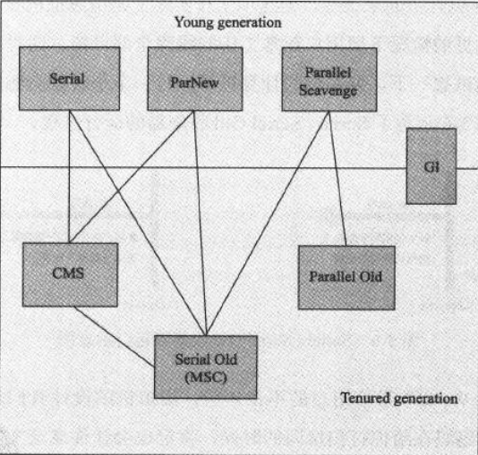
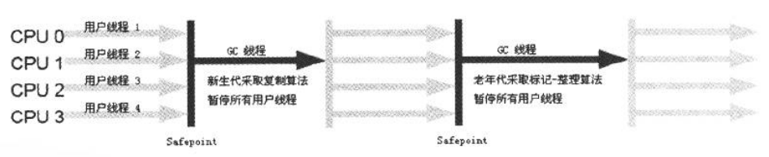
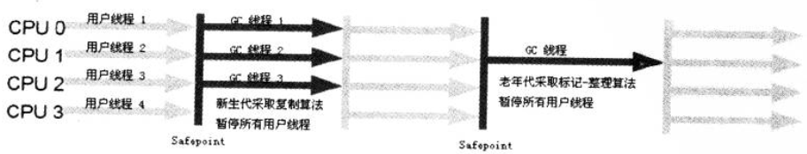
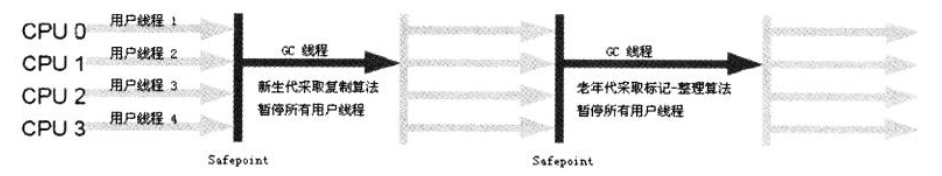
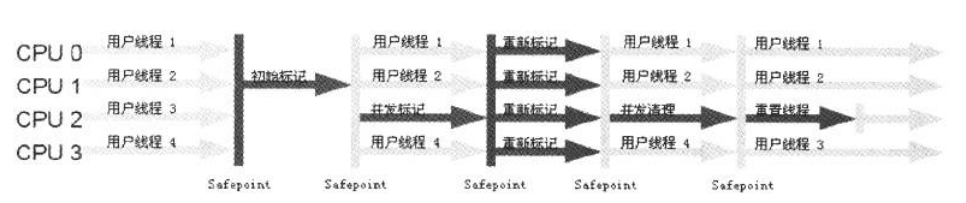
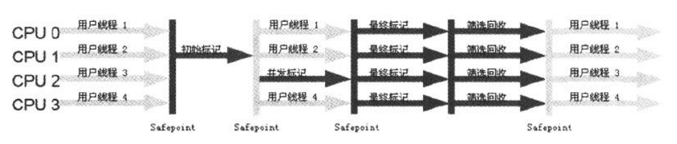
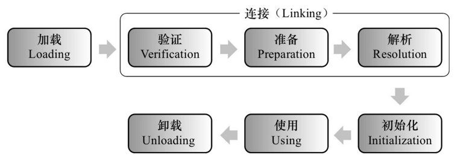
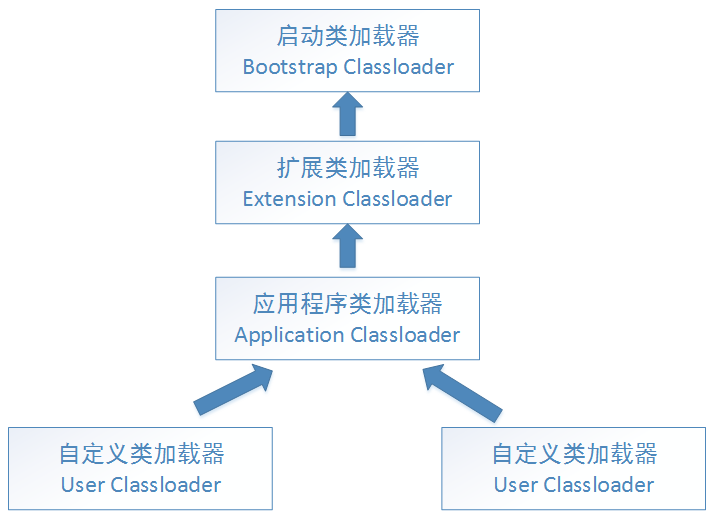

* [运行时数据区域运行时数据区域](#运行时数据区域)
    * [程序计数器](#程序计数器)
    * [Java虚拟机栈](#Java虚拟机栈)
    * [本地方法栈](#本地方法栈)
    * [Java堆](#Java堆)
    * [方法区](#方法区)
    * [运行时常量区](#运行时常量区)
    * [直接内存](#直接内存)
* [垃圾收集](#垃圾收集)
    * [判断一个对象是否可以被回收](#判断一个对象是否可以被回收)
    * [垃圾收集算法](#垃圾收集算法)
    * [垃圾收集器](#垃圾收集器)
* [内存分配与回收策略](#内存分配与回收策略)
    * [Minor GC 和 Full GC 的区别](#MinorGC和FullGC的区别)
    * [内存分配策略](#内存分配策略)
* [类加载机制](#类加载机制)
    * [类的生命周期](#类的生命周期)
    * [类加载的过程](#类加载的过程)
    * [类与类加载器](#类与类加载器)
    * [双亲委派模型](#双亲委派模型)

# 运行时数据区域

## 程序计数器
程序计数器(Program Counter Register)记录的是正在执行的虚拟机字节码指令的地址；
如果执行的是本地(Native)方法，这个计数器的值为空(Undefined)。

特点：
- 此内存区域是唯一一个在Java虚拟机规范中没有规定任何OutOfMemoryError情况的区域。
- 线程私有

## Java虚拟机栈
每个方法在执行的同时会创建一个栈帧(Stack Frame)用于存储局部变量、操作数栈、动态链接、方法出口等信息。每一个方法从调用直至执行完成的过程，就对应着一个栈帧在虚拟机栈中入栈到出栈的过程。


可以通过-Xss这个虚拟机参数来指定每个线程的Java虚拟机栈内存的大小
``` bash
java -Xss512M JackTheJava
```
局部变量表：存放了编译期可知的各种基本数据类型(boolean,byte,char,short,int,float,long,double)。对象引用(reference类型，不等同于对象本身，可能只是一个指向对象起始地址的指针)

该区域规定了两种异常情况：
- 如果线程请求的栈深度大于虚拟机所允许的最大深度，则抛出StackOverflow异常
- 栈内存进行动态扩展时无法申请到足够的内存，则抛出OutOfMemory异常

## 本地方法栈
本地方法栈(Native Method Stack)与Java虚拟机栈作用类似。区别是，Java虚拟机栈为虚拟机执行Java方法(字节码)服务，本地方法栈则为虚拟机使用到的Native方法服务。
本地方法栈也会抛出StackOverflow、OutOfMemory异常

## Java堆
几乎所有的对象都在这里分配内存，是垃圾收集的主要区域(“GC堆”)
现代的垃圾收集器基本上都采用分代收集算法，其主要的思想是针对不同类型的对象采取不同的垃圾回收算法，可以将堆分成两块
- 新生代(Young Gerneration)
- 老年代(Old Gerneration)

堆不需要连续内存，只要是逻辑上连续即可，并且可以动态增加内存大小（通过-Xmx和-Xms控制）
``` java
java -Xmx512M -Xms1024M HackTheJava // 第一个参数设置堆内存的初始值，第二个设置最大值
```
如果在堆中没有内存完成对象的内存分配，且无法再扩展堆内存时，将会抛出OutOfMemory异常

## 方法区
方法区(Method Area)与Java堆一样，是线程共享的区域，它用于存储已被虚拟机加载的类信息，常亮，静态变量，即时编译器编译后的代码等数据。
不需要连续的内存，并且可以动态扩展，动态扩展失败一样会抛出 OutOfMemoryError 异常。

对这块区域进行垃圾回收的主要目标是对常量池的回收和对类的卸载，但是一般比较难实现。

HotSpot虚拟机把它当成永久代来进行垃圾回收。但是很难确定永久代的大小，因为它受到很多因素影响，并且每次 Full GC 之后永久代的大小都会改变，所以经常会抛出 OutOfMemoryError 异常。为了更容易管理方法区，从 JDK 1.8 开始，移除永久代，并把方法区移至元空间，它位于本地内存中，而不是虚拟机内存中。

## 运行时常量池
方法区的一部分，用于存放用于存放编译器生成的各种字面量和符号引用，这部分将在类加载后进入方法区的运行时常量池中存放。

## 直接内存
在 JDK 1.4 中新加入了 NIO 类，它可以使用 Native 函数库直接分配堆外内存（Native 堆），然后通过一个存储在 Java 堆里的 DirectByteBuffer 对象作为这块内存的引用进行操作。

这样能在一些场景中显著提高性能，因为避免了在 Java 堆和 Native 堆中来回复制数据。

-------------------------

# 垃圾收集
垃圾收集主要是针对堆和方法区进行。

程序计数器、虚拟机栈和本地方法栈这三个区域属于线程私有的，只存在于线程的生命周期内，线程结束之后也会消失，因此不需要对这三个区域进行垃圾回收。

## 判断一个对象是否可以被回收
### 引用计数法
给对象添加一个引用计数器，当对象增加一个引用时计数器加 1，引用失效时计数器减 1。引用计数为 0 的对象可被回收。但是无法解决循环引用的问题。
```java
public class ReferenceCountingGC {

    public Object instance = null;

    public static void main(String[] args) {
        ReferenceCountingGC objectA = new ReferenceCountingGC();
        ReferenceCountingGC objectB = new ReferenceCountingGC();
        objectA.instance = objectB;
        objectB.instance = objectA;
    }
}
```
### 可达性分析算法
通过 GC Roots 作为起始点进行搜索，能够到达到的对象都是存活的，不可达的对象可被回收。
<div align="center"></div>

可作为GC Root的对象包括下面几种：
- 虚拟机栈中引用的对象。
- 方法区中静态属性引用的对象。
- 方法区中常量引用的对象
- 本地方法栈中JNI引用的对象。

简而言之，就是用户能够通过代码引用到的对象都可以作为GC Root。

### 方法区回收
方法区中的对象一般都是永久代中的，其垃圾收集主要回收废弃常量和无用的类。

要判定一个类是“无用的”，必须同时满足以下条件：
- 该类的所有对象都已经被回收。
- 加载该类的ClassLoder被回收。
- 该类对应的java.lang.Class对象没有在任何地方被引用，无法在任何地方通过反射访问该类的方法。

在大量使用反射、动态代理、CGLib 等 ByteCode 框架、动态生成 JSP 以及 OSGi 这类频繁自定义 ClassLoader 的场景都需要虚拟机具备类卸载功能，以保证不会出现内存溢出。

## 垃圾收集算法

### 标记-清除
<div align="center"></div>

将存存活的对象进行标记，然后清理掉未标记的对象。

缺点：
- 标记和清除的效率都很低。
- 会产生大量不连续的内存碎片，导致无法给大对象分配内存。

### 标记-整理
<div align="center"></div>

将所有存活的对象移到前端，然后直接清理掉边界以外的内存。

### 复制
<div align="center"></div>

将内存划分为大小相等的两块，每次只使用其中一块，当这一块内存用完了就将还存活的对象复制到另一块上面，然后再把使用过的内存空间进行一次清理。

主要不足是只使用了内存的一半。

现在的商业虚拟机都采用这种收集算法来回收新生代，但是并不是将新生代划分为大小相等的两块，而是分为一块较大的 Eden 空间和两块较小的 Survivor 空间，每次使用 Eden 空间和其中一块 Survivor。在回收时，将 Eden 和 Survivor 中还存活着的对象一次性复制到另一块 Survivor 空间上，最后清理 Eden 和使用过的那一块 Survivor。

HotSpot 虚拟机的 Eden 和 Survivor 的大小比例默认为 8:1，保证了内存的利用率达到 90%。如果每次回收有多于 10% 的对象存活，那么一块 Survivor 空间就不够用了，此时需要依赖于老年代进行分配担保，也就是借用老年代的空间存储放不下的对象。

### 分代收集
现在的商业虚拟机采用分代收集算法，它根据对象存活周期将内存划分为几块，不同块采用适当的收集算法。

一般将堆分为新生代和老年代。
- 新生代：复制算法。
- 老年代：标记-清除或者标记-整理算法。

## 垃圾收集器

<div align="center"></div>

### Serial 收集器

单线程的新生代收集器。缺点是“Stop the World”，优点是简单高效。

<div align="center"></div>

### ParNew 收集器

Serial 的多线程版本。

<div align="center"></div>

### Parallel Scavenge 收集器

Parallel Scavenge 收集器的目标是达到一个可控制的吞吐量。

Parallel Scavenge 收集器提供了2个参数用于精确控制吞吐量：

- -XX:MaxGCPauseMills, 最大垃圾收集停顿时间，是一个大于 0 毫秒的数。
- -XX:GCTimeRatio, 吞吐量大小。

### Serial Old 收集器

单线程的老年代收集器。

<div align="center"></div>

### CMS 收集器

CMS(Concurrent Mark Sweep)收集器是一种以获得最短回收停顿时间为目标的收集器。该收集器是基于”标记清除“算法实现的，它运作过程可分为以下 4 个步骤：

- 初始标记。标记 GC Root 能直接关联到的对象，有 Stop the world。
- 并发标记。GC Root Tracing 的过程。
- 重新标记。修正并发标记期间用户程序运作产生的垃圾。有 Stop the world，比初始标记长一些。
- 并发清除。

<div align="center"></div>

CMS 收集器虽然已经很牛逼，但是有以下几个缺点：

- 对 CPU 资源十分敏感。
- 无法清理浮动垃圾（GC 过程中，用户程序产生的垃圾出现在**标记**过程之后 ，便无法在当次 GC 清除它们）。
- 基于标记-清除算法，收集完成之后会有大量的空间碎片。

### G1 收集器

G1 收集器特点：

- **并行与并发**：充分利用多 CPU、多核环境下的硬件优势缩短 Stop the world 停顿时间。
- **分代收集**：能独立管理整个 GC 堆。
- **空间整合**：G1 从整体看是基于“标记-整理”算法实现，从局部（两个 Region 之间）看是基于“复制”算法实现，不会产生浮动垃圾。
- **可预测的停顿**：能建立可预测的停顿时间模型。

将 Java 堆划分为多个大小相等的 Region，保留新生代和老年代的概念，但是不存在物理隔离。

G1 收集器跟踪每个 Region 回收所获得的空间大小以及回收所需要时间的经验值，在后台维护一个优先列表，每次根据允许的收集时间，优先回收价值最大的 Region。

G1 收集器中，Region 之间的对象引用，虚拟机使用 Remembered Set 来避免全堆扫描。G1 中每一个 Region 都有一个与之对应的 Remembered Set 。

不计算维护 Remembered Set 的操作，G1收集器的运作如下几个步骤：

- 初始标记。标记 GC Root 能直接关联到的对象，需要短暂地停顿线程。
- 并发标记。从 GC Root 开始对对象进行可达性分析，耗时较长，可与用户程序并发执行。
- 最终标记。修正并发标记期间因用户程序继续运作，标记发生变动的那一部分。
- 筛选回收。

<div align="center"></div>


---------------------

# 内存分配与回收策略

## Minor GC 和 Full GC 的区别
- 新生代(Minor GC)：回收新生代的垃圾，因为Java对象大多数都是朝生夕灭，因此Minor GC非常频繁，执行速度快。
- 老年代(Full GC)：回收老年代和新生代。因为老年代存活的时间都比较长，一般在内存不够用的情况下会触发一次Full GC。

## 内存分配策略

### 1.对象优先在Eden分配
大多数情况下，新生代在Eden中分配，当Eden没有足够的空间，则发起一次Minor GC。

### 2.大对象直接进入老年代
典型的大对象是那种需要大量连续内存空间的Java对象，如很长的字符串或者数组。

经常出现大对象会提前触发垃圾收集以获取足够的连续空间分配给大对象。

`-XX:PretenureSizeThreshold`，大于此值的对象直接在老年代分配，避免在 Eden 区和 Survivor 区之间的大量内存复制。

### 3.长期存活的对象进入老年代
虚拟机为每个对象都定义可一个对象年龄计数器。对象在Eden空间每经历一次Minor GC，且存活下来，年龄就增加一岁，增加到一定年龄则进入老年代。

可以用`-XX:MaxTenuringThreshold` 用来定义年龄的阈值。

### 4.动态对象年龄判断
虚拟机并不是永远地要求对象的年龄必须达到 MaxTenuringThreshold 才能晋升老年代，如果在 Survivor 中相同年龄所有对象大小的总和大于 Survivor 空间的一半，则年龄大于或等于该年龄的对象可以直接进入老年代，无需等到 MaxTenuringThreshold 中要求的年龄。

### 5.空间分配担保
在发生 Minor GC 之前，虚拟机先检查老年代最大可用的连续空间是否大于新生代所有对象总空间，如果条件成立的话，那么 Minor GC 可以确认是安全的。

如果不成立的话虚拟机会查看 HandlePromotionFailure 设置值是否允许担保失败，如果允许那么就会继续检查老年代最大可用的连续空间是否大于历次晋升到老年代对象的平均大小，如果大于，将尝试着进行一次 Minor GC；如果小于，或者 HandlePromotionFailure 设置不允许冒险，那么就要进行一次 Full GC。

----------------------

# 类加载机制
类是在运行期间第一次使用时动态加载的，而不是一次性加载。因为如果一次性加载，那么会占用很多的内存。

## 类的生命周期
<div align="center"></div>

解析阶段可以在初始化之后进行，这是为了支持Java的动态绑定(多态)。

## 类加载的过程
包含加载、验证、准备、解析、初始化5个阶段。

### 1.加载
“加载”是“类加载”的一个阶段。在此阶段，虚拟机需要完成以下3件事：
- 通过一个类的全限定名来获取定义此类的二进制字节流。
- 将这个字节流所代表的**静态存储结构**转化为方法区的运行时数据结构。
- 在内存中生成一个代表这个类的java.lang.Class对象，作为方法区这个类的各种数据的访问入口。

### 2.验证
验证阶段主要包含4个阶段：文件格式验证、元数据验证、字节码验证、符号引用验证。以确保Class 文件的字节流中包含的信息符合当前虚拟机的要求，并且不会危害虚拟机自身的安全。

### 3.准备
类变量是被 static 修饰的变量，准备阶段为类变量分配内存并设置初始值，使用的是方法区的内存。

实例变量不会在这阶段分配内存，它将会在对象实例化时随着对象一起分配在堆中。

注意，实例化不是类加载的一个过程，类加载发生在所有实例化操作之前，并且类加载只进行一次，实例化可以进行多次。

初始值一般为 0 值，例如下面的类变量 value 被初始化为 0，初始化阶段过后才变成5。
```java
 public static int value1  = 5;
```
如果类变量是常量，那么会按照表达式来进行初始化，而不是赋值为 0。
```java
 public static final int value1  = 123;
```

### 4.解析
将常量池的符号引用替换为直接引用的过程。

### 5.初始化
初始化阶段才真正开始执行类中定义的Java代码。初始化阶段即虚拟机执行类构造器 `<clinit>()` 方法的过程。在准备阶段，类变量已经赋过一次系统要求的初始值，而在初始化阶段，根据程序员通过程序制定的主观计划去初始化类变量和其它资源。

`<clinit>()` 是由编译器自动收集类中所有类变量的赋值动作和静态语句块中的语句合并产生的，编译器收集的顺序由语句在源文件中出现的顺序决定。特别注意的是，静态语句块只能访问到定义在它之前的类变量，定义在它之后的类变量只能赋值，不能访问。例如以下代码：
```java
public class Test {
    static {
        i = 0;                // 给变量赋值可以正常编译通过
        System.out.print(i);  // 这句编译器会提示“非法向前引用”
    }
    static int i = 1;
}
```
由于父类的` <clinit>()` 方法先执行，也就意味着父类中定义的静态语句块的执行要优先于子类。例如以下代码：
```java
static class Parent {
    public static int A = 1;
    static {
        A = 2;
    }
}

static class Sub extends Parent {
    public static int B = A;
}

public static void main(String[] args) {
     System.out.println(Sub.B);  // 2
}
```
**什么时候初始化？**
1. 遇到 new、getstatic、putstatic、invokestatic 这四条字节码指令时，如果类没有进行过初始化，则必须先触发其初始化。最常见的生成这 4 条指令的场景是：使用 new 关键字实例化对象的时候；读取或设置一个类的静态字段（被 final 修饰、已在编译期把结果放入常量池的静态字段除外）的时候；以及调用一个类的静态方法的时候。
2. 使用 java.lang.reflect 包的方法对类进行反射调用的时候，如果类没有进行初始化，则需要先触发其初始化。
3. 当初始化一个类的时候，如果发现其父类还没有进行过初始化，则需要先触发其父类的初始化。
4. 当虚拟机启动时，用户需要指定一个要执行的主类（包含 main() 方法的那个类），虚拟机会先初始化这个主类；
5. 当使用 JDK 1.7 的动态语言支持时，如果一个 java.lang.invoke.MethodHandle 实例最后的解析结果为 REF_getStatic, REF_putStatic, REF_invokeStatic 的方法句柄，并且这个方法句柄所对应的类没有进行过初始化，则需要先触发其初始化；

以上几种方式称为**主动引用**。

**被动引用：**
- 通过子类引用父类的静态字段，不会导致子类初始化。
```java
System.out.println(SubClass.value);  // value 字段在 SuperClass 中定义
```
- 通过数组定义来引用类，不会触发此类的初始化。该过程会对数组类进行初始化，数组类是一个由虚拟机自动生成的、直接继承自 Object 的子类，其中包含了数组的属性和方法。
```java
SuperClass[] sca = new SuperClass[10];
```
- 常量在编译阶段会存入调用类的常量池中，本质上并没有直接引用到定义常量的类，因此不会触发定义常量的类的初始化。
```java
System.out.println(ConstClass.HELLOWORLD);
```

## 类与类加载器
两个类相等，需要类本身相等，并且使用同一个类加载器进行加载。这是因为每一个类加载器都拥有一个独立的类名称空间。

这里的相等，包括类的 Class 对象的 equals() 方法、isAssignableFrom() 方法、isInstance() 方法的返回结果为 true，也包括使用 instanceof 关键字做对象所属关系判定结果为 true。

## 双亲委派模型
### 类加载器的分类
从Java虚拟机的角度来看：
- 启动类加载器（Bootstrap ClassLoader），使用 C++ 实现，是虚拟机自身的一部分；
- 所有其它类的加载器，使用 Java 实现，独立于虚拟机，继承自抽象类 java.lang.ClassLoader。

从Java开发人员角度来看：
- 启动类加载器
- 扩展类加载器
- 应用程序类加载器

<div align="center"></div>

所谓双亲委派是指每次收到类加载请求时，先将请求委派给父类加载器完成（所有加载请求最终会委派到顶层的Bootstrap ClassLoader加载器中），如果父类加载器无法完成这个加载（该加载器的搜索范围中没有找到对应的类），子类尝试自己加载。

**实现：**
```java
protected Class<?> loadClass(String name, boolean resolve) throws ClassNotFoundException {
    synchronized (getClassLoadingLock(name)) {
        // First, check if the class has already been loaded
        Class<?> c = findLoadedClass(name);
        if (c == null) {
            try {
                if (parent != null) {
                    c = parent.loadClass(name, false);
                } else {
                    c = findBootstrapClassOrNull(name);
                }
            } catch (ClassNotFoundException e) {
                // ClassNotFoundException thrown if class not found
                // from the non-null parent class loader
            }

            if (c == null) {
                // If still not found, then invoke findClass in order
                // to find the class.
                c = findClass(name);
            }
        }
        if (resolve) {
            resolveClass(c);
        }
        return c;
    }
}
```
**双亲委派的好处：**
- 避免同一个类被多次加载
- 每个加载器只能加载自己范围内的类
