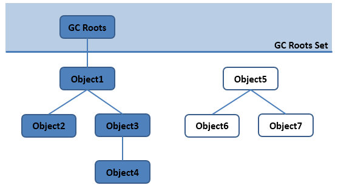
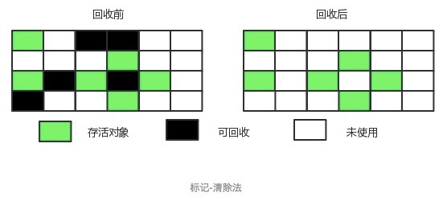
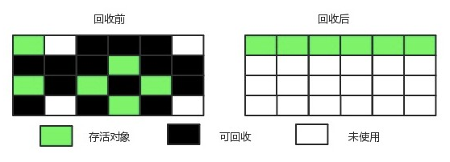
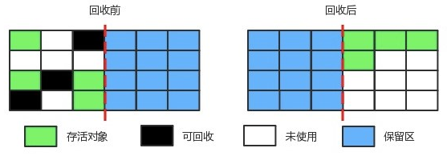

* [运行时数据区域运行时数据区域](#运行时数据区域)
    * [程序计数器](#程序计数器)
    * [Java虚拟机栈](#Java虚拟机栈)
    * [本地方法栈](#本地方法栈)
    * [Java堆](#Java堆)
    * [方法区](#方法区)
    * [运行时常量区](#运行时常量区)
    * [直接内存](#直接内存)
* [垃圾收集](#垃圾收集)
    * [判断一个对象是否可以被回收](#判断一个对象是否可以被回收)
    * [垃圾收集算法](#垃圾收集算法)

# 运行时数据区域

## 程序计数器
程序计数器(Program Counter Register)记录的是正在执行的虚拟机字节码指令的地址；
如果执行的是本地(Native)方法，这个计数器的值为空(Undefined)。

特点：
- 此内存区域是唯一一个在Java虚拟机规范中没有规定任何OutOfMemoryError情况的区域。
- 线程私有

## Java虚拟机栈
每个方法在执行的同时会创建一个栈帧(Stack Frame)用于存储局部变量、操作数栈、动态链接、方法出口等信息。每一个方法从调用直至执行完成的过程，就对应着一个栈帧在虚拟机栈中入栈到出栈的过程。


可以通过-Xss这个虚拟机参数来指定每个线程的Java虚拟机栈内存的大小
``` bash
java -Xss512M JackTheJava
```
局部变量表：存放了编译期可知的各种基本数据类型(boolean,byte,char,short,int,float,long,double)。对象引用(reference类型，不等同于对象本身，可能只是一个指向对象起始地址的指针)

该区域规定了两种异常情况：
- 如果线程请求的栈深度大于虚拟机所允许的最大深度，则抛出StackOverflow异常
- 栈内存进行动态扩展时无法申请到足够的内存，则抛出OutOfMemory异常

## 本地方法栈
本地方法栈(Native Method Stack)与Java虚拟机栈作用类似。区别是，Java虚拟机栈为虚拟机执行Java方法(字节码)服务，本地方法栈则为虚拟机使用到的Native方法服务。
本地方法栈也会抛出StackOverflow、OutOfMemory异常

## Java堆
几乎所有的对象都在这里分配内存，是垃圾收集的主要区域(“GC堆”)
现代的垃圾收集器基本上都采用分代收集算法，其主要的思想是针对不同类型的对象采取不同的垃圾回收算法，可以将堆分成两块
- 新生代(Young Gerneration)
- 老年代(Old Gerneration)

堆不需要连续内存，只要是逻辑上连续即可，并且可以动态增加内存大小（通过-Xmx和-Xms控制）
``` java
java -Xmx512M -Xms1024M HackTheJava // 第一个参数设置堆内存的初始值，第二个设置最大值
```
如果在堆中没有内存完成对象的内存分配，且无法再扩展堆内存时，将会抛出OutOfMemory异常

## 方法区
方法区(Method Area)与Java堆一样，是线程共享的区域，它用于存储已被虚拟机加载的类信息，常亮，静态变量，即时编译器编译后的代码等数据。
不需要连续的内存，并且可以动态扩展，动态扩展失败一样会抛出 OutOfMemoryError 异常。

对这块区域进行垃圾回收的主要目标是对常量池的回收和对类的卸载，但是一般比较难实现。

HotSpot虚拟机把它当成永久代来进行垃圾回收。但是很难确定永久代的大小，因为它受到很多因素影响，并且每次 Full GC 之后永久代的大小都会改变，所以经常会抛出 OutOfMemoryError 异常。为了更容易管理方法区，从 JDK 1.8 开始，移除永久代，并把方法区移至元空间，它位于本地内存中，而不是虚拟机内存中。

## 运行时常量池
方法区的一部分，用于存放用于存放编译器生成的各种字面量和符号引用，这部分将在类加载后进入方法区的运行时常量池中存放。

## 直接内存
在 JDK 1.4 中新加入了 NIO 类，它可以使用 Native 函数库直接分配堆外内存（Native 堆），然后通过一个存储在 Java 堆里的 DirectByteBuffer 对象作为这块内存的引用进行操作。

这样能在一些场景中显著提高性能，因为避免了在 Java 堆和 Native 堆中来回复制数据。

-------------------------

# 垃圾收集
垃圾收集主要是针对堆和方法区进行。

程序计数器、虚拟机栈和本地方法栈这三个区域属于线程私有的，只存在于线程的生命周期内，线程结束之后也会消失，因此不需要对这三个区域进行垃圾回收。

## 判断一个对象是否可以被回收
### 引用计数法
给对象添加一个引用计数器，当对象增加一个引用时计数器加 1，引用失效时计数器减 1。引用计数为 0 的对象可被回收。但是无法解决循环引用的问题。
```java
public class ReferenceCountingGC {

    public Object instance = null;

    public static void main(String[] args) {
        ReferenceCountingGC objectA = new ReferenceCountingGC();
        ReferenceCountingGC objectB = new ReferenceCountingGC();
        objectA.instance = objectB;
        objectB.instance = objectA;
    }
}
```
### 可达性分析算法
通过 GC Roots 作为起始点进行搜索，能够到达到的对象都是存活的，不可达的对象可被回收。
<div align="center"></div>

可作为GC Root的对象包括下面几种：
- 虚拟机栈中引用的对象。
- 方法区中静态属性引用的对象。
- 方法区中常量引用的对象
- 本地方法栈中JNI引用的对象。

简而言之，就是用户能够通过代码引用到的对象都可以作为GC Root。

### 方法区回收
方法区中的对象一般都是永久代中的，其垃圾收集主要回收废弃常量和无用的类。

要判定一个类是“无用的”，必须同时满足以下条件：
- 该类的所有对象都已经被回收。
- 加载该类的ClassLoder被回收。
- 该类对应的java.lang.Class对象没有在任何地方被引用，无法在任何地方通过反射访问该类的方法。

在大量使用反射、动态代理、CGLib 等 ByteCode 框架、动态生成 JSP 以及 OSGi 这类频繁自定义 ClassLoader 的场景都需要虚拟机具备类卸载功能，以保证不会出现内存溢出。

## 垃圾收集算法
### 标记-清除
<div align="center"></div>

将存存活的对象进行标记，然后清理掉未标记的对象。

缺点：
- 标记和清除的效率都很低。
- 会产生大量不连续的内存碎片，导致无法给大对象分配内存。

### 标记-整理
<div align="center"></div>

将所有存活的对象移到前端，然后直接清理掉边界以外的内存。

### 复制
<div align="center"></div>

将内存划分为大小相等的两块，每次只使用其中一块，当这一块内存用完了就将还存活的对象复制到另一块上面，然后再把使用过的内存空间进行一次清理。

主要不足是只使用了内存的一半。

现在的商业虚拟机都采用这种收集算法来回收新生代，但是并不是将新生代划分为大小相等的两块，而是分为一块较大的 Eden 空间和两块较小的 Survivor 空间，每次使用 Eden 空间和其中一块 Survivor。在回收时，将 Eden 和 Survivor 中还存活着的对象一次性复制到另一块 Survivor 空间上，最后清理 Eden 和使用过的那一块 Survivor。

HotSpot 虚拟机的 Eden 和 Survivor 的大小比例默认为 8:1，保证了内存的利用率达到 90%。如果每次回收有多于 10% 的对象存活，那么一块 Survivor 空间就不够用了，此时需要依赖于老年代进行分配担保，也就是借用老年代的空间存储放不下的对象。

### 分代收集
现在的商业虚拟机采用分代收集算法，它根据对象存活周期将内存划分为几块，不同块采用适当的收集算法。

一般将堆分为新生代和老年代。
- 新生代：复制算法。
- 老年代：标记-清除或者标记-整理算法。
