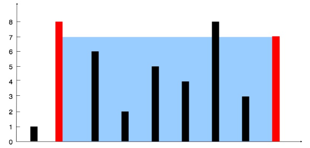
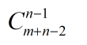

# LeetCode Top100 stars :fountain_pen:

* [1 两数之和](#1-两数之和)
* [2 两数相加](#2-两数相加)
* [3 无重复字符的最长子串](#3-无重复字符的最长子串)
* [4 最长的回文子串](#4-最长的回文子串)
* [14. 最长公共前缀](#14.-最长公共前缀)
* [15. 三数之和](#15.-三数之和)
* [17. 电话号码的字母组合](#17.-电话号码的字母组合)
* [19. 删除链表的倒数第N个节点](#19.-删除链表的倒数第N个节点)
* [20 有效的括号](#20-有效的括号)
* [21 合并两个有序链表](#21-合并两个有序链表)
* [22. 括号生成](#22.-括号生成)
* [23. 合并K个排序链表](#23.-合并K个排序链表)
* [27. 移除元素](#27.-移除元素)
* [28. 实现strStr()](#28.-实现strStr())
* [33. 搜索旋转排序数组](#33.-搜索旋转排序数组)
* [34. 在排序数组中查找元素的第一个和最后一个位置](#34.-在排序数组中查找元素的第一个和最后一个位置)
* [39. 组合总和](#39.-组合总和)
* [49. 字母异位词分组](#49.-字母异位词分组)
* [55. 跳跃游戏](#55.-跳跃游戏)
* [56. 合并区间](#56.-合并区间)
* [58. 最后一个单词的长度](#58.-最后一个单词的长度)
* [62. 不同路径](#62.-不同路径)
* [64. 最小路径和](#64.-最小路径和)
* [69. x 的平方和](#69.-x-的平方和)
* [75. 颜色分类](#75.-颜色分类)
* [78. 子集](#78.-子集)
* [79. 单词搜索](#79.-单词搜索)
* [83. 删除排序链表中的重复元素](#83.-删除排序链表中的重复元素)
* [88. 合并两个有序数组](#88.-合并两个有序数组)
* [94. 二叉树的中序遍历](#94.-二叉树的中序遍历)
* [96. 不同的二叉搜索树](#96.-不同的二叉搜索树)
* [98. 验证二叉搜索树](#98.-验证二叉搜索树)
* [100. 相同的树](#100.-相同的树)
* [101. 对称二叉树](#101.-对称二叉树)
* [104 二叉树的最大深度](#104-二叉树的最大深度)
* [121 买卖股票的最佳时机](#121-买卖股票的最佳时机)
* [136 只出现一次的数字](#136-只出现一次的数字)
* [141 环形链表](#141-环形链表)
* [155 最小栈](#155-最小栈)
* [166 相交链表](#166-相交链表)
* [198 打家劫舍](#198打家劫舍)
* [234 回文链表](#234-回文链表)
* [283 移动零](#283-移动零)
* [437 路径总和](#437-路径总和)
* [438 找到字符串中所有字母异位词](#438-找到字符串中所有字母异位词)
* [461 汉明距离](#461-汉明距离)
* [448 找到所有数组中消失的数字](#448-找到所有数组中消失的数字)
* [538 把二叉搜索树转换为累加树](#538-把二叉搜索树转换为累加树)
* [543 二叉树的直径](#543-二叉树的直径)
* [572 另一个树的子树](#572-另一个树的子树)
* [581. 最短无序连续子数组](#581.-最短无序连续子数组)
* [617. 合并二叉树](#617.-合并二叉树)
* [771. 宝石与石头](#771.-宝石与石头)

--------------------

## [1 两数之和](https://leetcode-cn.com/problems/two-sum/)

### 题目描述-Easy

给定一个整数数组 nums 和一个目标值 target，请你在该数组中找出和为目标值的那 两个 整数，并返回他们的数组下标。

你可以假设每种输入只会对应一个答案。但是，你不能重复利用这个数组中同样的元素。

    示例:
    
    给定 nums = [2, 7, 11, 15], target = 9
    
    因为 nums[0] + nums[1] = 2 + 7 = 9
    所以返回 [0, 1]

### 解题思路
用过的数字保存在map里面。
```java
public int[] twoSum(int[] nums, int target) {
    Map<Integer, Integer> map = new HashMap<>();
    for (int i = 0; i < nums.length; i++) {
        int temp = target - nums[i];
        if (map.containsKey(temp))
            return new int[]{map.get(temp), i};
        else
            map.put(nums[i], i);
    }
    return null;
}
```
## [2-两数相加](https://leetcode-cn.com/problems/add-two-numbers/)

### 题目描述

给出两个 非空 的链表用来表示两个非负的整数。其中，它们各自的位数是按照 逆序 的方式存储的，并且它们的每个节点只能存储 一位 数字。

如果，我们将这两个数相加起来，则会返回一个新的链表来表示它们的和。

您可以假设除了数字 0 之外，这两个数都不会以 0 开头。

    示例：
    
    输入：(2 -> 4 -> 3) + (5 -> 6 -> 4)
    输出：7 -> 0 -> 8
    原因：342 + 465 = 807

### 解题思路

遍历链表，时间复杂度`O(N)`
```java
public ListNode addTwoNumbers(ListNode l1, ListNode l2) {
    if (l1 == null && l2 != null)
        return l2;
    if (l1 != null && l2 == null)
        return l1;
    if (l1 == null && l2 == null)
        return null;

    int carry = 0;
    ListNode result = null;
    ListNode current = result;

    while (l1 != null || l2 != null) {
        int num1 = l1 != null ? l1.val : 0;
        int num2 = l2 != null ? l2.val : 0;
        int sum = carry + num1 + num2;

        ListNode newNode = new ListNode(sum % 10);
        carry = sum / 10;
        if (result == null)
            result = newNode;
        else
            current.next = newNode;
        current = newNode;
        if (l1 != null)  l1 = l1.next;
        if (l2 != null)  l2 = l2.next;
    }
    if (carry > 0)
        current.next = new ListNode(carry);
    return result;
}
```
## [3 无重复字符的最长子串](https://leetcode-cn.com/problems/longest-substring-without-repeating-characters/)

### 题目描述

给定一个字符串，请你找出其中不含有重复字符的 最长子串 的长度。

    示例 1:
    
    输入: "abcabcbb"
    输出: 3
    解释: 因为无重复字符的最长子串是 "abc"，所以其长度为 3。
    示例 2:
    
    输入: "bbbbb"
    输出: 1
    解释: 因为无重复字符的最长子串是 "b"，所以其长度为 1。
    示例 3:
    
    输入: "pwwkew"
    输出: 3
    解释: 因为无重复字符的最长子串是 "wke"，所以其长度为 3。
         请注意，你的答案必须是 子串 的长度，"pwke" 是一个子序列，不是子串。
### 解题思路
```java
public int lengthOfLongestSubstring(String s) {
        if (s.length() == 0 || s == null)
            return 0;
        char[] chars = s.toCharArray();
        int length = 1;
        int left = 0;
        int right = 0;

        for (; right < chars.length; right++) {
            for (int index = left; index < right; index++) {
                if (chars[index] == chars[right]) {
                    length = length > right - left ? length : right - left;
                    left = index + 1;
                    break;
                }
            }
        }
        length = length > right - left ? length : right - left;
        return length;
    }
```

## [4 最长的回文子串](https://leetcode-cn.com/problems/longest-palindromic-substring/)

### 题目描述

给定一个字符串 `s`，找到 `s` 中最长的回文子串。你可以假设 `s` 的最大长度为 1000。

**示例 1：**

```
输入: "babad"
输出: "bab"
注意: "aba" 也是一个有效答案。
```

**示例 2：**

```
输入: "cbbd"
输出: "bb"
```

### 解题思路

## [11. 盛最多水的容器](https://leetcode-cn.com/problems/container-with-most-water/)

### 题目描述

给定 *n* 个非负整数 *a*1，*a*2，...，*a*n，每个数代表坐标中的一个点 (*i*, *ai*) 。在坐标内画 *n* 条垂直线，垂直线 *i* 的两个端点分别为 (*i*, *ai*) 和 (*i*, 0)。找出其中的两条线，使得它们与 *x* 轴共同构成的容器可以容纳最多的水。

**说明：**你不能倾斜容器，且 *n* 的值至少为 2。

<div align="center"></div>

图中垂直线代表输入数组 [1,8,6,2,5,4,8,3,7]。在此情况下，容器能够容纳水（表示为蓝色部分）的最大值为 49。

### 解题思路

```java
public int maxArea(int[] height) {
    int max = 0;
    int left = 0, right = height.length - 1;
    while (left < right) {
        max = Math.max(max, Math.min(height[left], height[right]) * (right - left));
        if (height[left] < height[right])
            left++;
        else
            right--;
    }
    return max;
}
```

## 14. 最长公共前缀

### [题目描述](https://leetcode-cn.com/problems/longest-common-prefix/)

编写一个函数来查找字符串数组中的最长公共前缀。

如果不存在公共前缀，返回空字符串 `""`。

**示例 1:**

```
输入: ["flower","flow","flight"]
输出: "fl"
```

**示例 2:**

```
输入: ["dog","racecar","car"]
输出: ""
解释: 输入不存在公共前缀。
```

**说明:**

所有输入只包含小写字母 `a-z` 。

### 解题思路

```java
public String longestCommonPrefix(String[] strs) {
    if (strs.length == 0 || null == strs)
        return "";
    if (strs.length == 1)	// 特殊情况
        return strs[0];
    String subString;	// 记录最小公共前缀
    int minLengthIndex = strs[0].length();
    int index = 0;  
    for (int i = 1; i < strs.length; i++) {		// 先找到最短的字符串
        if (minLengthIndex > strs[i].length()) {
            minLengthIndex = strs[i].length();
            index = i;
        }
    }
    swap(strs, index);	// 与第一个字符串交换位置，防止后面重复比较
    for (int i = strs[0].length(); i > 0; i--) {  // 依次求最短字符串的子串
        subString = strs[0].substring(0, i);
        for (int j = 1; j < strs.length; j++) {	// 与所有的其它字符串对应子串比较
            if (!subString.equals(strs[j].substring(0, i)))  // 遇到不一样的直接调出
                break;
            if (subString.equals(strs[j].substring(0, i)) && j == strs.length - 1)
                return subString;  // 只有子串相等，且已经遍历到最后一个字符串才算成功找到
        }
    }
    return "";
}

private void swap(String[] strs, int j) {
    String temp = strs[0];
    strs[0] = strs[j];
    strs[j] = temp;
}
```


## [15. 三数之和](https://leetcode-cn.com/problems/3sum/)

### 题目描述

给定一个包含 *n* 个整数的数组 `nums`，判断 `nums` 中是否存在三个元素 *a，b，c ，*使得 *a + b + c =* 0 ？找出所有满足条件且不重复的三元组。

**注意：**答案中不可以包含重复的三元组。

```
例如, 给定数组 nums = [-1, 0, 1, 2, -1, -4]，

满足要求的三元组集合为：
[
  [-1, 0, 1],
  [-1, -1, 2]
]
```

### 解题思路

该解法的时间复杂度为 O(N<sup>2</sup>)

```java
public List<List<Integer>> threeSum(int[] nums) {
    List<List<Integer>> lists = new ArrayList<>();
    Arrays.sort(nums);
    if (nums == null || nums.length == 0 || nums[0] >= 0)
        return lists;
    for (int i = 0; i < nums.length; i++) {
        int left = i + 1, right = nums.length - 1;
        int target = -nums[i];
        if (i > 0 && nums[i] == nums[i - 1])   // 判断相邻2个数是否重复
            continue;
        while (left < right) {
            List<Integer> list = new ArrayList<>();
            if (nums[left] + nums[right] == target) {
                list.add(nums[i]);
                list.add(nums[left]);
                list.add(nums[right]);
                lists.add(list);
                while (left < right && nums[left] == nums[left + 1]) left++;
                while (left < right && nums[right] == nums[right - 1]) right--;
                left++;
                right--;
            } else if (nums[left] + nums[right] > target) {
                right--;
            } else {
                left++;
            }
        }
    }
    return lists;
}
```

## 17. 电话号码的字母组合

### [题目描述](https://leetcode-cn.com/problems/letter-combinations-of-a-phone-number/)

给定一个仅包含数字 `2-9` 的字符串，返回所有它能表示的字母组合。

给出数字到字母的映射如下（与电话按键相同）。注意 1 不对应任何字母。

<div align="center"></div>

**示例:**

```
输入："23"
输出：["ad", "ae", "af", "bd", "be", "bf", "cd", "ce", "cf"].
```

**说明:**
尽管上面的答案是按字典序排列的，但是你可以任意选择答案输出的顺序。

### 解题思路
```java
public List<String> letterCombinations(String digits) {
    List<String> list = new ArrayList<>();
    int length = digits.length();
    String[] s = new String[length];
    if (s.length == 0)
        return list;
    for (int i=0; i<length; i++) {
        switch (digits.charAt(i)) {
            case '2' : s[i] = "abc";    break;
            case '3' : s[i] = "def";    break;
            case '4' : s[i] = "ghi";    break;
            case '5' : s[i] = "jkl";    break;
            case '6' : s[i] = "mno";    break;
            case '7' : s[i] = "pqrs";   break;
            case '8' : s[i] = "tuv";    break;
            case '9' : s[i] = "wxyz";    break;
        }
    }
    list = getStringWithFor(s, 0, list, "");
    return list;
}
private List<String> getStringWithFor(String[] s, int i, List<String> list, String temp) {
    if (i < s.length - 1) {
        for (int j=0; j<s[i].length(); j++) {
            list = getStringWithFor(s, i+1, list, temp + s[i].charAt(j));
        }
        i++;
    }
    else {
        for (int j=0; j<s[i].length(); j++) {
            list.add(temp + s[i].charAt(j));
        }
    }
    return list;
}
```

## 19. 删除链表的倒数第N个节点

### [题目描述](https://leetcode-cn.com/problems/remove-nth-node-from-end-of-list/)

给定一个链表，删除链表的倒数第 *n* 个节点，并且返回链表的头结点。

**示例：**

```
给定一个链表: 1->2->3->4->5, 和 n = 2.

当删除了倒数第二个节点后，链表变为 1->2->3->5.
```

**说明：**

给定的 *n* 保证是有效的。

**进阶：**

你能尝试使用一趟扫描实现吗？

### 解题思路

快慢指针的方法，类似于求链表倒数第 K 个数。

```java
public ListNode removeNthFromEnd(ListNode head, int n) {
    if (head == null || n <= 0)
        return null;

    ListNode fast = head;	// 快指针
    ListNode slow = head;	// 慢指针
    // 不管链表是否走到尽头，都走完 n 步
    for (int i=0; i<n; i++) {
        fast = fast.next;
    }
    // 如果走完 n 步之后，fast == null, 说明需要删除的节点是头结点
    if (fast == null)
        return head.next;
    // 如果走完 n 步之后，fast != null，继续遍历
    while (fast.next != null) {
        fast = fast.next;
        slow = slow.next;
    }
    // 如果 slow.next 越界，则说明删除的节点是链表最后一个
    slow.next = slow.next.next;
    return head;
}
```


## [20 有效的括号](https://leetcode-cn.com/problems/valid-parentheses/)

### 题目描述

给定一个只包括 '('，')'，'{'，'}'，'['，']' 的字符串，判断字符串是否有效。

有效字符串需满足：

左括号必须用相同类型的右括号闭合。
左括号必须以正确的顺序闭合。
注意空字符串可被认为是有效字符串。

    示例 1:
    
    输入: "()"
    输出: true
    示例 2:
    
    输入: "()[]{}"
    输出: true
    示例 3:
    
    输入: "(]"
    输出: false
    示例 4:
    
    输入: "([)]"
    输出: false
    示例 5:
    
    输入: "{[]}"
    输出: true

### 解题思路

```java
public boolean isValid(String s) {
    if (s.length() % 2 != 0)
        return false;
    Stack<Character> stack = new Stack<>();
    for (int i=0; i<s.length(); i++){
        char c = s.charAt(i);
        switch (c){
            case '(' :
            case '[' :
            case '{' :
                stack.push(c);
                break;
            case ')' :
            case ']' :
            case '}' :
                if (!stack.empty()){
                    char pop = stack.pop();
                    if (c == '}' && pop != '{' || c == ']' && pop != '[' ||c == ')' && pop != '(')
                        return false;
                }else
                    return false;
                break;
        }
    }
    return stack.empty() ? true : false;
}
```
## [21-合并两个有序链表](https://leetcode-cn.com/problems/merge-two-sorted-lists/)

## 题目描述
将两个有序链表合并为一个新的有序链表并返回。新链表是通过拼接给定的两个链表的所有节点组成的。

    示例：
    
    输入：1->2->4, 1->3->4
    输出：1->1->2->3->4->4

### 解题思路
空间换时间
```java
 public ListNode mergeTwoLists(ListNode l1, ListNode l2) {
    // 类似归并排序中的合并过程
    ListNode dummyHead = new ListNode(0);
    ListNode cur = dummyHead;
    while (l1 != null && l2 != null) {
        if (l1.val < l2.val) {
            cur.next = l1;
            cur = cur.next;
            l1 = l1.next;
        } else {
            cur.next = l2;
            cur = cur.next;
            l2 = l2.next;
        }
    }
    // 任一为空，直接连接另一条链表
    if (l1 == null) {
        cur.next = l2;
    } else {
        cur.next = l1;
    }
    return dummyHead.next;
}
```
## 22. 括号生成
### [题目描述](https://leetcode-cn.com/problems/generate-parentheses/)
给出 n 代表生成括号的对数，请你写出一个函数，使其能够生成所有可能的并且有效的括号组合。

    例如，给出 n = 3，生成结果为：
    
    [
      "((()))",
      "(()())",
      "(())()",
      "()(())",
      "()()()"
    ]
### 解题思路
```java
public List<String> generateParenthesis(int n) {
    List<String> list = new ArrayList<>();
    String str = new String();
    generate(list, str, n, n);
    return list;
}
public void generate(List<String> list, String str, int left, int right) {
    if (left == 0 && right == 0) {
        list.add(str);
        return;
    }
    if (left > 0) {
        generate(list, str + '(', left - 1, right);
    }
    if (right > left) {
        generate(list, str + ')', left, right - 1);
    }
}
```
## 23. 合并K个排序链表

### [题目描述](https://leetcode-cn.com/problems/merge-k-sorted-lists/)

合并 *k* 个排序链表，返回合并后的排序链表。请分析和描述算法的复杂度。

**示例:**

```
输入:
[
  1->4->5,
  1->3->4,
  2->6
]
输出: 1->1->2->3->4->4->5->6
```

### 解题思路

归并的思路，每次两个链表进行归并。

```java
public ListNode mergeKLists(ListNode[] lists) {
    if (lists == null || lists.length == 0) return null;
    int left = 0, right = lists.length - 1;
    while (left < right) {
        int mid = (left + right - 1) / 2;
        for (int i=0; i<=mid; i++) {
            lists[i] = mergeTwo(lists[i], lists[right - i]);
        }
        right = (left + right) / 2;
    }
    return lists[0];
}

private ListNode mergeTwo(ListNode l1, ListNode l2) {
    if (l1 == null && l2 == null) return null;
    if (l1 == null && l2 != null) return l2;
    if (l1 != null && l2 == null) return l1;
    ListNode result = new ListNode(-1);
    ListNode cur = result;

    while (l1 != null && l2 != null) {
        if (l1.val > l2.val) {
            cur.next = l2;
            cur = l2;
            l2 = l2.next;
        } else {
            cur.next = l1;
            cur = l1;
            l1 = l1.next;
        }
    }
    if (l1 != null)     cur.next = l1;
    if (l2 != null)     cur.next = l2;
    return result.next;
}
```

## 27. 移除元素

### [题目描述](https://leetcode-cn.com/problems/remove-element/)

给定一个数组 *nums* 和一个值 *val*，你需要**原地**移除所有数值等于 *val* 的元素，返回移除后数组的新长度。

不要使用额外的数组空间，你必须在**原地修改输入数组**并在使用 O(1) 额外空间的条件下完成。

元素的顺序可以改变。你不需要考虑数组中超出新长度后面的元素。

**示例 1:**

```
给定 nums = [3,2,2,3], val = 3,

函数应该返回新的长度 2, 并且 nums 中的前两个元素均为 2。

你不需要考虑数组中超出新长度后面的元素。
```

**示例 2:**

```
给定 nums = [0,1,2,2,3,0,4,2], val = 2,

函数应该返回新的长度 5, 并且 nums 中的前五个元素为 0, 1, 3, 0, 4。

注意这五个元素可为任意顺序。

你不需要考虑数组中超出新长度后面的元素。
```

### 解题思路

双指针，如果左指针遇到 val，且右指针不是 val，则交换。

```java
public int removeElement(int[] nums, int val) {
    if (null == nums || nums.length == 0)
        return 0;

    int cnt = 0;
    int left = 0, right = nums.length - 1;

    while (left <= right) {
        if (nums[left] != val) {
            cnt++;
            left++;
        }
        else {
            if (nums[right] == val) {
                right--;
            }
            else {
                swap(nums, left, right);
                cnt++;
                left++;
            }
        }
    }
    return cnt;
}
private void swap(int[] nums, int i, int j) {
    int temp = nums[i];
    nums[i] = nums[j];
    nums[j] = temp;
}
```

## 28. 实现strStr()

### [题目描述](https://leetcode-cn.com/problems/implement-strstr/)

实现 [strStr()](https://baike.baidu.com/item/strstr/811469) 函数。

给定一个 haystack 字符串和一个 needle 字符串，在 haystack 字符串中找出 needle 字符串出现的第一个位置 (从0开始)。如果不存在，则返回  **-1**。

**示例 1:**

```
输入: haystack = "hello", needle = "ll"
输出: 2
```

**示例 2:**

```
输入: haystack = "aaaaa", needle = "bba"
输出: -1
```

### 解题思路

```java
public int strStr(String haystack, String needle) {
    if ("".equals(needle))
        return 0;
    if ("".equals(haystack))
        return -1;
    for (int i=0; i<haystack.length(); i++) {
        // 判断第一个字符是否相等
        if (haystack.charAt(i) == needle.charAt(0)) {
            // 确保后续长度＞子
            if (haystack.length() - i >= needle.length())
                if (haystack.substring(i, i + needle.length()).equals(needle))
                    return i;
        }
    }
    return -1;
}
```


## 33. 搜索旋转排序数组

### [题目描述](https://leetcode-cn.com/problems/search-in-rotated-sorted-array/)

假设按照升序排序的数组在预先未知的某个点上进行了旋转。

( 例如，数组 `[0,1,2,4,5,6,7]` 可能变为 `[4,5,6,7,0,1,2]` )。

搜索一个给定的目标值，如果数组中存在这个目标值，则返回它的索引，否则返回 `-1` 。

你可以假设数组中不存在重复的元素。

你的算法时间复杂度必须是 *O*(log *n*) 级别。

**示例 1:**

```
输入: nums = [4,5,6,7,0,1,2], target = 0
输出: 4
```

**示例 2:**

```
输入: nums = [4,5,6,7,0,1,2], target = 3
输出: -1
```

### 解题思路

将数组一分为二，其中一定有一个是有序的，另一个可能是有序，也能是部分有序。此时有序部分用二分法查找。无序部分再一分为二，其中一个一定有序，另一个可能有序，可能无序。就这样循环。

```java
public int search(int[] nums, int target) {
    if (nums == null || nums.length == 0)  return -1;
    int left = 0, right = nums.length - 1;
    while (left <= right) {
        int mid = (left + right) / 2;
        if (nums[mid] == target)    return mid;
        if (nums[left] <= nums[mid]) {
            if (nums[left] <= target && target <= nums[mid]) {
                right = mid - 1;
            } else {
                left = mid + 1;
            }
        } else {
            if (nums[mid] <= target && target <= nums[right]) {
                left = mid + 1;
            } else {
                right = mid - 1;
            }
        }
    }
    return -1;
}
```

## 34. 在排序数组中查找元素的第一个和最后一个位置

### [题目描述](https://leetcode-cn.com/problems/find-first-and-last-position-of-element-in-sorted-array/)

给定一个按照升序排列的整数数组 `nums`，和一个目标值 `target`。找出给定目标值在数组中的开始位置和结束位置。

你的算法时间复杂度必须是 *O*(log *n*) 级别。

如果数组中不存在目标值，返回 `[-1, -1]`。

**示例 1:**

```
输入: nums = [5,7,7,8,8,10], target = 8
输出: [3,4]
```

**示例 2:**

```
输入: nums = [5,7,7,8,8,10], target = 6
输出: [-1,-1]
```

### 解题思路


```java
public int[] searchRange(int[] nums, int target) {
    int[] num = new int[2];
    int ans = -1;
    if(nums.length != 0){//数组不为空才执行
        ans = search(nums,0,nums.length-1,target);
    }
    int i=0,j=0;
    if(ans != -1){
        i=ans;
        j=ans;
        while(i>=0 && nums[i]==target) i--;//循环找头位置
        while(j<nums.length && nums[j]==target)j++;//循环找结束位置
        num[0]=i+1;
        num[1]=j-1;
    } else{
        num[0]=-1;
        num[1]=-1;
    }
    return num;
}
private int search(int[] nums, int left, int right, int target) {
    if (nums == null || nums.length == 0 || nums[left] > target || nums[right] < target)   return -1;
    int mid = (left + right) / 2;

    if (nums[mid] == target) {
        return mid;
    } else if (nums[mid] > target) {
        return search(nums, left, mid - 1, target);
    } else {
        return search(nums, mid + 1,right, target);
    }
}
```

## 39. 组合总和

### [题目描述](https://leetcode-cn.com/problems/combination-sum/)

给定一个**无重复元素**的数组 `candidates` 和一个目标数 `target` ，找出 `candidates` 中所有可以使数字和为 `target` 的组合。

`candidates` 中的数字可以无限制重复被选取。

**说明：**

- 所有数字（包括 `target`）都是正整数。
- 解集不能包含重复的组合。 

**示例 1:**

```
输入: candidates = [2,3,6,7], target = 7,
所求解集为:
[
  [7],
  [2,2,3]
]
```

**示例 2:**

```tex
输入: candidates = [2,3,5], target = 8,
所求解集为:
[
  [2,2,2,2],
  [2,3,3],
  [3,5]
]
```

### 解题思路

```java
public List<List<Integer>> combinationSum(int[] candidates, int target) {
    List<List<Integer>> list = new ArrayList<>();
    if (candidates == null) 
        return list;
    Arrays.sort(candidates);
    List<Integer> li = new ArrayList<>();
    int index = 0;
    if (candidates.length == 0 || target < candidates[0])
        return list;
    putNum(candidates, target, index, list, li);
    return list;
}
private void putNum(int[] candidates, int leaveTarget, int index, List<List<Integer>> list,
                    List<Integer> li) {
    if (index >= candidates.length) 
        return;
    // 判断是否大于剩余目标
    if (leaveTarget < candidates[index]) 
        return;
    if (leaveTarget == candidates[index]) {
        li.add(candidates[index]);
        ArrayList<Integer> arr = new ArrayList<Integer>();
        for (int k : li) 
            arr.add(k);
        list.add(arr);
        li.remove(li.size() - 1);
        return;
    }
    li.add(candidates[index]);
    leaveTarget -= candidates[index];
    putNum(candidates, leaveTarget, index, list, li);
    li.remove(li.size() - 1);
    leaveTarget += candidates[index];
    putNum(candidates, leaveTarget, index + 1, list, li);
    return;
}
```

## 49. 字母异位词分组

### [题目描述](https://leetcode-cn.com/problems/group-anagrams/)

给定一个字符串数组，将字母异位词组合在一起。字母异位词指字母相同，但排列不同的字符串。

**示例:**

```
输入: ["eat", "tea", "tan", "ate", "nat", "bat"],
输出:
[
  ["ate","eat","tea"],
  ["nat","tan"],
  ["bat"]
]
```

**说明：**

- 所有输入均为小写字母。
- 不考虑答案输出的顺序。

### 解题思路

```java
public List<List<String>> groupAnagrams(String[] strs) {
    List<List<String>> lists = new ArrayList<>();
    if (strs == null || strs.length == 0)     return lists;

    String[] s = new String[strs.length];   // 用来存储排序过后的 strs
    // 给 strs 里面的每个子串排序
    for (int i=0; i<strs.length; i++) {
        char[] temp = strs[i].toCharArray();
        Arrays.sort(temp);
        s[i] = new String(temp);
    }
    int num = 0;
    Map<String, Integer> map = new HashMap<>();
    // 统计有多少种类
    for (int i=0; i<s.length; i++) {
        if (!map.containsKey(s[i])) {
            map.put(s[i], num++);
        }
    }
    // 建容器
    for (int i=0; i<num; i++) {
        lists.add(new ArrayList());
    }

    for (int i=0; i<s.length; i++) {
        lists.get(map.get(s[i])).add(strs[i]);
    }

    return lists;
}
```

## 55. 跳跃游戏

### [题目描述](https://leetcode-cn.com/problems/jump-game/)

给定一个非负整数数组，你最初位于数组的第一个位置。

数组中的每个元素代表你在该位置可以跳跃的最大长度。

判断你是否能够到达最后一个位置。

**示例 1:**

```
输入: [2,3,1,1,4]
输出: true
解释: 从位置 0 到 1 跳 1 步, 然后跳 3 步到达最后一个位置。
```

**示例 2:**

```
输入: [3,2,1,0,4]
输出: false
解释: 无论怎样，你总会到达索引为 3 的位置。但该位置的最大跳跃长度是 0 ， 所以你永远不可能到达最后一个位置。
```

### 解题思路

从后向前遍历，如果`nums[i] >= n`则证明能够到达，否则距离`n++`。

```java
public boolean canJump(int[] nums) {
    if (nums == null || nums.length == 0)   return false;
    int n = 1;
    for (int i=nums.length-2; i>=0; i--) {
        if (nums[i] >= n)
            n = 1;
        else
            n++;
        if (i == 0 && n > 1)
            return false;
    }
    return true;
}
```

## 56. 合并区间

### [题目描述](https://leetcode-cn.com/problems/merge-intervals/)

给出一个区间的集合，请合并所有重叠的区间。

**示例 1:**

```
输入: [[1,3],[2,6],[8,10],[15,18]]
输出: [[1,6],[8,10],[15,18]]
解释: 区间 [1,3] 和 [2,6] 重叠, 将它们合并为 [1,6].
```

**示例 2:**

```
输入: [[1,4],[4,5]]
输出: [[1,5]]
解释: 区间 [1,4] 和 [4,5] 可被视为重叠区间。
```

### 解题思路

先将原来 list 中的对象根据 `start` 关键字排序，这样可以防止后面合并不到的情况。

```java
class IntervalsComparator implements Comparator<Interval>
{
    public int compare(Interval i1,Interval i2)
    {
       return i1.start-i2.start;
    }
}
public List<Interval> merge(List<Interval> intervals) {
    if (intervals == null || intervals.size() == 0) return intervals;

    Collections.sort(intervals, new IntervalsComparator()); // 对原 list 先排序
    List<Interval> list = new ArrayList<>();    // 存放结果
    Interval temp = intervals.get(0);   // 存放合并后的一个小并集

    for (int i=1; i<intervals.size(); i++) {
        if (temp.end >= intervals.get(i).start && temp.start <= intervals.get(i).end) {
            int start, end;
            start = temp.start > intervals.get(i).start ? intervals.get(i).start : temp.start;
            end = temp.end > intervals.get(i).end ? temp.end : intervals.get(i).end;
            temp = new Interval(start, end);

        } else {
            list.add(temp);
            temp = intervals.get(i);
        }
    }
    list.add(temp);
    return list;
}
```

## 58. 最后一个单词的长度

### [题目描述](https://leetcode-cn.com/problems/length-of-last-word/)

给定一个仅包含大小写字母和空格 `' '` 的字符串，返回其最后一个单词的长度。

如果不存在最后一个单词，请返回 0 。

**说明：**一个单词是指由字母组成，但不包含任何空格的字符串。

**示例:**

```
输入: "Hello World"
输出: 5
```

### 解题思路

```java
public int lengthOfLastWord(String s) {
    if (null == s) {
        return 0;
    }

    int cnt = 0;
    for (int i=s.length()-1; i>=0; i--) {
        if (s.charAt(i) == ' ' && cnt == 0)
            continue;
        if (s.charAt(i) != ' ') {
            cnt++;
        }
        else 
            break;
    }
    return cnt;
}
```


## 62. 不同路径

### [题目描述](https://leetcode-cn.com/problems/unique-paths/)

一个机器人位于一个 *m x n* 网格的左上角 （起始点在下图中标记为“Start” ）。

机器人每次只能向下或者向右移动一步。机器人试图达到网格的右下角（在下图中标记为“Finish”）。

问总共有多少条不同的路径？

<div align="center"></div>

例如，上图是一个7 x 3 的网格。有多少可能的路径？

**说明：***m* 和 *n* 的值均不超过 100。

**示例 1:**

```
输入: m = 3, n = 2
输出: 3
解释:
从左上角开始，总共有 3 条路径可以到达右下角。
1. 向右 -> 向右 -> 向下
2. 向右 -> 向下 -> 向右
3. 向下 -> 向右 -> 向右
```

**示例 2:**

```
输入: m = 7, n = 3
输出: 28
```

### 解题思路

**方法一**

该问题的数学模型是一个组合问题，容易得出在  *m x n* 网格中，走到终点一共需要`m + n - 2`步，其中有`n - 1`步为向下走，则总共的走法为：

<div align="center"></div>

```java
public int uniquePaths(int m, int n) {
        if (m == 0 || n == 0)
            return 0;
        int count = m + n - 2;
        int min = Math.min(m, n);
        long a = 1;	// 用 int 会溢出
        long b = 1;
         int c = min;
        for (int i=1; i<=c-1; i++) {
            a *= count--;
            b *= --min;
        }
        return (int)(a / b);
    }
```

**方法二**

动态规划。

```java
public int uniquePaths(int m, int n) {
    if (m == 0 || n == 0)
        return 0;
    int[][] dp = new int[m][n];
    for (int i=0; i<m; i++) {
        for (int j=0; j<n; j++) {
            if (i == 0 || j == 0) 
                dp[i][j] = 1;	// 沿着边路走的方案唯一
            else 
                dp[i][j] = dp[i][j-1] + dp[i-1][j];
        }
    }
    return dp[m-1][n-1];
}
```

## 64. 最小路径和

### [题目描述](https://leetcode-cn.com/problems/minimum-path-sum/)

给定一个包含非负整数的 *m* x *n* 网格，请找出一条从左上角到右下角的路径，使得路径上的数字总和为最小。

**说明：**每次只能向下或者向右移动一步。

**示例:**

```
输入:
[
  [1,3,1],
  [1,5,1],
  [4,2,1]
]
输出: 7
解释: 因为路径 1→3→1→1→1 的总和最小。
```

### 解题思路

动态规划入门，同上题。

```java
public int minPathSum(int[][] grid) {
    int m = grid.length, n = grid[0].length;
    if (m == 0 && n == 0)
        return 0;
    int[][] path = new int[m][n];

    path[0][0] = grid[0][0];

    // 上边路
    for (int i=1; i<n; na beijingi++) {
        path[0][i] = path[0][i-1] + grid[0][i];
    }
    // 下边路
    for (int i=1; i<m; i++) {
        path[i][0] = path[i-1][0] + grid[i][0];
    }

    for (int i=1; i<m; i++) {
        for (int j=1; j<n; j++) {
            path[i][j] = path[i][j-1] > path[i-1][j] ? path[i-1][j] + grid[i][j] : 
                         path[i][j-1] + grid[i][j];
        }
    }
    return path[m-1][n-1];
}
```

## 69. x 的平方和

### [题目描述](https://leetcode-cn.com/problems/sqrtx/)

实现 `int sqrt(int x)` 函数。

计算并返回 *x* 的平方根，其中 *x* 是非负整数。

由于返回类型是整数，结果只保留整数的部分，小数部分将被舍去。

**示例 1:**

```
输入: 4
输出: 2
```

**示例 2:**

```
输入: 8
输出: 2
说明: 8 的平方根是 2.82842..., 
     由于返回类型是整数，小数部分将被舍去。
```

### 解题思路

牛顿迭代公式：`x = (x + a / x) / 2`

```java
public int mySqrt(int x) {
    if (x == 0)
        return 0;
    double ret = 1;
    double last = 0;

    while (ret != last) {
        last = ret;
        ret = (ret + x / ret) / 2;
    }
    return (int)ret;
}
```


## 75. 颜色分类

### [题目描述](https://leetcode-cn.com/problems/sort-colors/)

给定一个包含红色、白色和蓝色，一共 *n* 个元素的数组，**原地**对它们进行排序，使得相同颜色的元素相邻，并按照红色、白色、蓝色顺序排列。

此题中，我们使用整数 0、 1 和 2 分别表示红色、白色和蓝色。

**注意:**
不能使用代码库中的排序函数来解决这道题。

**示例:**

```
输入: [2,0,2,1,1,0]
输出: [0,0,1,1,2,2]
```

### 解题思路

遍历一次，0放数组前端，2放末尾。

```java
public void sortColors(int[] nums) {
    if (nums.length == 0 || nums == null)  return;

    int left = 0, right = nums.length - 1;
    int i = 0;
    while (i <= right) {
        if (nums[i] == 0) {
            swap(nums, i++, left++);
        } else if (nums[i] == 2) {
            swap(nums, i, right--);	// 如果 nums[i] == 2，则交换完成之后还需要再判断被换过来的数是不是 1
        } else 
            i++;
    }
}
private void swap(int[] nums, int i, int j) {
    int temp = nums[i];
    nums[i] = nums[j];
    nums[j] = temp;
}
```

## 78. 子集

### [题目描述](https://leetcode-cn.com/problems/subsets/)

给定一组**不含重复元素**的整数数组 *nums*，返回该数组所有可能的子集（幂集）。

**说明：**解集不能包含重复的子集。

**示例:**

```
输入: nums = [1,2,3]
输出:
[
  [3],
  [1],
  [2],
  [1,2,3],
  [1,3],
  [2,3],
  [1,2],
  []
]
```

### 解题思路

① 外层循环逐一往中间集合 temp 中加入元素 nums[i]，使这个元素处于存在状态

② 开始递归，递归中携带加入新元素的 temp，并且下一次循环的起始是 i 元素的下一个，因而递归中更新 i 值为 i + 1

③ 将这个从中间集合 temp 中移除，使该元素处于不存在状态

```java
public List<List<Integer>> subsets(int[] nums) {
    List<List<Integer>> list = new ArrayList<>();
    if (nums == null || nums.length == 0)
        return list;
    List<Integer> temp = new ArrayList<>();
    dfs(list, temp, nums, 0);
    return list;
}
private void dfs(List<List<Integer>> res, List<Integer> temp, int[] nums, int j) {
    res.add(new ArrayList<Integer>(temp));
    for (int i=j; i<nums.length; i++) {
        temp.add(nums[i]);
        dfs(res, temp, nums, i+1);
        temp.remove(temp.size() - 1);
    }
}
```

## 79. 单词搜索

### [题目描述](https://leetcode-cn.com/problems/word-search/)

给定一个二维网格和一个单词，找出该单词是否存在于网格中。

单词必须按照字母顺序，通过相邻的单元格内的字母构成，其中“相邻”单元格是那些水平相邻或垂直相邻的单元格。同一个单元格内的字母不允许被重复使用。

**示例:**

```
board =
[
  ['A','B','C','E'],
  ['S','F','C','S'],
  ['A','D','E','E']
]

给定 word = "ABCCED", 返回 true.
给定 word = "SEE", 返回 true.
给定 word = "ABCB", 返回 false.
```

### 解题思路

深度优先搜索

```java
public boolean exist(char[][] board, String word) {
    boolean[][] visited = new boolean[board.length][board[0].length];

    for (int i=0; i<board.length; i++) {
        for (int j=0; j<board[0].length; j++) {
            if (board[i][j] == word.charAt(0)) {
                // 先找到第一个相等的字符
                if (isExist(visited, board, word, i, j, 0))
                    return true;
            }
        }
    }
    return false;
}
private boolean isExist(boolean[][] visited, char[][] board, String word, int x, int y, int index) {
    if (index == word.length())
        return true;
    // 判断是否越界，当前值是否跟 Word 的对应字符相等
    else if (x < 0 || x >= board.length || y < 0 || y >= board[0].length || visited[x][y] || board[x][y] != word.charAt(index))
        return false;
    else {
        // 标记当前点为访问
        visited[x][y] = true;
        boolean exist = (isExist(visited, board, word, x + 1, y, index + 1) ||
            isExist(visited, board, word, x - 1, y, index + 1) ||
            isExist(visited, board, word, x, y + 1, index + 1) ||
            isExist(visited, board, word, x, y - 1, index + 1)) ? true : false;
        visited[x][y] = false;
        return exist;
    }
}
```

## 83. 删除排序链表中的重复元素

### [题目描述](https://leetcode-cn.com/problems/remove-duplicates-from-sorted-list/)

给定一个排序链表，删除所有重复的元素，使得每个元素只出现一次。

**示例 1:**

```
输入: 1->1->2
输出: 1->2
```

**示例 2:**

```
输入: 1->1->2->3->3
输出: 1->2->3
```

