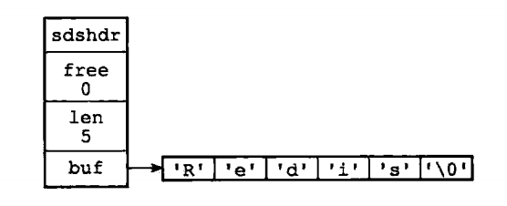
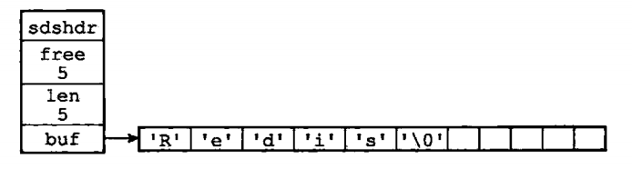
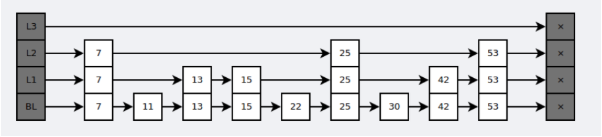
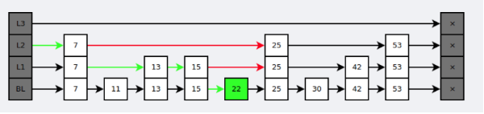
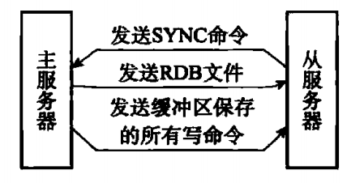

* [概述](#概述)
* [数据类型](#数据类型)
* [数据结构](#数据结构)
    * [SDS](#SDS)
    * [字典](#字典)
    * [跳跃表](#跳跃表)
* [数据持久化](#数据持久化)
    * [RDB持久化](#RDB持久化)
    * [AOF持久化](#AOF持久化)
* [参考资料](#参考资料)

----------------------------------

# 概述
Redis是一种速度非常快的非关系型(NoSQL)高性能键值对(key-value)数据库。它通过提供多种键值数据类型来适应不同场景下的存储需求，目前为止Redis支持的键值数据类型如下：
- 字符串(String)
- 列表(List)
- 集合(Set)
- 散列表(Hash)
- 有序集合(ZSet)

其应用场景也非常广泛：
- 缓存(最多)。
- 分布式集群架构中的session分离。
- 分布式锁实现。
- 任务队列等。

-------------------------------

# 数据类型

关于Redis的数据类型，此文章有详细讲述：[what redis data structure look like?](https://redislabs.com/ebook/part-1-getting-started/chapter-1-getting-to-know-redis/1-2-what-redis-data-structures-look-like/)

# 数据结构
## SDS
Redis自己构建了一种名为简单动态字符串(Simple Dynamic string, SDS)的抽象类型，并将 SDS 用作 Redis 的默认字符串表示。

### SDS的定义
每个`sds.h/sdshdr`结构表示一个SDS值：
```c
struct sdshdr {
    // 记录 buf 数组中已使用字节的数量
    // 等于 SDS 所保存字符串的长度
    int len;

    // 记录 buf 数组中未使用字节的数量
    int free;

    // 字节数组，用于保存字符串
    char buf[];
};
```
无剩余空间的情况，其中空字符`'\0'`，不占用数组 len 的长度。
<div align="center"></div>

有剩余空间的情况：
<div align="center"></div>

比起C字符串，SDS具有以下优点：
- 常数复杂度获取字符串长度。
- 杜绝缓冲区溢出。
- 减少修改字符串长度时所需要内充重分配次数。
- 二进制安全。
- 兼容部分C字符串函数。

## 字典
dictht是一个散列表的结构，使用的是链地址法处理哈希冲突。
```c
/* This is our hash table structure. Every dictionary has two of this as we
 * implement incremental rehashing, for the old to the new table. */
typedef struct dictht {
    dictEntry **table;
    unsigned long size;
    unsigned long sizemask;
    unsigned long used;
} dictht;
```
```c
typedef struct dictEntry {
    void *key;
    union {
        void *val;
        uint64_t u64;
        int64_t s64;
        double d;
    } v;
    struct dictEntry *next;
} dictEntry;
```
Redis的字典dict中，含有2个dictht，这是为了方便rehash操作。在扩容时，将其中一个dictht上的键值对rehash到另外一个字典中去，完成后释放空间，并且互换两张表的角色。
```c
typedef struct dict {
    dictType *type;
    void *privdata;
    dictht ht[2];
    long rehashidx;          /* rehashing not in progress if rehashidx == -1 */
    unsigned long iterators; /* number of iterators currently running */
} dict;
```
rehash操作是采用渐进方式，这是为了避免一次性执行过多的rehash给服务器带来过大的负担。

渐进式rehash通过记录dict的rehashidx完成。它从0开始，然后每一次rehash都会递增。

例如把`dict[0]`上的`table[rehashidx]`键值对rehash到`dict[1]`上，`dict[0]`的`table[rehashidx]`变为`null`，然后执行`rehashidx++`。在执行完渐进式 rehash 之后，将 rehashidx 重新设置为 -1 。

在rehash期间，每进行一次增删改查操作，都会执行一次渐进式的rehash操作。采用渐进式的rehash会导致字典中的数据分散在2个dictht上，因此对字典的删除、查找和更新操作会先在`ht[0]`里面进行查找，没找到则继续在`ht[1]`中查找。新增操作则是一律保存到`ht[1]`里面。

## 跳跃表
是有序集合底层实现之一。它是基于多指针有序链表实现的，可以看成多个有序链表。

```c
typedef struct zskiplistNode {
    // 层
    struct zskiplistLevel {
        // 前进指针
        struct zskiplistNode *forward;
        // 跨度
        unsigned int span;
    } level[];
    // 后退指针
    struct zskiplistNode *backward;
    // 分值
    double score;
    // 成员对象
    robj * obj;
} zskiplistNode;
```

跳跃表支持平均`O(logN)`、最坏`O(N)`复杂度的节点查找，还可以通过顺序性操作来批量处理节点。

<div align="center"></div>

在查找时，从上层指针开始查找，找到对应区间之后再到下一层进行查找。
<div align="center"></div>

如果一个有序集合包含的元素数量比较多，或者元素成员是比较长的字符串，Redis就会使用跳跃表来作为有序集合键的底层实现。

与红黑树等平衡树相比，跳跃表具有以下优点：
- 插入速度非常快，因为不需要进行旋转等操作来维护平衡性，更容易实现；
- 支持无锁操作。

----------------------------

# 数据持久化
Redis的高性能是由于其将所有数据都存储在了内存中，为了使Redis在重启之后仍能保证数据不丢失，需要将数据从内存中同步到硬盘中，这一过程就是持久化。

Redis支持两种方式的持久化，一种是RDB方式，一种是AOF方式。可以单独使用其中一种或将二者结合使用。
## RDB持久化
RDB方式的持久化是通过快照（snapshotting）完成的，当符合一定条件时Redis会自动将内存中的数据进行快照并持久化到硬盘。

### RDB文件的创建
有2个 Redis 命令可以用于生成 RDB 文件，`SAVE`和`BGSAVE`。
- **SAVE：** 阻塞 Redis服务进程，直到 RDB 文件创建完毕， 期间服务器不能处理任何命令请求。
- **BGSAVE：** 派生出一个子进程负责创建 RDB 文件，服务器进行继续处理命令请求。

### BGSAVE命令执行时服务器的状态
期间处理`SAVE`, `BGSAVE`, `BGREWRITEAOF`三个命令会和平时有所不同。

- 在`BGSAVE`执行期间，客户端发送的`BGSAVE`和`SAVE`命令会被拒绝，防止产生竞争条件。
- `BGSAVE`和`BGREWRITEAOF`不能同时执行(处于性能考虑)：
    - 如果`BGSAVE`命令执行期间，客户端发送的`BGREWRITEAOF`会被延迟到前者执行完毕后再执行。
    - 如果`BGREWRITEAOF`命令执行期间，客户端发送的`BGSAVE`命令会被服务器拒绝。

通过RDB方式实现持久化，一旦Redis异常退出，就会丢失最后一次快照以后更改的所有数据。这就需要开发者根据具体的应用场合，通过组合设置自动快照条件的方式来将可能发生的数据损失控制在能够接受的范围。如果数据很重要以至于无法承受任何损失，则可以考虑使用AOF方式进行持久化。

## AOF持久化
使用 AOF 持久化需要设置同步选项，从而确保写命令什么时候会同步到磁盘文件上。这是因为对文件进行写入并不会马上将内容同步到磁盘上，而是先存储到缓冲区，然后由操作系统决定什么时候同步到磁盘。有以下同步选项：
- always(每个写命令都同步)
- everysec(每秒同步一次)
- no(让操作系统来决定什么时候同步)

----------------------------

# 复制
通过使用 slaveof host port 命令来让一个服务器成为另一个服务器的从服务器。一个服务器能有多个从服务器，但是只能有一个主服务器。

## 连接过程
1. 从服务器向主服务器发送 `SYNC` 命令；
2. 收到 `SYNC` 命令的煮服务器开始执行 `BGSAVE`命令，在后台生成一个 RDB 文件，并使用一个缓冲区记录现在开始执行的所有**写命令**，当保存完毕之后，会将该 RDB 文件发送给从服务器；
3. 主服务器将缓冲区的所有的写命令发送给从服务器。

<div align="center"></div>


---------------------------
# 参考资料
- 黄健宏. Redis 设计与实现 [M]. 机械工业出版社, 2014.
- CyC2018-Redis
