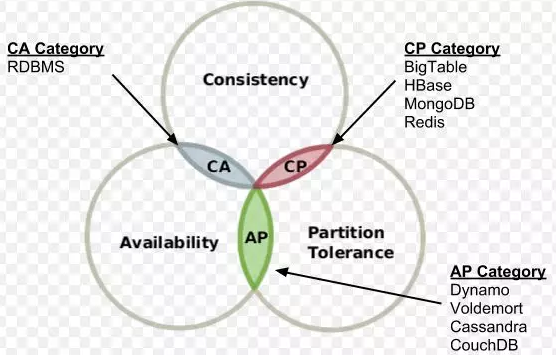

* [CAP](#CAP)

----------------

## CAP
CAP(布鲁尔定理) 定律是分布式系统中最基础的原则。它提出，对于一个分布式系统，不能同时满足以下三点：
- **Consisteny(一致性)**

  一致性的要求是指，对于任何客户端来说，每次的读操作，都能获得最新的数据。即，当有客户端向A节点写入了新数据之后，其它客户端从B节点中进行读操作所获得的数据必须也是最新的，是与A节点数据保持一致的。

- **Availability(可用性)**

  可用性的要求是指，每个请求都能在合理的时间内获得符合预期的响应（不保证获取的结果是最新的数据）。

- **Partition tolerance(分区容错性)**

  分区容错性是指，当节点之间的网络出现问题之后，系统依然能正常提供服务。

### 权衡

在分布式系统中，**分区容忍性必不可少**，因为需要总是假设网络是不可靠的。因此，CAP 理论实际上是要在可用性和一致性之间做权衡。

可用性和一致性往往是冲突的，很难使它们同时满足。在多个节点之间进行数据同步时，

- 为了保证一致性（CP），不能访问未同步完成的节点，也就失去了部分可用性；
- 为了保证可用性（AP），允许读取所有节点的数据，但是数据可能不一致。
