# 题目分类 :fireworks:
* [栈和队列](#栈和队列)
    * [用两个栈实现队列](#用两个栈实现队列)
* [查找和排序](#查找和排序)
    * [旋转数组的最小数字](#旋转数组的最小数字)
* [递归和循环](#递归和循环)
    * [斐波那契数列](#斐波那契数列)
    * [跳台阶](#跳台阶)
    * [变态跳台阶](#变态跳台阶)
    * [矩形覆盖](#矩形覆盖)
* [位运算](#位运算)
    * [二进制中1的个数](#二进制中1的个数)
* [代码的完整性](#代码的完整性)
    * [数值的整数次方](#数值的整数次方)
    * [调整数组顺序使奇数位于偶数前面](#调整数组顺序使奇数位于偶数前面)
* [代码的鲁棒性](#代码的鲁棒性)
    * [链表中倒数第k个结点](#链表中倒数第k个结点)
    * [反转链表](#反转链表)
    * [合并两个排序的链表](#合并两个排序的链表)
    * [树的子结构](#树的子结构)
* [面试思路](#面试思路)
    * [二叉树的镜像](#二叉树的镜像)
* [画图让抽象形象化](#画图让抽象形象化)
    * [顺时针打印矩阵](#顺时针打印矩阵)
* [举例让抽象具体化](#举例让抽象具体化)
    * [包含min函数的栈](#包含min函数的栈)
    * [栈的压入、弹出序列](#栈的压入、弹出序列)
    * [从上往下打印二叉树](#从上往下打印二叉树)
    * [二叉树中和为某一值的路径](#二叉树中和为某一值的路径)
* [分解让复杂问题简单](#分解让复杂问题简单)
    * [复杂链表的复制](#复杂链表的复制)
    * [二叉搜索树与双向链表](#二叉搜索树与双向链表)
    * [字符串的排列](#字符串的排列)
* [时间效率](#时间效率)
    * [数组中出现次数超过一半的数字](#数组中出现次数超过一半的数字)
    * [最小的K个数](#最小的K个数)
----------------------

# 查找和排序
## [旋转数组的最小数字](https://www.nowcoder.com/practice/9f3231a991af4f55b95579b44b7a01ba?tpId=13&tqId=11159&rp=1&ru=/ta/coding-interviews&qru=/ta/coding-interviews/question-ranking)
## 题目描述

把一个数组最开始的若干个元素搬到数组的末尾，我们称之为数组的旋转。 输入一个非减排序的数组的一个旋转，输出旋转数组的最小元素。 例如数组{3,4,5,1,2}为{1,2,3,4,5}的一个旋转，该数组的最小值为1。

NOTE：给出的所有元素都大于0，若数组大小为0，请返回0。
### 解题思路

-----------------------

# 递归和循环
## [斐波那契数列](https://www.nowcoder.com/practice/c6c7742f5ba7442aada113136ddea0c3?tpId=13&tqId=11160&tPage=1&rp=1&ru=/ta/coding-interviews&qru=/ta/coding-interviews/question-ranking)
## 题目描述

大家都知道斐波那契数列，现在要求输入一个整数n，请你输出斐波那契数列的第n项（从0开始，第0项为0）。 n<=39

### 解题思路
斐波那契数列（Fibonacci sequence），又称黄金分割数列、因数学家列昂纳多·斐波那契（Leonardoda Fibonacci）以兔子繁殖为例子而引入，故又称为“兔子数列”，指的是这样一个数列：1、1、2、3、5、8、13、21、34、……在数学上，斐波纳契数列以如下被以递推的方法定义：
```
          | 1, (n=1)
f(n) =    | 2, (n=2)
          | f(n-1)+f(n-2) ,(n>2,n为整数)
```
代码如下：
```java
package fibonacci;

public class Fibonacci {
    public int solution(int n){
        if (n == 0)
            return 0;
        if (n == 1)
            return 1;
        if (n == 2)
            return 1;
        return solution(n-1) + solution(n-2);
    }
}
```
但是上述的解法有很严重的效率问题，通过求解第10项的调用过程图来分析：
<div align="center"></div>
从上图中不难发现：在这棵树中有很多结点是重复的，而且重复的结点数会随着n的增大而急剧增加，这意味计算量会随着n的增大而急剧增大。事实上，用递归方法计算的时间复杂度是以n的指数的方式递增的。

**改进解法**

改进的方法并不复杂。上述递归代码之所以慢是因为重复的计算太多，我们只要想办法避免重复计算就行了。这里的办法是从下往上计算，首先根据f(0)和f(1)算出f(2)，再根据f(1)和f(2)算出f(3)……依此类推就可以算出第n项了。很容易理解，这种思路的时间复杂度是O(n)。
```java
public int solution2(int n){
        int[] pre = {0,1};
        if (n < 2){
            return pre[n];
        }
        int f0 = 0;
        int f1 = 1;
        int fn = 0;

        for (int i=2; i<=n; i++){
            fn = f0 + f1;
            f0 = f1;
            f1 = fn;
        }
        return fn;
    }
```

## [跳台阶](https://www.nowcoder.com/practice/8c82a5b80378478f9484d87d1c5f12a4?tpId=13&tqId=11161&tPage=1&rp=1&ru=%2Fta%2Fcoding-interviews&qru=%2Fta%2Fcoding-interviews%2Fquestion-ranking)
## 题目描述

一只青蛙一次可以跳上1级台阶，也可以跳上2级。求该青蛙跳上一个n级的台阶总共有多少种跳法（先后次序不同算不同的结果）。

### 解题思路
列出前几种情况:

    当n=1时，fn=1;
    当n=2时，fn=2;
    当n=3时，fn=3;
    当n=4时，fn=5;
    当n=5时，fn=8;
容易看出，总的跳法是一个[斐波那契数列](#斐波那契数列)。

## [变态跳台阶](https://www.nowcoder.com/practice/22243d016f6b47f2a6928b4313c85387?tpId=13&tqId=11162&tPage=1&rp=1&ru=%2Fta%2Fcoding-interviews&qru=%2Fta%2Fcoding-interviews%2Fquestion-ranking)
## 题目描述

一只青蛙一次可以跳上1级台阶，也可以跳上2级……它也可以跳上n级。求该青蛙跳上一个n级的台阶总共有多少种跳法。

### 解题思路
关于本题，前提是n个台阶会有一次n阶的跳法，分析如下：
```
f(1)=1;
f(2)=f(2-1)+f(2-2);  //f(2-2) 表示2阶一次跳2阶的次数。
f(3)=f(3-1)+f(3-2)+f(3-3);
···
f(n)=f(n-1)+f(n-2)+...+f(n-n);
```
**说明：**
1) 这里的f(n)代表的是n个台阶有一次1,2,...n阶的跳法数。
2) 当n=1时，只有一种跳法，f(1)=1;
3) 当n=2时，有一次1阶或者2阶，这回归到了问题1，f(2)=f(2-1)+f(2-2);
4) 当n=3时，有一次1阶、2阶或者3阶。第一次跳出1阶后剩下f(3-1)；第一次跳出2阶后剩下f(3-2)；第一次跳出3阶后剩下f(3-3)；
5) 当n=3时，有一次1阶、2阶...n阶，得出结论：f(n)=f(n-1)+f(n-2)+...+f(n-n)=f(0)+f(1)+...+f(n-1)
6) 继续简化：f(n-1)=f(n-2)+f(n-3)+...+f(n-1-n+1)=f(0)+f(1)+...+f(n-2)
7) 可以得出：f(n)=2f(n-1)。

代码如下：
```java
package jumpFloorII;

public class JumpFloorII {

    public int solution(int target) {
        if (target < 2)
            return 1;
        return 2*solution(target-1);
    }
}
```

## [矩形覆盖](https://www.nowcoder.com/practice/72a5a919508a4251859fb2cfb987a0e6?tpId=13&tqId=11163&tPage=1&rp=1&ru=%2Fta%2Fcoding-interviews&qru=%2Fta%2Fcoding-interviews%2Fquestion-ranking)

## 题目描述

我们可以用2*1的小矩形横着或者竖着去覆盖更大的矩形。请问用n个2*1的小矩形无重叠地覆盖一个2*n的大矩形，总共有多少种方法？

### 解题思路
    当n=1时，只有一种方法；
    当n=2时，有2种方法；
    ...
    当n=n时，分两步考虑：假设第一块摆放的是2*1的方块，则剩下的有f(n-1)种摆放的方案；假设第一块摆放的是1*2，则必须有另外一块1*2才能凑成满足题目要求的矩形，因此剩下f(n-2)种方案。
可以推导出，最后得出的是一个[斐波那契数列](#斐波那契数列)：
```
          | 1, (n=1)
f(n) =    | 2, (n=2)
          | f(n-1)+f(n-2) ,(n>2,n为整数)
```

-----------------------

# 栈和队列
## [用两个栈实现队列](https://www.nowcoder.com/practice/54275ddae22f475981afa2244dd448c6?tpId=13&tqId=11158&tPage=1&rp=1&ru=/ta/coding-interviews&qru=/ta/coding-interviews/question-ranking)

## 题目描述

用两个栈来实现一个队列，完成队列的Push和Pop操作。队列中的元素为int类型。

### 解题思路
队列的特征为先进先出(FIFO)，而栈的特点为先进后出。由stack1处理push操作，stack2处理pop操作。需要注意的是，每一次向stack1中添加新元素时，都需要把stack2中剩余的元素先添加入stack1。
```java
import java.util.Stack;

public class Solution {
    Stack<Integer> stack1 = new Stack<Integer>();
    Stack<Integer> stack2 = new Stack<Integer>();

    public void push(int node) {
        // 重新将2里面的元素倒入1中
        while (!stack2.empty()){
            stack1.push(stack2.pop());
        }
        stack1.push(node);
    }

    public int pop() {
        while (!stack1.empty()){
            stack2.push(stack1.pop());
        }

        return stack2.pop();
    }
}
```

-----------------------------

# 位运算
## [二进制中1的个数](https://www.nowcoder.com/practice/8ee967e43c2c4ec193b040ea7fbb10b8?tpId=13&tqId=11164&tPage=1&rp=1&ru=%2Fta%2Fcoding-interviews&qru=%2Fta%2Fcoding-interviews%2Fquestion-ranking)

## 题目描述

输入一个整数，输出该数二进制表示中1的个数。其中负数用补码表示。

### 解题思路
**思路1：**

调用API函数，可以直接将整数类型的数转化为二进制字符串，然后再判断字符串中“1”的个数：
```java
public class NumberOf1 {

    public int solution(int n){
        int count = 0;
        String s = Integer.toBinaryString(n);
        char[] ch = s.toCharArray();
        for (char c:ch){
            if (c == '1')
                count++;
        }
        return count;
    }
}
```
**思路2：**

把整数减1与原来的数做与运算，每次运算能将原整数二进制数的最后一位变为0，原整数二进制中有多少个1，便能进行多少次与运算：
```java
public int solution2(int n){
        int count = 0;
        while (n != 0){
            count++;
            n = n & (n - 1);
        }
        return count;
    }
```

----------------------------

# 代码的完整性
## [数值的整数次方](https://www.nowcoder.com/practice/1a834e5e3e1a4b7ba251417554e07c00?tpId=13&tqId=11165&tPage=1&rp=1&ru=%2Fta%2Fcoding-interviews&qru=%2Fta%2Fcoding-interviews%2Fquestion-ranking)

## 题目描述

给定一个double类型的浮点数base和int类型的整数exponent。求base的exponent次方。

### 解题思路
这里考察的是分多种情况计算，指数为0的时候，结果恒为1。当底数为0，指数为负数时，会抛出除0错误。
```java
public class Power {

    public double solution(double base, int exponent) {
        if (exponent == 0)
            return 1.0;
        if (base == 0.0)
            if (exponent < 0)
                throw new RuntimeException("error");
            else
                return 0.0;
        int e = exponent > 0 ? exponent : -exponent;
        double result = 1;

        while (e != 0){
            //根据当前位是1还是0决定累乘还是不累乘
            result = (e & 1) == 0 ? result : result * base;
            base *= base;
            e = e >> 1;
        }
        return exponent > 0 ? result : 1/result;
    }
}
```
## [调整数组顺序使奇数位于偶数前面](https://www.nowcoder.com/practice/beb5aa231adc45b2a5dcc5b62c93f593?tpId=13&tqId=11166&tPage=1&rp=1&ru=%2Fta%2Fcoding-interviews&qru=%2Fta%2Fcoding-interviews%2Fquestion-ranking)

## 题目描述

输入一个整数数组，实现一个函数来调整该数组中数字的顺序，使得所有的奇数位于数组的前半部分，所有的偶数位于数组的后半部分，并保证奇数和奇数，偶数和偶数之间的相对位置不变。

### 解题思路
注意需要保持原数组的相对位置不变，这里只新建一个数组用来保存偶数，奇数仍然保存在原数组当中，用`lastOdd`来标记上重新放入奇数的原数组索引。
```java
package reOrderArray;

public class ReOrderArray {
  public void solution2(int[] array){
        List<Integer> even = new ArrayList<>();
        int lastOdd = 0;
        for (int i=0; i<array.length; i++){
            if (array[i] % 2 == 0) {
                even.add(array[i]);

            }else {
                array[lastOdd++] = array[i];
            }
        }
        for (Integer e:even)
            array[lastOdd++] = e;
    }
}
```
----------------------------------
# 代码的鲁棒性
## [链表中倒数第k个结点](https://www.nowcoder.com/practice/529d3ae5a407492994ad2a246518148a?tpId=13&tqId=11167&tPage=1&rp=1&ru=%2Fta%2Fcoding-interviews&qru=%2Fta%2Fcoding-interviews%2Fquestion-ranking)

## 题目描述

输入一个链表，输出该链表中倒数第k个结点。

### 解题思路
为了实现只遍历一遍就能找到倒数第K个节点，我们可以定义两个指针，第一个指针从链表的头指针开始遍历向前走k-1步，第二个指针保持不动。从第k步开始，第二个指针也开始从链表的头指针开始遍历。由于2个指针的距离保持在k-1，当第一个指针到达链表的尾节点时，第二个指针刚好走到倒数第k个节点。
```java
package findKthToTail;

public class FindKthToTail {
    public ListNode solution(ListNode head, int k){
        if(head == null || k <= 0){
            return null;
        }
        ListNode ANode = head;
        ListNode BNode = null;
        for(int i = 0;i<k-1;i++){
            if(ANode.next != null)
                ANode = ANode.next;
            else
                return null;
        }
        BNode = head;
        while(ANode.next != null){
            ANode = ANode.next;
            BNode = BNode.next;
        }
        return BNode;
    }
}
```

## [反转链表](https://www.nowcoder.com/practice/75e878df47f24fdc9dc3e400ec6058ca?tpId=13&tqId=11168&tPage=1&rp=1&ru=/ta/coding-interviews&qru=/ta/coding-interviews/question-ranking)

## 题目描述

输入一个链表，反转链表后，输出新链表的表头。

### 解题思路
在下图中，假设在h之前的节点全部都反转完成，现在将`i.next`指向h，这将导致i指向j的链接断开，因此需要先将j节点单独保存。然后遍历到链表的尾部，返回当前尾节点即为反转链表的头结点。
<div align="center"></div>

```java
package reverseList;
public class ReverseList {
    public ListNode solution(ListNode head) {
        if (head == null)
            return null;
        if (head.next == null)
            return head;

        ListNode resHead = null;
        ListNode preNode = null;
        ListNode curNode = head;
        ListNode nextNode;

        while (curNode != null){
            nextNode = curNode.next;
            if (nextNode == null)
                resHead = curNode;
            curNode.next = preNode;  // 把当前节点的next指向前一个节点
            preNode = curNode;
            curNode = nextNode;
        }
        return resHead;
    }
}
```

## [合并两个排序的链表](https://www.nowcoder.com/practice/d8b6b4358f774294a89de2a6ac4d9337?tpId=13&tqId=11169&tPage=1&rp=1&ru=/ta/coding-interviews&qru=/ta/coding-interviews/question-ranking)

## 题目描述

输入两个单调递增的链表，输出两个链表合成后的链表，当然我们需要合成后的链表满足单调不减规则。

### 解题思路
首先有2个递增的链表
<div align="center"></div>

合成的新链表要满足单调不减的排序，则可以理解为，遍历完两条链表，每次都比较出当前2链表头结点的大小，取小的那个为新链表的尾节点，如下所示：

<div align="center"></div>

很显然，可以看做为一个递归操作。除此之外，还要考虑一些特殊的情况。比如当链表为空时，因此额外增加一些判断条件就可以，代码如下：
```java
package merge;

import org.junit.Test;

public class Merge {
    public ListNode solution(ListNode list1, ListNode list2) {

        ListNode result;
        if (list1 == null && list2 == null)
            return null;
        if (list1 != null && list2 == null)
            return list1;
        if (list1 == null && list2 != null)
            return list2;

        if (list1.val > list2.val){
            result = list2;
            result.next = solution(list1,list2.next);
        }else {
            result = list1;
            result.next = solution(list1.next,list2);
        }
        return result;
    }
}
```

## [树的子结构](https://www.nowcoder.com/practice/6e196c44c7004d15b1610b9afca8bd88?tpId=13&tqId=11170&tPage=1&rp=1&ru=/ta/coding-interviews&qru=/ta/coding-interviews/question-ranking)

## 题目描述

输入两棵二叉树A，B，判断B是不是A的子结构。（ps：我们约定空树不是任意一个树的子结构）

### 解题思路
下图所示，树A有一部分结构跟树B是一样的，称树B是树A的子树。
<div align="center"></div>

分两步，首先在A树中找到B树的根节点，然后继续判断基于A树中找到的节点下的子树是否跟B树一致，如果是则返回true，否则继续找。
<div align="center"></div>

此思想用递归实现最为方便：
```java
package hasSubtree;

public class HasSubtree {
    public boolean solution(TreeNode root1, TreeNode root2){

        boolean result = false;
        if (root1 != null && root2 != null){
            if (root1.val == root2.val)
                result = doesTree1HasTree2(root1,root2);
            if (!result){
                result = solution(root1.left,root2);
            }
            if (!result){
                result = solution(root1.right,root2);
            }
        }
        return result;
    }

    public boolean doesTree1HasTree2(TreeNode root1, TreeNode root2){
        if (root2 == null)
            return true;
        if (root1 == null)
            return false;
        if (root1.val != root2.val)
            return false;
        return doesTree1HasTree2(root1.left,root2.left) && doesTree1HasTree2(root1.right,root2.right);
    }
}
```
------------------------

# 面试思路
## [二叉树的镜像](https://www.nowcoder.com/practice/564f4c26aa584921bc75623e48ca3011?tpId=13&tqId=11171&tPage=1&rp=1&ru=%2Fta%2Fcoding-interviews&qru=%2Fta%2Fcoding-interviews%2Fquestion-ranking)

## 题目描述

操作给定的二叉树，将其变换为源二叉树的镜像。

**输入描述:**

二叉树的镜像定义：源二叉树
<div align="center">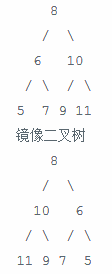</div>

### 解题思路
先前序遍历这棵树的每个节点，如果遍历到的节点有子节点，就交换2个子节点的位置，当交换完所有的非叶节点的左、右子节点后，就得到了树的镜像。这里要注意当输入一个`root == null`的情况。
<div align="center">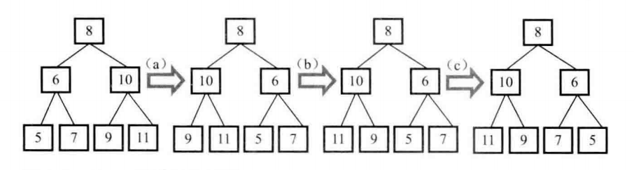</div>

代码如下：
```java
package mirror;

public class Mirror {
    public void solution(TreeNode root){
        if (root == null)
            return;
        if (root.left == null && root.right == null)
            return;
        TreeNode temp = root.left;
        root.left = root.right;
        root.right = temp;
        if (root.left != null)
            solution(root.left);
        if (root.right != null)
            solution(root.right);
    }
}
```

-----------------------

#  画图让抽象形象化
## [顺时针打印矩阵](https://www.nowcoder.com/practice/9b4c81a02cd34f76be2659fa0d54342a?tpId=13&tqId=11172&tPage=1&rp=1&ru=/ta/coding-interviews&qru=/ta/coding-interviews/question-ranking)

## 题目描述

输入一个矩阵，按照从外向里以顺时针的顺序依次打印出每一个数字，例如，如果输入如下4 X 4矩阵
<div align="center">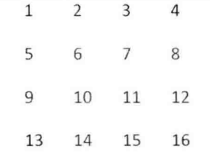</div>

则依次打印出数字1,2,3,4,8,12,16,15,14,13,9,5,6,7,11,10.

### 解题思路
可以把矩阵想象成若干个圈，如图所示
<div align="center">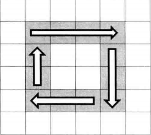</div>

接下来分析循环的结束条件，假设这个矩阵的行数是row，列数是col。每一圈中左上角的坐标为`(start,start)`，且可以得出让循环继续的条件是`col>startX*2`并且`row>startY*2`。所以我们可以用如下循环来打印矩阵：

```java
public ArrayList<Integer> solution(int[][] matrix) {
    int row = matrix.length;
    int col = matrix[0].length;
    ArrayList<Integer> result = new ArrayList<>();
    if (matrix == null || row < 0 || col < 0)
        return null;
    int start = 0;
    while (col > start * 2 && row > start * 2) {
        result.addAll(printInCycle(matrix, row, col, start));
        ++start;
    }
    return result;
}
```
接下来考虑如何实现`printInCycle`，可以把打印一圈分为4步：
- 从左到右打印一行（必须的）
- 从上到下打印一列（终止行号大于起始行号）
- 从右到做打印一行（终止行号大于起始行号，终止列号大于起始列号）
- 从下到上打印一列（至少要有3行2列）

每一步根据起始坐标和终止坐标用循环就能打印。需要注意如下几种退化成一行或者一列甚至一个点的情况，因此打印这样的一圈就不再需要4步，如下图：
<div align="center">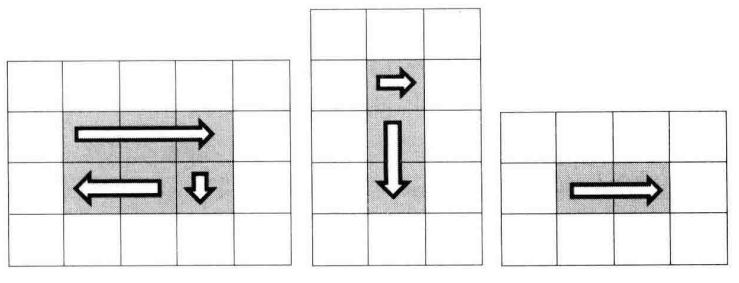</div>

代码如下：
```java
public ArrayList<Integer> printInCycle(int[][] matrix, int row, int col, int start) {
    ArrayList<Integer> result = new ArrayList<>();
    int endX = col - start - 1;
    int endY = row - start - 1;
    // 从左到右打印一行
    for (int i = start; i <= endX; ++i) {
        result.add(matrix[start][i]);
    }
    // 从上到下打印一列
    if (start < endY) {
        for (int i = start + 1; i <= endY; ++i) {
            result.add(matrix[i][endX]);
        }
    }
    // 从右到左打印一行
    if (start < endX && start < endY) {
        for (int i = endX - 1; i >= start; --i) {
            result.add(matrix[endY][i]);
        }
    }
    // 从下到上打印一列
    if (start < endX && start < endY - 1) {
        for (int i = endY - 1; i >= start + 1; --i) {
            result.add(matrix[i][start]);
        }
    }
    return result;
}
```
--------------------------

# 举例让抽象具体化
## [包含min函数的栈](https://www.nowcoder.com/practice/4c776177d2c04c2494f2555c9fcc1e49?tpId=13&tqId=11173&tPage=1&rp=1&ru=/ta/coding-interviews&qru=/ta/coding-interviews/question-ranking)

## 题目描述
定义栈的数据结构，请在该类型中实现一个能够得到栈中所含最小元素的min函数（时间复杂度应为O(1)。

### 解题思路
将每次的最小元素都保存在另外一个辅助栈中。如下图
<div align="center">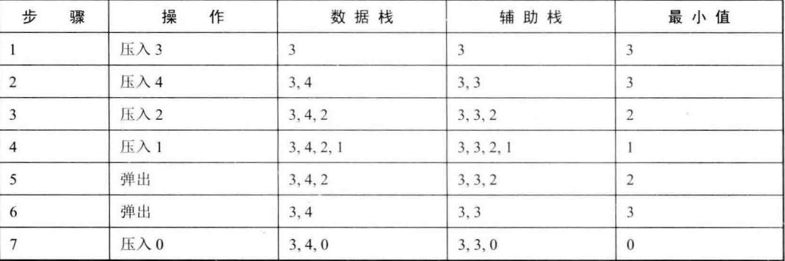</div>

当压入栈的元素小于辅助栈定元素时，添加当前元素到辅助栈定。否则添加原来辅助栈定元素至栈顶。
```java
package minElementFunction;

/*  定义栈的数据结构，请在该类型中实现一个能够得到栈中
    所含最小元素的min函数（时间复杂度应为O（1））。
*/

import java.util.Stack;

public class Solution {

    Stack<Integer> stack1 = new Stack<>(); // 数据栈
    Stack<Integer> stack2 = new Stack<>(); // 辅助栈 用于返回min值

    public void push(int node) {
        stack1.push(node);
        if (stack2.empty()) {
            stack2.push(node);
        } else {
            if (node < stack2.peek().intValue())
                stack2.push(node);
            else stack2.push(stack2.peek());
        }
    }

    public void pop() {
        if (!stack1.empty())
            stack1.pop();
        if (!stack2.empty())
            stack2.pop();
    }

    public int top() {
        if (!stack1.empty())
            return stack1.peek().intValue();
        else return 0;
    }

    public int min() {
        if (!stack2.empty())
            return stack2.peek().intValue();
        else return 0;
    }
}
```

## [栈的压入、弹出序列](https://www.nowcoder.com/practice/d77d11405cc7470d82554cb392585106?tpId=13&tqId=11174&tPage=2&rp=1&ru=%2Fta%2Fcoding-interviews&qru=%2Fta%2Fcoding-interviews%2Fquestion-ranking)

## 题目描述
输入两个整数序列，第一个序列表示栈的压入顺序，请判断第二个序列是否可能为该栈的弹出顺序。假设压入栈的所有数字均不相等。例如序列1,2,3,4,5是某栈的压入顺序，序列4,5,3,2,1是该压栈序列对应的一个弹出序列，但4,3,5,1,2就不可能是该压栈序列的弹出序列。（注意：这两个序列的长度是相等的）
### 解题思路
建立一个辅助栈，将`pushA`中的元素压入栈，直到等于`popA[j]`，此时将栈顶元素弹出，再比较栈顶元素是否与`popA[++j]`相等，如相等，则直接弹出，如不相等，则继续将`pushA`中的元素压入栈，直到与上述`popA[++j]`相等。详细过程如下图：
<div align="center"></div>

最后判定，若栈最后为空，则返回`true`。
```java
package isPopOrder;

import java.util.Stack;

public class Solution {
    public boolean isPopOrder(int[] pushA, int[] popA){
        if (pushA.length == 0 || popA.length == 0)
            return false;
        if (pushA.length != popA.length)
            return false;

        Stack<Integer> stack = new Stack<>();
        int j = 0;
        for (int i=0; i<pushA.length; i++){
            stack.push(pushA[i]);
            while (!stack.empty() && stack.peek() == popA[j]){
                stack.pop();
                j++;
            }
        }
        if (stack.empty())
            return true;
        else
            return false;
    }
}
```

## [从上往下打印二叉树](https://www.nowcoder.com/practice/7fe2212963db4790b57431d9ed259701?tpId=13&tqId=11175&tPage=2&rp=1&ru=%2Fta%2Fcoding-interviews&qru=%2Fta%2Fcoding-interviews%2Fquestion-ranking)

## 题目描述
从上往下打印出二叉树的每个节点，同层节点从左至右打印。
### 解题思路
使用队列来进行层次遍历。假设需要遍历的树如下：
<div align="center">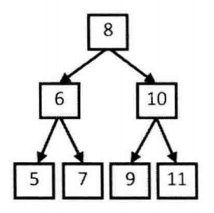</div>

按层次进行遍历，首先将根节点入队，为了能够遍历到下一层的节点，因此需要将根节点的左右子节点保存到队列当中。不需要使用两个队列分别存储当前层的节点和下一层的节点，因为在开始遍历一层的节点时，当前队列中的节点数就是当前层的节点数，只要控制遍历这么多节点数，就能保证这次遍历的都是当前层的节点。
<div align="center">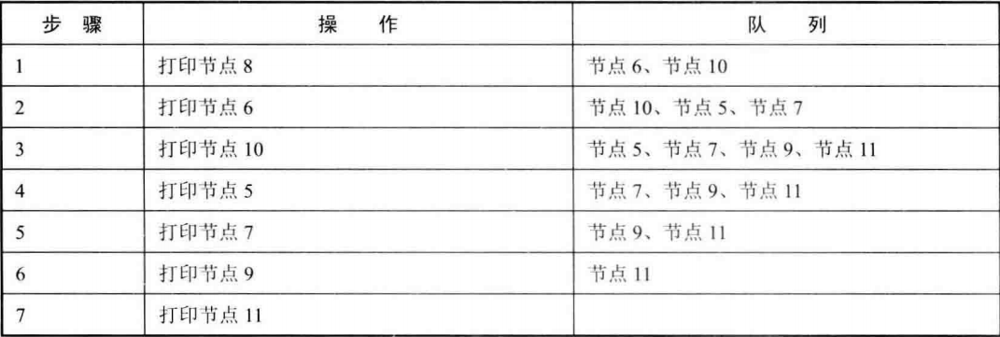</div>

```java
public ArrayList<Integer> PrintFromTopToBottom(TreeNode root) {
    Queue<TreeNode> queue = new LinkedList<>();
    ArrayList<Integer> ret = new ArrayList<>();
    queue.add(root);
    while (!queue.isEmpty()){
        int cnt = queue.size();
        while (cnt-- > 0){
            TreeNode t = queue.poll();
            if (t == null)
                continue;
            ret.add(t.val);
            queue.add(t.left);
            queue.add(t.right);
        }
    }
    return ret;
}
```

## [二叉搜索树的后序遍历序列](https://www.nowcoder.com/practice/a861533d45854474ac791d90e447bafd?tpId=13&tqId=11176&tPage=2&rp=2&ru=%2Fta%2Fcoding-interviews&qru=%2Fta%2Fcoding-interviews%2Fquestion-ranking)

## 题目描述
输入一个整数数组，判断该数组是不是某二叉搜索树的后序遍历的结果。如果是则输出Yes,否则输出No。假设输入的数组的任意两个数字都互不相同。
### 解题思路
在后序遍历中，最后一个数字是根节点。数组中前面的数字可以分为2部分，小于根节点的为左子树，大于根节点的为右子树。如果在右子树序列中，有小于根节点的值，则返回`false`。例如数组`{5,7,6,9,11,10,8}`，根节点为8，左子树为5,7,6；右子树为9,11,10。
```java
public boolean verifySequenceOfBST(int[] sequence) {
    if (sequence == null || sequence.length == 0)
        return false;
    return verify(sequence, 0, sequence.length - 1);
}

public boolean verify(int[] sequence, int first, int last) {
    if (last - first <= 1)
        return true;
    int rootVal = sequence[last];
    int curIndex = first;
    while (sequence[curIndex] < rootVal && curIndex < last)
        curIndex++;
    // 判断右子树节点有没有比根节点小的
    for (int i = curIndex; i < last; i++)
        if (sequence[i] < rootVal)
            return false;
    return verify(sequence, first, curIndex - 1) && verify(sequence, curIndex, last - 1);
}
```

## [二叉树中和为某一值的路径](https://www.nowcoder.com/practice/b736e784e3e34731af99065031301bca?tpId=13&tqId=11177&tPage=2&rp=2&ru=%2Fta%2Fcoding-interviews&qru=%2Fta%2Fcoding-interviews%2Fquestion-ranking)

## 题目描述
输入一颗二叉树的跟节点和一个整数，打印出二叉树中结点值的和为输入整数的所有路径。路径定义为从树的根结点开始往下一直到叶结点所经过的结点形成一条路径。(注意: 在返回值的list中，数组长度大的数组靠前)
### 解题思路
首先注意的是，题目对路径的定义为根节点到叶节点。对于树的遍历，先访问根节点的为先序遍历。每访问一个节点，遍把当前节点添加到路径中去，如果访问到的叶节点是不满足要求的路径，则把最后添加进去的叶节点删除，然后继续遍历其它节点。对于如下二叉树：
<div align="center">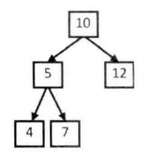</div>

设`target = 22`，则有如下遍历次序：
<div align="center">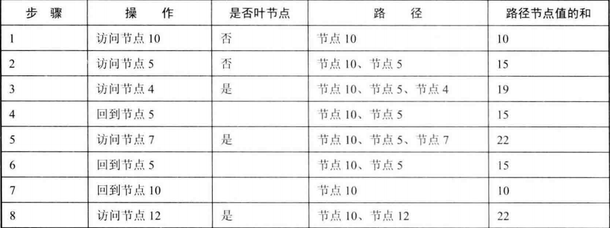</div>

```java
private ArrayList<ArrayList<Integer>> ret = new ArrayList<>();

public ArrayList<ArrayList<Integer>> findPath(TreeNode root, int target) {
    backtracking(root, target, new ArrayList<>());
    return ret;
}

public void backtracking(TreeNode node, int target, ArrayList<Integer> path) {
    if (node == null || target < node.val)
        return;
    path.add(node.val);
    target -= node.val;
    if (target == 0 && node.left == null && node.right == null)  // 题目要求到叶节点的路径
        ret.add(new ArrayList<>(path));
    else {
        backtracking(node.left, target, path);
        backtracking(node.right, target, path);
    }
    path.remove(path.size() - 1);
}
```

------------------------

# 分解让复杂问题简单
## [复杂链表的复制](https://www.nowcoder.com/practice/f836b2c43afc4b35ad6adc41ec941dba?tpId=13&tqId=11178&tPage=2&rp=2&ru=%2Fta%2Fcoding-interviews&qru=%2Fta%2Fcoding-interviews%2Fquestion-ranking)

## 题目描述
输入一个复杂链表（每个节点中有节点值，以及两个指针，一个指向下一个节点，另一个特殊指针指向任意一个节点），返回结果为复制后复杂链表的head。（注意，输出结果中请不要返回参数中的节点引用，否则判题程序会直接返回空）
### 解题思路
第一步，在每个节点的后面插入复制的节点。
<div align="center">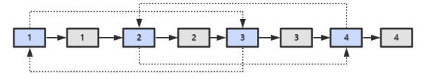</div>

第二步，对复制节点的random连接进行复制。
<div align="center">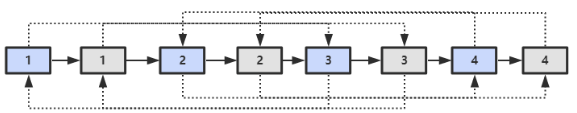</div>

第三步，拆分。
<div align="center">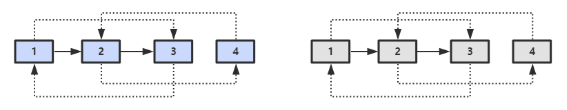</div>

```java
public class RandomListNode {
    int label;
    RandomListNode next = null;
    RandomListNode random = null;

    RandomListNode(int label) {
        this.label = label;
    }
}

public RandomListNode clone(RandomListNode pHead) {
    if (pHead == null)
        return null;
    // 插入新节点
    RandomListNode cur = pHead;
    while (cur != null){
        RandomListNode clone = new RandomListNode(cur.label);
        clone.next = cur.next;
        cur.next = clone;
        cur = clone.next;
    }
    // 建立random连接
    cur = pHead;
    while (cur != null){
        RandomListNode clone = cur.next;
        if (cur.random != null)
            clone.random = cur.random.next;
        cur = clone.next;
    }
    // 分离连接
    cur = pHead;
    RandomListNode pCloneHead = cur.next;
    while (cur.next != null){
        RandomListNode next = cur.next;
        cur.next = next.next;
        cur = next;
    }
    return pCloneHead;
}
```
## [二叉搜索树与双向链表](https://www.nowcoder.com/practice/947f6eb80d944a84850b0538bf0ec3a5?tpId=13&tqId=11179&tPage=2&rp=2&ru=%2Fta%2Fcoding-interviews&qru=%2Fta%2Fcoding-interviews%2Fquestion-ranking)

## 题目描述
输入一棵二叉搜索树，将该二叉搜索树转换成一个排序的双向链表。要求不能创建任何新的结点，只能调整树中结点指针的指向。
### 解题思路
因为搜索二叉树和双向排序链表都是有序的。
<div align="center">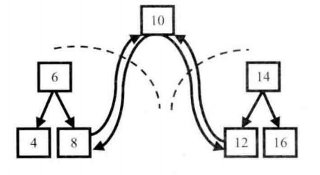</div>

```java
public class TreeNode {
    int val = 0;
    TreeNode left = null;
    TreeNode right = null;

    public TreeNode(int val) {
        this.val = val;
    }
}
private TreeNode pre = null;
private TreeNode head = null;
public TreeNode convert(TreeNode pRootOfTree) {
    inOrder(pRootOfTree);
    return head;
}
private void inOrder(TreeNode node){
    if (node == null)
        return;
    inOrder(node.left);
    node.left = pre;   // 没理解
    if (pre != null)
        pre.right = node;
    pre = node;
    if (head == null)
        head = node;
    inOrder(node.right);
}
```
## [字符串的排列](https://www.nowcoder.com/practice/fe6b651b66ae47d7acce78ffdd9a96c7?tpId=13&tqId=11180&tPage=2&rp=2&ru=%2Fta%2Fcoding-interviews&qru=%2Fta%2Fcoding-interviews%2Fquestion-ranking)

## 题目描述
输入一个字符串,按字典序打印出该字符串中字符的所有排列。例如输入字符串abc,则打印出由字符a,b,c所能排列出来的所有字符串abc,acb,bac,bca,cab和cba。
### 解题思路
```java
private ArrayList<String> ret = new ArrayList<>();

public ArrayList<String> Permutation(String str) {
    if (str.length() == 0)
        return ret;
    char[] chars = str.toCharArray();
    Arrays.sort(chars);
    backtracking(chars, new boolean[chars.length], new StringBuilder());
    return ret;
}

private void backtracking(char[] chars, boolean[] hasUsed, StringBuilder s) {
    if (s.length() == chars.length) {
        ret.add(s.toString());
        return;
    }
    for (int i = 0; i < chars.length; i++) {
        if (hasUsed[i])
            continue;
        if (i != 0 && chars[i] == chars[i - 1] && !hasUsed[i - 1]) /* 保证不重复 */
            continue;
        hasUsed[i] = true;
        s.append(chars[i]);
        backtracking(chars, hasUsed, s);
        s.deleteCharAt(s.length() - 1);
        hasUsed[i] = false;
    }
}
```

-----------------------------

# 时间效率
## [数组中出现次数超过一半的数字](https://www.nowcoder.com/practice/e8a1b01a2df14cb2b228b30ee6a92163?tpId=13&tqId=11181&tPage=2&rp=2&ru=%2Fta%2Fcoding-interviews&qru=%2Fta%2Fcoding-interviews%2Fquestion-ranking)

## 题目描述
数组中有一个数字出现的次数超过数组长度的一半，请找出这个数字。例如输入一个长度为9的数组{1,2,3,2,2,2,5,4,2}。由于数字2在数组中出现了5次，超过数组长度的一半，因此输出2。如果不存在则输出0。
### 解题思路
利用hash的思想，直接统计出数组中所有元素的频次，当发现有次数大于数组长度一半的时候，直接返回当前数字。**这个想法是错误的，不同数字的hash值可能是一样的，例如{2, 2, 2, 2, 11, 2, 11, 2, 2}，下面算法得出的答案是11，错误。此方法受限于hash冲突，如果能避免hash冲突，则能正确得出答案。**
```java
public int moreThanHalfNum_Solution(int[] array){
    public int moreThanHalfNum_Solution(int[] array) {
    if (array == null)
        return 0;
    int arrayLength = array.length;
    int[] ret = new int[arrayLength];
    for (int i = 0; i < arrayLength; i++) {
        if (++ret[array[i] % arrayLength] > arrayLength / 2)
            return array[i];
    }
    return 0;
    }
}
```
**正确算法**
多数投票问题，可以利用 Boyer-Moore Majority Vote Algorithm 来解决这个问题，使得时间复杂度为 O(N)。

使用 cnt 来统计一个元素出现的次数，当遍历到的元素和统计元素相等时，令 cnt++，否则令 cnt--。如果前面查找了 i 个元素，且 cnt == 0，说明前 i 个元素没有 majority，或者有 majority，但是出现的次数少于 i / 2 ，因为如果多于 i / 2 的话 cnt 就一定不会为 0 。此时剩下的 n - i 个元素中，majority 的数目依然多于 (n - i) / 2，因此继续查找就能找出 majority。
```java
public int MoreThanHalfNum_Solution(int[] nums) {
    int majority = nums[0];
    for (int i = 1, cnt = 1; i < nums.length; i++) {
        cnt = nums[i] == majority ? cnt + 1 : cnt - 1;
        if (cnt == 0) {
            majority = nums[i];
            cnt = 1;
        }
    }
    int cnt = 0;
    for (int val : nums)
        if (val == majority)
            cnt++;
    return cnt > nums.length / 2 ? majority : 0;
}
```
## [最小的K个数](https://www.nowcoder.com/practice/6a296eb82cf844ca8539b57c23e6e9bf?tpId=13&tqId=11182&rp=2&ru=/ta/coding-interviews&qru=/ta/coding-interviews/question-ranking)

## 题目描述
输入n个整数，找出其中最小的K个数。例如输入4,5,1,6,2,7,3,8这8个数字，则最小的4个数字是1,2,3,4,。
### 解题思路
快速排序的 `partition()` 方法，会返回一个整数 j 使得 `a[l..j-1]` 小于等于 `a[j]`，且 `a[j+1..h]` 大于等于 `a[j]`，此时 `a[j]` 就是数组的第 j 大元素。可以利用这个特性找出数组的第 K 个元素，这种找第 K 个元素的算法称为快速选择算法。
```java
public ArrayList<Integer> GetLeastNumbers_Solution(int[] nums, int k) {
    ArrayList<Integer> ret = new ArrayList<>();
    if (k > nums.length || k <= 0)
        return ret;
    findKthSmallest(nums, k - 1);
    /* findKthSmallest 会改变数组，使得前 k 个数都是最小的 k 个数 */
    for (int i = 0; i < k; i++)
        ret.add(nums[i]);
    return ret;
}

public void findKthSmallest(int[] nums, int k) {
    int l = 0, h = nums.length - 1;
    while (l < h) {
        int j = partition(nums, l, h);
        if (j == k)
            break;
        if (j > k)
            h = j - 1;
        else
            l = j + 1;
    }
}

private int partition(int[] nums, int l, int h) {
    int p = nums[l];     /* 切分元素 */
    int i = l, j = h + 1;
    while (true) {
        while (i != h && nums[++i] < p) ;
        while (j != l && nums[--j] > p) ;
        if (i >= j)
            break;
        swap(nums, i, j);
    }
    swap(nums, l, j);
    return j;
}

private void swap(int[] nums, int i, int j) {
    int t = nums[i];
    nums[i] = nums[j];
    nums[j] = t;
}
```

------------------------------

<!-- ## 题目描述

### 解题思路 -->
