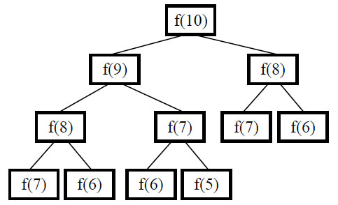
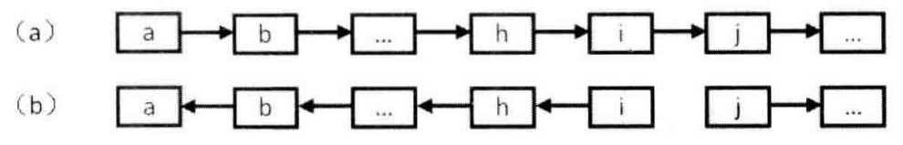
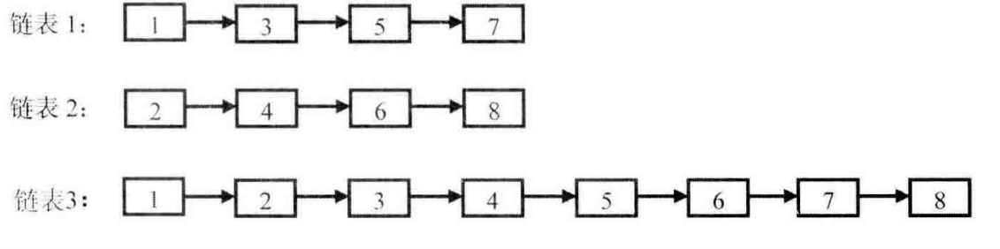
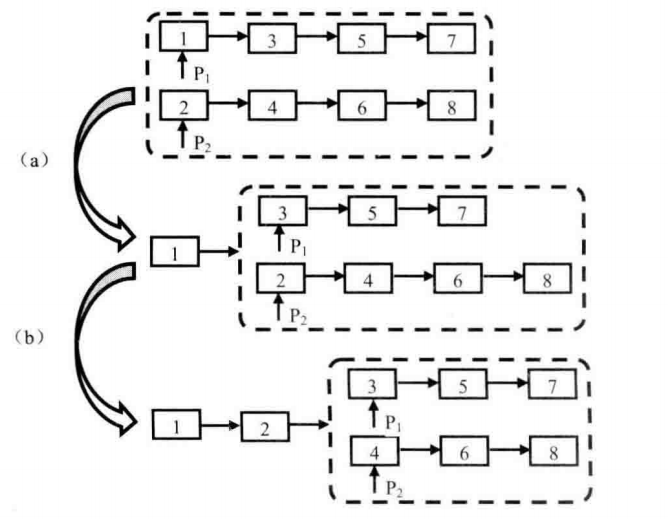
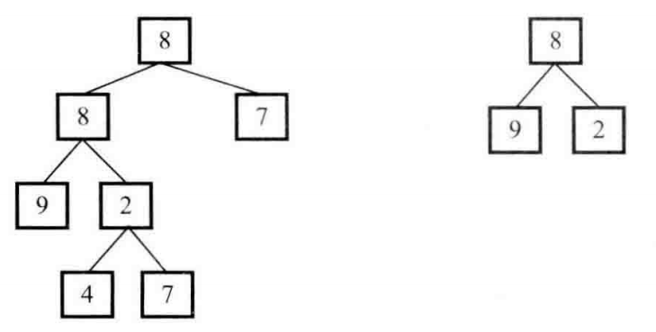
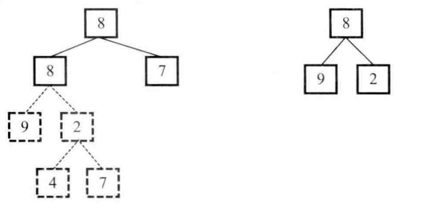

# 题目分类 :fireworks:
* [栈和队列](#栈和队列)
* [查找和排序](#查找和排序)
* [递归和循环](#递归和循环)
* [位运算](#位运算)
* [代码的完整性](#代码的完整性)
* [代码的鲁棒性](#代码的鲁棒性)
----------------------

* [1 用两个栈实现队列](#用两个栈实现队列)
* [2 旋转数组的最小数字](#旋转数组的最小数字)
* [3 斐波那契数列](#斐波那契数列)
* [4 跳台阶](#跳台阶)
* [5 变态跳台阶](#变态跳台阶)
* [6 矩形覆盖](#矩形覆盖)
* [7 二进制中1的个数](#二进制中1的个数)
* [8 数值的整数次方](#数值的整数次方)
* [9 调整数组顺序使奇数位于偶数前面](#调整数组顺序使奇数位于偶数前面)
* [10 链表中倒数第k个结点](#链表中倒数第k个结点)
* [11 反转链表](#反转链表)
* [12 合并两个排序的链表](#合并两个排序的链表)


------------------------

# 查找和排序
## [旋转数组的最小数字](https://www.nowcoder.com/practice/9f3231a991af4f55b95579b44b7a01ba?tpId=13&tqId=11159&rp=1&ru=/ta/coding-interviews&qru=/ta/coding-interviews/question-ranking)
**题目描述**

把一个数组最开始的若干个元素搬到数组的末尾，我们称之为数组的旋转。 输入一个非减排序的数组的一个旋转，输出旋转数组的最小元素。 例如数组{3,4,5,1,2}为{1,2,3,4,5}的一个旋转，该数组的最小值为1。

NOTE：给出的所有元素都大于0，若数组大小为0，请返回0。
### 解题思路

-----------------------

# 递归和循环
## [斐波那契数列](https://www.nowcoder.com/practice/c6c7742f5ba7442aada113136ddea0c3?tpId=13&tqId=11160&tPage=1&rp=1&ru=/ta/coding-interviews&qru=/ta/coding-interviews/question-ranking)
**题目描述**

大家都知道斐波那契数列，现在要求输入一个整数n，请你输出斐波那契数列的第n项（从0开始，第0项为0）。 n<=39

### 解题思路
斐波那契数列（Fibonacci sequence），又称黄金分割数列、因数学家列昂纳多·斐波那契（Leonardoda Fibonacci）以兔子繁殖为例子而引入，故又称为“兔子数列”，指的是这样一个数列：1、1、2、3、5、8、13、21、34、……在数学上，斐波纳契数列以如下被以递推的方法定义：
```
          | 1, (n=1)
f(n) =    | 2, (n=2)
          | f(n-1)+f(n-2) ,(n>2,n为整数)
```
代码如下：
```java
package fibonacci;

public class Fibonacci {
    public int solution(int n){
        if (n == 0)
            return 0;
        if (n == 1)
            return 1;
        if (n == 2)
            return 1;
        return solution(n-1) + solution(n-2);
    }
}
```
但是上述的解法有很严重的效率问题，通过求解第10项的调用过程图来分析：
<div align="center"></div>
从上图中不难发现：在这棵树中有很多结点是重复的，而且重复的结点数会随着n的增大而急剧增加，这意味计算量会随着n的增大而急剧增大。事实上，用递归方法计算的时间复杂度是以n的指数的方式递增的。

**改进解法**

改进的方法并不复杂。上述递归代码之所以慢是因为重复的计算太多，我们只要想办法避免重复计算就行了。这里的办法是从下往上计算，首先根据f(0)和f(1)算出f(2)，再根据f(1)和f(2)算出f(3)……依此类推就可以算出第n项了。很容易理解，这种思路的时间复杂度是O(n)。
```java
public int solution2(int n){
        int[] pre = {0,1};
        if (n < 2){
            return pre[n];
        }
        int f0 = 0;
        int f1 = 1;
        int fn = 0;

        for (int i=2; i<=n; i++){
            fn = f0 + f1;
            f0 = f1;
            f1 = fn;
        }
        return fn;
    }
```

## [跳台阶](https://www.nowcoder.com/practice/8c82a5b80378478f9484d87d1c5f12a4?tpId=13&tqId=11161&tPage=1&rp=1&ru=%2Fta%2Fcoding-interviews&qru=%2Fta%2Fcoding-interviews%2Fquestion-ranking)
**题目描述**

一只青蛙一次可以跳上1级台阶，也可以跳上2级。求该青蛙跳上一个n级的台阶总共有多少种跳法（先后次序不同算不同的结果）。

### 解题思路
列出前几种情况:

    当n=1时，fn=1;
    当n=2时，fn=2;
    当n=3时，fn=3;
    当n=4时，fn=5;
    当n=5时，fn=8;
容易看出，总的跳法是一个[斐波那契数列](#斐波那契数列)。

## [变态跳台阶](https://www.nowcoder.com/practice/22243d016f6b47f2a6928b4313c85387?tpId=13&tqId=11162&tPage=1&rp=1&ru=%2Fta%2Fcoding-interviews&qru=%2Fta%2Fcoding-interviews%2Fquestion-ranking)
**题目描述**

一只青蛙一次可以跳上1级台阶，也可以跳上2级……它也可以跳上n级。求该青蛙跳上一个n级的台阶总共有多少种跳法。

### 解题思路
关于本题，前提是n个台阶会有一次n阶的跳法，分析如下：
```
f(1)=1;
f(2)=f(2-1)+f(2-2);  //f(2-2) 表示2阶一次跳2阶的次数。
f(3)=f(3-1)+f(3-2)+f(3-3);
···
f(n)=f(n-1)+f(n-2)+...+f(n-n);
```
**说明：**
1) 这里的f(n)代表的是n个台阶有一次1,2,...n阶的跳法数。
2) 当n=1时，只有一种跳法，f(1)=1;
3) 当n=2时，有一次1阶或者2阶，这回归到了问题1，f(2)=f(2-1)+f(2-2);
4) 当n=3时，有一次1阶、2阶或者3阶。第一次跳出1阶后剩下f(3-1)；第一次跳出2阶后剩下f(3-2)；第一次跳出3阶后剩下f(3-3)；
5) 当n=3时，有一次1阶、2阶...n阶，得出结论：f(n)=f(n-1)+f(n-2)+...+f(n-n)=f(0)+f(1)+...+f(n-1)
6) 继续简化：f(n-1)=f(n-2)+f(n-3)+...+f(n-1-n+1)=f(0)+f(1)+...+f(n-2)
7) 可以得出：f(n)=2f(n-1)。

代码如下：
```java
package jumpFloorII;

public class JumpFloorII {

    public int solution(int target) {
        if (target < 2)
            return 1;
        return 2*solution(target-1);
    }
}
```

## [矩形覆盖](https://www.nowcoder.com/practice/72a5a919508a4251859fb2cfb987a0e6?tpId=13&tqId=11163&tPage=1&rp=1&ru=%2Fta%2Fcoding-interviews&qru=%2Fta%2Fcoding-interviews%2Fquestion-ranking)

**题目描述**

我们可以用2*1的小矩形横着或者竖着去覆盖更大的矩形。请问用n个2*1的小矩形无重叠地覆盖一个2*n的大矩形，总共有多少种方法？

### 解题思路
    当n=1时，只有一种方法；
    当n=2时，有2种方法；
    ...
    当n=n时，分两步考虑：假设第一块摆放的是2*1的方块，则剩下的有f(n-1)种摆放的方案；假设第一块摆放的是1*2，则必须有另外一块1*2才能凑成满足题目要求的矩形，因此剩下f(n-2)种方案。
可以推导出，最后得出的是一个[斐波那契数列](#斐波那契数列)：
```
          | 1, (n=1)
f(n) =    | 2, (n=2)
          | f(n-1)+f(n-2) ,(n>2,n为整数)
```

-----------------------

# 栈和队列
## [用两个栈实现队列](https://www.nowcoder.com/practice/54275ddae22f475981afa2244dd448c6?tpId=13&tqId=11158&tPage=1&rp=1&ru=/ta/coding-interviews&qru=/ta/coding-interviews/question-ranking)

**题目描述**

用两个栈来实现一个队列，完成队列的Push和Pop操作。队列中的元素为int类型。

### 解题思路
队列的特征为先进先出(FIFO)，而栈的特点为先进后出。由stack1处理push操作，stack2处理pop操作。需要注意的是，每一次向stack1中添加新元素时，都需要把stack2中剩余的元素先添加入stack1。
```java
import java.util.Stack;

public class Solution {
    Stack<Integer> stack1 = new Stack<Integer>();
    Stack<Integer> stack2 = new Stack<Integer>();

    public void push(int node) {
        // 重新将2里面的元素倒入1中
        while (!stack2.empty()){
            stack1.push(stack2.pop());
        }
        stack1.push(node);
    }

    public int pop() {
        while (!stack1.empty()){
            stack2.push(stack1.pop());
        }

        return stack2.pop();
    }
}
```

-----------------------------

# 位运算
## [二进制中1的个数](https://www.nowcoder.com/practice/8ee967e43c2c4ec193b040ea7fbb10b8?tpId=13&tqId=11164&tPage=1&rp=1&ru=%2Fta%2Fcoding-interviews&qru=%2Fta%2Fcoding-interviews%2Fquestion-ranking)

**题目描述**

输入一个整数，输出该数二进制表示中1的个数。其中负数用补码表示。

### 解题思路
**思路1：**

调用API函数，可以直接将整数类型的数转化为二进制字符串，然后再判断字符串中“1”的个数：
```java
public class NumberOf1 {

    public int solution(int n){
        int count = 0;
        String s = Integer.toBinaryString(n);
        char[] ch = s.toCharArray();
        for (char c:ch){
            if (c == '1')
                count++;
        }
        return count;
    }
}
```
**思路2：**

把整数减1与原来的数做与运算，每次运算能将原整数二进制数的最后一位变为0，原整数二进制中有多少个1，便能进行多少次与运算：
```java
public int solution2(int n){
        int count = 0;
        while (n != 0){
            count++;
            n = n & (n - 1);
        }
        return count;
    }
```

----------------------------

# 代码的完整性
## [数值的整数次方](https://www.nowcoder.com/practice/1a834e5e3e1a4b7ba251417554e07c00?tpId=13&tqId=11165&tPage=1&rp=1&ru=%2Fta%2Fcoding-interviews&qru=%2Fta%2Fcoding-interviews%2Fquestion-ranking)

**题目描述**

给定一个double类型的浮点数base和int类型的整数exponent。求base的exponent次方。

### 解题思路
这里考察的是分多种情况计算，指数为0的时候，结果恒为1。当底数为0，指数为负数时，会抛出除0错误。
```java
public class Power {

    public double solution(double base, int exponent) {
        if (exponent == 0)
            return 1.0;
        if (base == 0.0)
            if (exponent < 0)
                throw new RuntimeException("error");
            else
                return 0.0;
        int e = exponent > 0 ? exponent : -exponent;
        double result = 1;

        while (e != 0){
            //根据当前位是1还是0决定累乘还是不累乘
            result = (e & 1) == 0 ? result : result * base;
            base *= base;
            e = e >> 1;
        }
        return exponent > 0 ? result : 1/result;
    }
}
```
## [调整数组顺序使奇数位于偶数前面](https://www.nowcoder.com/practice/beb5aa231adc45b2a5dcc5b62c93f593?tpId=13&tqId=11166&tPage=1&rp=1&ru=%2Fta%2Fcoding-interviews&qru=%2Fta%2Fcoding-interviews%2Fquestion-ranking)

**题目描述**

输入一个整数数组，实现一个函数来调整该数组中数字的顺序，使得所有的奇数位于数组的前半部分，所有的偶数位于数组的后半部分，并保证奇数和奇数，偶数和偶数之间的相对位置不变。

### 解题思路
注意需要保持原数组的相对位置不变，这里只新建一个数组用来保存偶数，奇数仍然保存在原数组当中，用`lastOdd`来标记上重新放入奇数的原数组索引。
```java
package reOrderArray;

public class ReOrderArray {
  public void solution2(int[] array){
        List<Integer> even = new ArrayList<>();
        int lastOdd = 0;
        for (int i=0; i<array.length; i++){
            if (array[i] % 2 == 0) {
                even.add(array[i]);

            }else {
                array[lastOdd++] = array[i];
            }
        }
        for (Integer e:even)
            array[lastOdd++] = e;
    }
}
```
----------------------------------
# 代码的鲁棒性
## [链表中倒数第k个结点](https://www.nowcoder.com/practice/529d3ae5a407492994ad2a246518148a?tpId=13&tqId=11167&tPage=1&rp=1&ru=%2Fta%2Fcoding-interviews&qru=%2Fta%2Fcoding-interviews%2Fquestion-ranking)

**题目描述**

输入一个链表，输出该链表中倒数第k个结点。

### 解题思路
为了实现只遍历一遍就能找到倒数第K个节点，我们可以定义两个指针，第一个指针从链表的头指针开始遍历向前走k-1步，第二个指针保持不动。从第k步开始，第二个指针也开始从链表的头指针开始遍历。由于2个指针的距离保持在k-1，当第一个指针到达链表的尾节点时，第二个指针刚好走到倒数第k个节点。
```java
package findKthToTail;

public class FindKthToTail {
    public ListNode solution(ListNode head, int k){
        if(head == null || k <= 0){
            return null;
        }
        ListNode ANode = head;
        ListNode BNode = null;
        for(int i = 0;i<k-1;i++){
            if(ANode.next != null)
                ANode = ANode.next;
            else
                return null;
        }
        BNode = head;
        while(ANode.next != null){
            ANode = ANode.next;
            BNode = BNode.next;
        }
        return BNode;
    }
}
```

## [反转链表](https://www.nowcoder.com/practice/75e878df47f24fdc9dc3e400ec6058ca?tpId=13&tqId=11168&tPage=1&rp=1&ru=/ta/coding-interviews&qru=/ta/coding-interviews/question-ranking)

**题目描述**

输入一个链表，反转链表后，输出新链表的表头。

### 解题思路
在下图中，假设在h之前的节点全部都反转完成，现在将`i.next`指向h，这将导致i指向j的链接断开，因此需要先将j节点单独保存。然后遍历到链表的尾部，返回当前尾节点即为反转链表的头结点。
<div align="center"></div>

```java
package reverseList;
public class ReverseList {
    public ListNode solution(ListNode head) {
        if (head == null)
            return null;
        if (head.next == null)
            return head;

        ListNode resHead = null;
        ListNode preNode = null;
        ListNode curNode = head;
        ListNode nextNode;

        while (curNode != null){
            nextNode = curNode.next;
            if (nextNode == null)
                resHead = curNode;
            curNode.next = preNode;  // 把当前节点的next指向前一个节点
            preNode = curNode;
            curNode = nextNode;
        }
        return resHead;
    }
}
```

## [合并两个排序的链表](https://www.nowcoder.com/practice/d8b6b4358f774294a89de2a6ac4d9337?tpId=13&tqId=11169&tPage=1&rp=1&ru=/ta/coding-interviews&qru=/ta/coding-interviews/question-ranking)

**题目描述**

输入两个单调递增的链表，输出两个链表合成后的链表，当然我们需要合成后的链表满足单调不减规则。

### 解题思路
首先有2个递增的链表
<div align="center"></div>

合成的新链表要满足单调不减的排序，则可以理解为，遍历完两条链表，每次都比较出当前2链表头结点的大小，取小的那个为新链表的尾节点，如下所示：

<div align="center"></div>

很显然，可以看做为一个递归操作。除此之外，还要考虑一些特殊的情况。比如当链表为空时，因此额外增加一些判断条件就可以，代码如下：
```java
package merge;

import org.junit.Test;

public class Merge {
    public ListNode solution(ListNode list1, ListNode list2) {

        ListNode result;
        if (list1 == null && list2 == null)
            return null;
        if (list1 != null && list2 == null)
            return list1;
        if (list1 == null && list2 != null)
            return list2;

        if (list1.val > list2.val){
            result = list2;
            result.next = solution(list1,list2.next);
        }else {
            result = list1;
            result.next = solution(list1.next,list2);
        }
        return result;
    }
}
```

## [树的子结构](https://www.nowcoder.com/practice/6e196c44c7004d15b1610b9afca8bd88?tpId=13&tqId=11170&tPage=1&rp=1&ru=/ta/coding-interviews&qru=/ta/coding-interviews/question-ranking)

**题目描述**

输入两棵二叉树A，B，判断B是不是A的子结构。（ps：我们约定空树不是任意一个树的子结构）

### 解题思路
下图所示，树A有一部分结构跟树B是一样的，称树B是树A的子树。
<div align="center"></div>

分两步，首先在A树中找到B树的根节点，然后继续判断基于A树中找到的节点下的子树是否跟B树一致，如果是则返回true，否则继续找。
<div align="center"></div>

此思想用递归实现最为方便：
```java
package hasSubtree;

public class HasSubtree {
    public boolean solution(TreeNode root1, TreeNode root2){

        boolean result = false;
        if (root1 != null && root2 != null){
            if (root1.val == root2.val)
                result = doesTree1HasTree2(root1,root2);
            if (!result){
                result = solution(root1.left,root2);
            }
            if (!result){
                result = solution(root1.right,root2);
            }
        }
        return result;
    }

    public boolean doesTree1HasTree2(TreeNode root1, TreeNode root2){
        if (root2 == null)
            return true;
        if (root1 == null)
            return false;
        if (root1.val != root2.val)
            return false;
        return doesTree1HasTree2(root1.left,root2.left) && doesTree1HasTree2(root1.right,root2.right);
    }
}
```
------------------------
