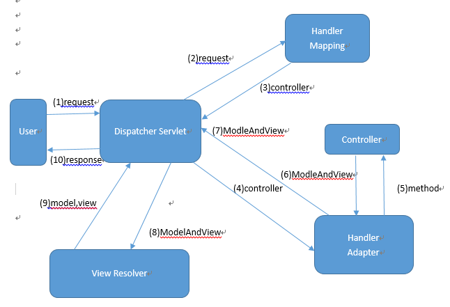
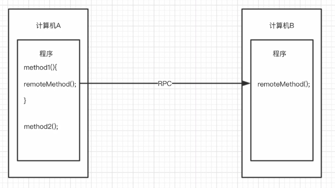
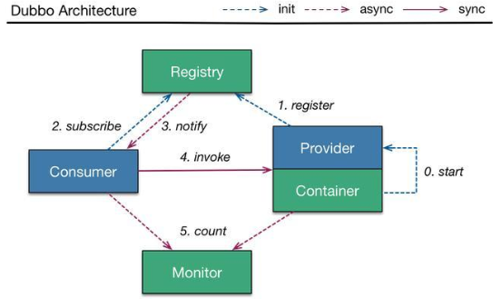

* [SpringMVC](#SpringMVC)
    * [SpringMVC处理请求的流程](#SpringMVC处理请求的流程)
* [Spring](#Spring)
    * [Spring IoC](#Spring-IoC)
    * [Spring AOP](#Spring-AOP)
* [dubbo](#dubbo)

----------------------

# SpringMVC
MVC是Model-View-Controller的简称，即模型-视图-控制器。MVC是一种设计模式，它强行把应用程序的输入、处理和输出分开。

SpringMVC是一个表现层框架，作用就是从请求中接收传入的参数，将处理后的结果数据返回给页面展示。

SpringMVC的**三大组件**：**处理器映射器**(指定url到请求方法的映射，根据输入的url字符串，找到要请求的方法。相当于一个Map的存储结构)，**处理器适配器**(根据不同的处理器，找到不同的处理器适配器去执行)，**视图解析器**(根据不同类型的视图去解析视图)。

MVC中模型、视图和控制器都承担着不同的任务：
- **视图：** 用户看到并与之交互的界面，向用户展示数据，并接收用户的输入。它不参与任何业务逻辑处理。
- **模型：** 表示业务处理，相当于JavaBean。一个模型能为多个视图**提供数据**，提高了代码的复用性。
- **控制器：** 当用户单击Web上的提交按钮，控制器接收请求并调用相应的模型去处理请求。

## SpringMVC处理请求的流程
SpringMVC提供了前端控制器(Dispatcher Servlet)；处理器映射器(Handler Mapping)和处理适配器（Handler Adapter），视图解析器(View Resolver)进行视图管理；动作处理器Controller接口（包含ModelAndView，以及处理请求响应对象request和response），配置灵活，支持文件上传，数据简单转化等强大功能。
<div align="center"></div>

工作流程如下：
- 客户通过url发送请求
- 前端控制器(Dispatcher Servlet)接收到请求，通过系统或自定义的处理器映射器找到对应的Handler，生成处理器执行链HandlerExecutionChain(包括处理器对象和处理器拦截器)一并返回给DispatcherServlet。
- DispatcherServlet根据处理器Handler获取处理器适配器HandlerAdapter执行HandlerAdapter处理一系列的操作，如：参数封装，数据格式转换，数据验证等操作
- 执行处理器Handler(Controller，也叫页面控制器)。
- Handler执行完成返回ModelAndView，Model装的是数据，View决定返回到哪个页面。
- HandlerAdapter将Handler执行结果ModelAndView返回到DispatcherServlet
- DispatcherServlet将ModelAndView传给ViewReslover视图解析器
- ViewReslover解析后返回具体View
- DispatcherServlet对View进行渲染视图（即将模型数据model填充至视图中）。
- DispatcherServlet响应用户。

**注解驱动的作用：**

替我们自动配置最新版的注解处理器映射器和处理器适配器。
```xml
<mvc:annotation-driven/>
```

**注解扫描的作用**

配置@Controller注解扫描，扫描指定package下的注解。
```xml
<contex:component-scan base-package="minhe.controller"/>
```

---------------------

# Spring
Spring是一个分层的 JavaSE/EE 一栈式轻量级开源框架。它是为了解决企业应用开发的复杂性而创建的。

Spring的两大核心技术：
- IoC(控制反转)
- AOP(面向切面编程)

**Spring框架的特点：**

* 方便解耦，简化开发。
    * Spring 就是一个大工厂，可以将所有对象的创建和依赖关系维护，交给 Spring 管理。
* AOP编程的支持。
    * Spring 提供面向切面编程，可以方便的实现对程序进行权限拦截、运行监控等功能。
* 声明式事务的支持
    * 只需要通过配置就可以完成对事务的管理，无需手动编程。
* 方便程序的测试
    * Spring 对 Junit4 支持，可以通过注解方便地测试 Spring 程序。
* 方便集成各种优秀的框架
    * Spring 不排斥各种优秀的开源框架，其内部提供了对各种优秀框架(如：Structs2, Hinernate, MyBatis 等)直接支持
* 降低 JavaEE API 的使用难度
    * Spring 对 JavaEE 开发中非常难用的一些 API(JDBC, JavaMail, 远程调用等)，都提供了封装，使这些 API的应用难度都大大降低。

## Spring IoC
### 什么是IoC的功能？
- IoC, Inverse of Control, 控制反转，将创建对象的权利反转给 Spring 。
- IoC 可以解决程序耦合性高的问题。

两种工厂：ApplicationContext，当配置文件加载完毕时，所有的对象都已经创建好了。
```java
ApplicationContext ac = new ClassPathXmlApplicationContex("applicationContext.xml");
UserService us = (UserService)ac.getBean("userService");
```
BeanFactory，对象在getBean之后才创建好。
```java
BeanFactory factory = new XmlBeanFactory(new ClassPathResource("applicationContext.xml"));
UserService us = (UserService)factory.getBean("userService");
```

**BeanFactory 和 ApplicationContext的区别：**

* BeanFactory  ---- BeanFactory采取延迟加载，第一次 getBean 时才会初始化 Bean。
* ApplicationContext  ---- 在加载 applicationContext.xml 时候就会创建具体的 Bean 对象，还提供了一些其它的功能。
    * 事件传递
    * Bean 自动装配
    * 各种不同应用层的 Context 体现

**Bean 标签的一些属性：**
* **id** ---- Bean起个名字，在约束中采用ID的约束，唯一。
    * 取值要求：必须以字母开始，可以使用字母、数字、连字符、下划线、句话、冒号	id:不能出现特殊字符
* **name** ---- Bean起个名字，没有采用ID的约束
    * 取值要求：name:出现特殊字符。如果`<bean>`没有id的话 , name可以当做id使用
	* Spring框架在整合Struts1的框架的时候，Struts1的框架的访问路径是以/开头的，例如：/bookAction
* **class属性** ---- Bean对象的全路径
* **scope属性**			---- scope属性代表Bean的作用范围
	* singleton			---- 单例（默认值，整个运行环境中就这一个实例。）
	* prototype			---- 多例，在Spring框架整合Struts2框架的时候，Action类也需要交给Spring做管理，配置把Action类配置成多例！！
	* request			---- 应用在Web项目中,每次HTTP请求都会创建一个新的Bean
	* session			---- 应用在Web项目中,同一个HTTP Session 共享一个Bean
	* globalsession		---- 应用在Web项目中,多服务器间的session
* **Bean对象的创建和销毁的两个属性配置**
	* 说明：Spring初始化bean或销毁bean时，有时需要作一些处理工作，因此spring可以在创建和拆卸bean的时候调用bean的两个生命周期方法
	* **init-method**		-- 当bean被载入到容器的时候调用init-method属性指定的方法
	* **destroy-method**	-- 当bean从容器中删除的时候调用destroy-method属性指定的方法
		* 想查看destroy-method的效果，有如下条件
			* scope= singleton有效
			* web容器中会自动调用，但是main函数或测试用例需要手动调用（需要使用ClassPathXmlApplicationContext的close()方法）


## Spring AOP
与OOP相比，面向切面，传统的OOP开发中的代码逻辑是自上而下的，在这些过程中会产生一切横切性的问题，这些问题与主业务逻辑关系不大，会散落在代码的各个地方，难以维护。AOP的思想就是把业务逻辑和横切问题进行分离，从而达到解耦的目的，使代码的重用性和开发效率变高。
### AOP的应用场景
- 日志记录
- 权限验证
- 效率检查
- 事务管理等

### AOP的底层技术
Spring AOP底层用到2种代理机制：
- JDK的动态代理：针对实现了接口的类产生代理
- cglib代理：针对没有实现接口的类产生代理，应用的是底层字节码增强技术，生成当前类的子类对象。

### AOP开发中的相关术语
- **Joinpoint(连接点):** 所谓连接点是指那些被拦截到的点。在Spring中,这些点指的是方法,因为Spring只支持方法类型的连接点.
- **Pointcut(切入点):** 所谓切入点是指我们要对哪些Joinpoint进行拦截的定义.
- **Advice(通知/增强):** 所谓通知是指拦截到Joinpoint之后所要做的事情就是通知.通知分为前置通知,后置通知,异常通知,最终通知,环绕通知(切面要完成的功能)
- **Introduction(引介):** 引介是一种特殊的通知在不修改类代码的前提下, Introduction可以在运行期为类动态地添加一些方法或Field.
- **Target(目标对象):** 代理的目标对象
- **Weaving(织入):** 是指把增强应用到目标对象来创建新的代理对象的过程。Spring采用动态代理织入，而AspectJ采用编译期织入和类装在期织入。
- **Proxy（代理）:** 一个类被AOP织入增强后，就产生一个结果代理类
- **Aspect(切面):** 是切入点和通知（引介）的结合

----------------------------------

# dubbo
Apache Dubbo 是一款高性能、轻量级的开源 Java RPC 框架。

## 什么是RPC
远程过程调用(Remote Procedure Call, RPC)是一个计算机通信协议。该协议允许运行于一台计算机上的程序调用另外一台计算机的子程序，而程序员无需额外为这个交互作用编程。如果涉及的软件采用面向对象编程(Java)，也叫做远程调用或远程方法调用。

<div align="center"></div>

只要支持网络传输的协议就是RPC协议。

## dubbo结构
<div align="center"></div>
