# Java数据结构 :pencil2:

* [二叉树](#二叉树)
    * [二叉树的遍历](#二叉树的遍历)
* [红黑树](#红黑树)
    * [1 平衡树和非平衡树](#平衡树和非平衡树)
    * [2 旋转](#旋转)
* [2-3-4树](#2-3-4树)
    * [1 插入](#插入)
    * [2 2-3-4树转变为红黑树](#2-3-4树转变为红黑树)
    * [3 2-3-4树的效率](#2-3-4树的效率)
    * [4 2-3树](#2-3树)
    * [5 B-树](#B--树)
    * [6 B+树](#B++树)
    * [7 B*树](#B*-树)
* [哈希表](#哈希表)
    * [1 哈希化](#哈希化)
    * [2 开放地址法](#开放地址法)
    * [3 链地址法](#链地址法)
    * [4 哈希函数](#哈希函数)
* [堆](#堆)
    * [1 优先级队列、堆和抽象数据类型](#优先级队列、堆和抽象数据类型)
-----------------------

# 二叉树
## 二叉树的遍历

二叉树分先序、中序、后序三种遍历方法。

```java
public class TreeNode {
    
    int val;
    TreeNode left;
    TreeNode right;
    
    TreeNode(int x) {
        val = x;
    }
}
```


### 先序遍历

其中**先序遍历**是指：

1. 访问根节点
2. 采用先序递归遍历左子树
3. 采用先序递归遍历右子树

注意：每个节点的分支都遵循上述的访问顺序，体现“递归调用”。
<div align="center">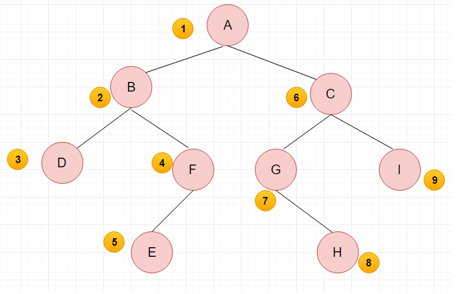</div>

**递归方法**

```java
private void preOrder(TreeNode root) {
    if (root == null)
        return;
    System.out.println(root.val);	// 访问根节点
    preOrder(root.left);	// 访问左孩子
    preOrder(root.right);   // 访问右孩子
}
```

**非递归方法**

```java
private List<Integer> preOrder(TreeNode root) {
    List<Integer> list = new ArrayList<>();
    Stack<Integer> stack = new Stack<>();
    if (root == null)
        return list;
    stack.push(root);	// 先序遍历，先根入栈
    while (!stack.empty()) {
        TreeNode temp = stack.pop();	// 保存当前根节点
        if (temp != null) {
            list.add(temp.val);
            stack.push(root.right);		// 右孩子入栈
            stack.push(root.left);		// 左孩子入栈
        }
    }
    return list;
}
```

### 中序遍历

1. 采用中序递归遍历左子树
2. 访问根节点
3. 采用中序递归遍历右子树

<div align="center"></div>

**递归方法**

```java
private void inOrder(TreeNode root) {
    if (root == null)
        return;
    inOrder(root.left);	// 访问左孩子
	System.out.println(root.val);	// 访问根节点
    inOrder(root.right);   // 访问右孩子
}
```

**非递归方法**

```java
private List<Integer> inorderTraversal(TreeNode root) {
    List<Integer> list = new ArrayList<>();
    Stack<TreeNode> stack = new Stack<>();
    TreeNode cur = root;

    while (cur != null || !stack.empty()) {
        while (cur != null) {   // 循环判断左孩子是否为空
            stack.push(cur);    // 不为空则压入栈
            cur = cur.left;     // 继续判断是否有左孩子
        }
        cur = stack.pop();  // 弹出最底层左孩子
        list.add(cur.val);
        cur = cur.right;    // 指向右孩子，如果有则继续向下遍历，没有则弹出导出第二个左孩子
    }
    return list;
}
```

### 后序遍历

1. 采用后序递归遍历左子树
2. 采用后序递归遍历右子树
3. 访问根节点

<div align="center">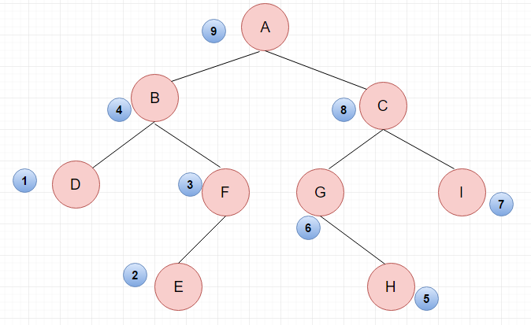</div>

**递归方法**

```java
private void postOrder(TreeNode root) {
    if (root == null)
        return;
    postOrder(root.left);	// 访问左孩子
    postOrder(root.right);   // 访问右孩子
    System.out.println(root.val);	// 访问根节点
```

**非递归方法**

先采用类似先序遍历，先遍历根结点再右孩子最后左孩子（先序是先根结点再左孩子最后右孩子），最后把遍历的序列逆转即得到了后序遍历。

```java
public List<Integer> postorderTraversal(TreeNode root) {
    Deque<TreeNode> stack = new LinkedList<>();
    stack.push(root);
    List<Integer> list = new ArrayList<>();
    while (!stack.isEmpty()) {
        TreeNode node = stack.pop();
        if (node != null) {
            list.add(node.val);
            stack.push(node.left);
            stack.push(node.right);
        }
    }
    Collections.reverse(list);
    return list;
}
```

### 层次遍历

层序遍历也即宽度优先搜索，一层一层搜索，**非递归代码**如下：

```java
private List<List<Integer>> levelOrder(TreeNode root) {
    List<List<Integer>> list = new ArrayList<>();	// 存放结果
    Queue<TreeNode> treeQueue = new LinkedList<>();	// 存放每一层节点的队列
    int levelNum = 0;	// 记录某一层总共有多少个节点
    treeQueue.add(root);	// 根进队
    while (!treeQueue.isEmpty()) {
        levelNum = treeQueue.size();	// 当前队列大小表示当前层的节点数
        List<Integer> levelList = new ArrayList<>();	// 存放当前层节点的值
        while (levelNum > 0) {
            TreeNode temp = treeQueue.poll();
            if (temp != null) {		// temp不为空
                levelList.add(temp.val);
                treeQueue.add(temp.left);	// 左子节点入队
                treeQueue.add(temp.right);
            }
            levelNum--;
        }
        if (levelList.size() > 0) {
            list.add(levelList);
        }
    }
    return list;
}
```


----------------------

# 红黑树

红黑树（Red-Black Tree，以下简称RBTree）的实际应用非常广泛，比如Linux内核中的完全公平调度器、高精度计时器、ext3文件系统等等，各种语言的函数库如Java的TreeMap和TreeSet.解决非平衡树问题的方法。主要讨论插入操作。

**自顶向下插入：**

在搜索例程沿着树向下查找插入点，在此进程中可能要对树的结构做一些改变。

## 平衡树和非平衡树
创建一颗只有一个节点的树，然后插入一系列升序或者降序的关键字。如下图
<div align="center">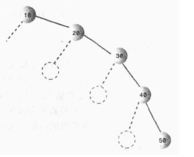</div>
这些节点排在一条直线上，没有分支，所有的节点都在根的一侧，这棵树属于极端不平衡的情况。

### 时间复杂度降低到O(N)
当树没有分支的时候，就相当于一个链表。对于随机数据的实际数量来说，一颗特别不平衡的情况不太可能，因此部分非平衡树的时间介于O(N)和Olog(N)之间，这取决于树的不平衡程度。

### 红黑树的特征
- 节点都有颜色。
- 在插入和删除的过程中，要遵循保持这些颜色的不同排列规则。

**红-黑规则**

插入（删除）一个新节点都要遵循的规则：
- 每一个节点不是红色的就是黑色的；
- 根节点总是黑色的；
- 如果节点是红色的，则他的子节点必须是黑色的；
- 从根到叶节点(没有子节点)或空子节点的每条路径，都必须包含相同数目的黑色节点。

在从根到叶节点路径上黑色节点的数目称为 **黑色高度(black height)**。

### 修正违规的情况
假设看到颜色的规则被违犯了，有且只有下列2种的修正措施：
- 改变节点的颜色；
- 执行旋转操作

## 旋转
旋转必须做2件事：
- 使一些节点上升，一些节点下降，帮助树平衡；
- 保证不破坏二叉搜索树的特征；

<div align="center"></div>

选择则一个节点作为旋转的“顶端”。如果做一次右旋，这个顶端节点将会移动到它右子节点的位置，左子节点将会移动到它原来的位置（必须确保右旋必须有一个左子节点）。左旋类似。**旋转不会改变每颗子树中节点的相互关系**。

**推荐文章：**
- [漫画：什么是红黑树](https://juejin.im/post/5a27c6946fb9a04509096248#comment)
- [红黑树深入剖析及Java实现](https://zhuanlan.zhihu.csom/p/24367771)
- [红黑树详细分析](http://www.tianxiaobo.com/2018/01/11/%E7%BA%A2%E9%BB%91%E6%A0%91%E8%AF%A6%E7%BB%86%E5%88%86%E6%9E%90/)

-------------------------
# 2-3-4树
## 2-3-4树的介绍
2-3-4树，就是多叉树。它的每个节点最多有4个子节点和3个数据项。是 B- 树的特殊情况。
<div align="center">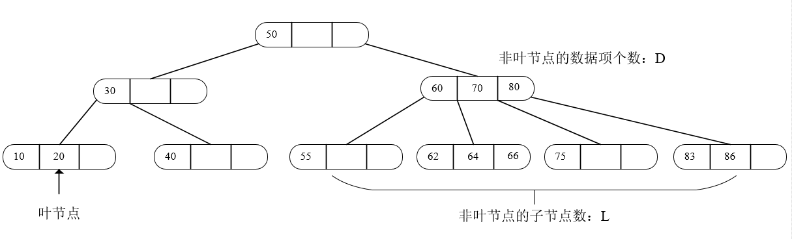</div>
2-3-4树中所有的叶节点总是在同一层上。非叶节点的子节点数总是比它含有的数据项多1。

**用符号可表示为：** L=D+1

2-3-4树的节点如下：
<div align="center">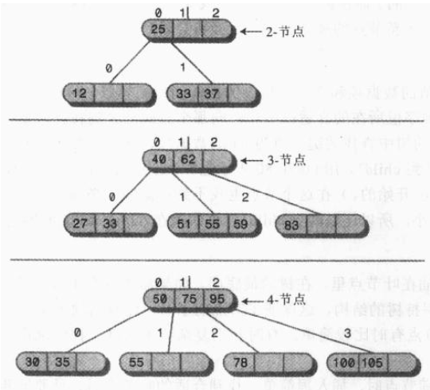</div>

### 2-3-4树的组织
用`0~2`的数字给数据项编号，`0~3`的数字给子节点链编号 。`2-3-4`树的关键字存储顺序跟二叉树一样，但是新增了如下图的规则：
<div align="center">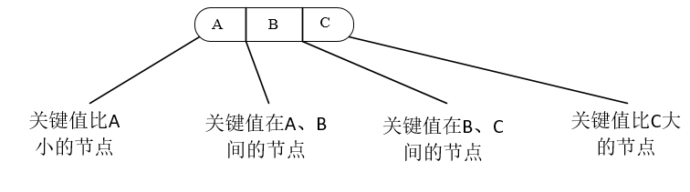</div>

## 插入
查找时没有碰到**满节点**时，插入很简单。找到合适的叶节点后，只要把新数据项插入进去就可以了：
<div align="center">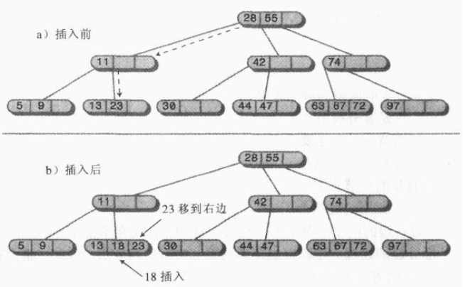</div>

### 节点分裂
如果在寻找要插入位置的路途中，节点已经满了。这种情况下必须分裂(split)。把要分裂的节点中数据项设为A、B、C。下面是分裂时的情况（**假设分裂的节点不是根**）:
- 创建一个新的空节点。它是要分裂节点的兄弟，要放在分裂节点的右边。
- 数据项C移到新节点中。
- 数据项B移到要分裂节点的父节点中。
- 数据项A保留在原来的位置上。
- 最右边的两个子节点从分裂节点处断开，连接到新的节点上。
<div align="center">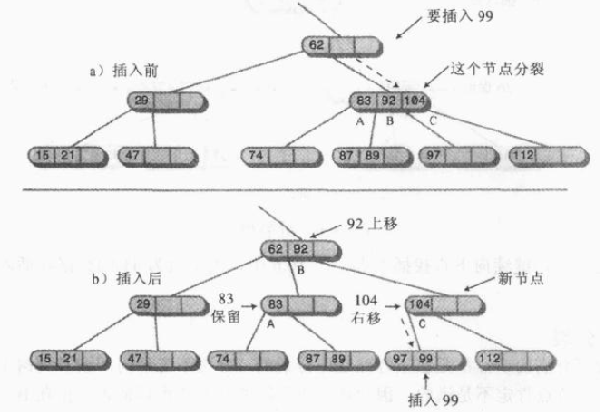</div>
插入只需要分裂一个节点，除非插入路径上存在不止一个满的节点。这种情况需要多重分裂。

### 根的分裂
如果一开始查找插入点就碰到满的根时：
- 创建新的根。它是要分裂节点的父节点。
- 创建第二个新节点。它是要分裂节点的兄弟节点。
- 数据项C移动到新的兄弟节点中。
- 数据项B移动到新的根节点中。
- 数据项A保留在原来的位置上。
- 要分裂的节点最右边两个子节点断开连接，连接到新的兄弟节点上。
<div align="center">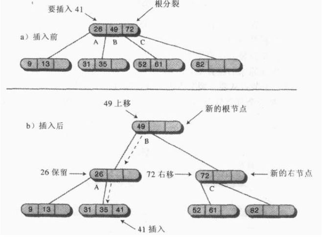</div>

### 在下行路途中分裂
所有满的节点都是在下行路中分裂的。下面显示的是空树中的一系列插入过程。有4个节点分裂了，2个是根，2个是叶节点。
<div align="center">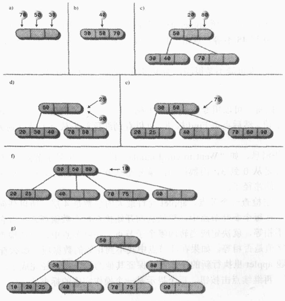</div>

详细代码：[Node](https://gist.github.com/MinheZ/23f94b295fb3956f9dff66e41ccd74fc), [Tree234](https://gist.github.com/MinheZ/ef66e10b12e62236b37df04792b9b1ec)

## 2-3-4树转变为红黑树
应用三条规则可以吧2-3-4树转变为红黑树：
- 把2-3-4树中的每个2-节点转化为红黑树的黑色节点；
- 把每个3-节点转化为一个子节点和一个父节点。子节点有2个自己的子节点：W和X或X和Y。父节点有另一个子节点：Y或W。哪个节点变成子节点或父节点都无所谓。子节点涂成红色，父节点涂成黑色；
- 把每个4-节点转化成一个度节点和两个子节点。第一个子节点有它自己的子节点W和X，第二个子节点拥有子节点Y和Z。子节点涂成红色，父节点涂成黑色。
<div align="center"></div>
2-3-4树转化为红黑树实例：
<div align="center">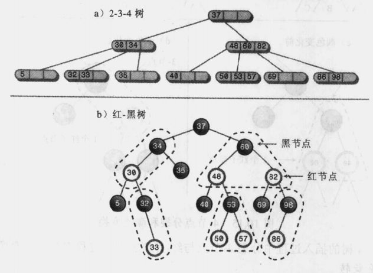</div>
可以想象为抓着中间的数据项，把整棵树“拎”起来。

## 2-3-4树的效率
2-3-4树中每个节点最多可以有4个节点，如果每个节点都是满的，树的高度和`log4(N)`成正比。因此，在所有节点都满的情况下2-3-4树的高度是红黑树的一半。不过他们不可能是满的。

2-3-4树的高度大概在`log2(N+1)`和`log2(N+1)/2`之间。但是2-3-4树每个节点要查看的数据项更多，这部分是线性查找，使得查找时间增加的倍数和`M`(每个节点的平均数据项个数)成正比。因此2-3-4树总的效率与`M*log4(N)`成正比。

2-3-4树中每个节点的数据项都不一样，按照平均2个来计算的话，查找时间与`2*log4(N)`成正比，在大O表示法中这个小的常数可以忽略。

因此，2-3-4树增加每个节点的数据项数量可以抵偿树高度的减小。总的查找时间与红黑树相当，都是`Olog(N)`。

## 2-3树
相比2-3-4树，节点数据项和子节点个数都少1。父节点和子节点的关键字排序顺序和2-3-4树保持一致。

### 节点分裂
2-3树中新的数据项必须参与分裂的过程：如果新数据项要插入的叶节点不满，则可以立即插进去，如果叶节点满了，该节点就得分裂。该节点的两个数据项和新数据项分在这三个节点里：已存在的节点、新节点和父节点。如果父节点非满，操作完成。
<div align="center">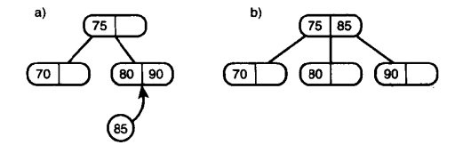</div>
否则继续分裂父节点。
<div align="center">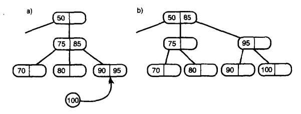</div>
如果根节点也是满的，则创建一个新的根作为原来根的父节点。
<div align="center">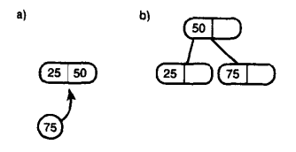</div>
下图则是展示一颗2-3树顺着向上延续分裂节点直到达到根位置的情况：
<div align="center">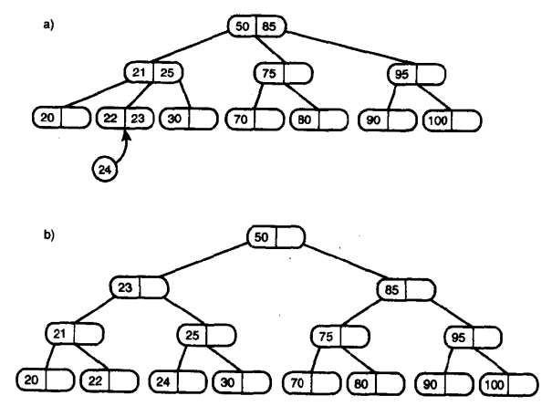</div>
补充：每次分裂的详细情况
<div align="center"></div>

## B 树
B 树是一种适用于外查找的，平衡的多叉树。一颗 m 阶的的 B 树满足下面的条件：
- 树中每个节点至多有 m 个孩子；
- 除根节点和叶子结点，其它每个节点至少有 m/2 个孩子；
- 若根结点不是叶子结点，则至少有2个孩子；
- 所有叶子结点(失败节点)都出现在同一层，叶子结点不包含任何关键字信息；

## B-树
类似于2-3-4树，但是每个节点有**更多的数据项**。B-树的阶数由节点拥有最多的子节点数决定。

**插入:** B-树当中的节点尽可能地满
- 节点分裂时数据项平分：一半到新创建的节点中去，一半保留在原来的节点中。
- 节点分裂像2-3树一样**从底向上**，而不是自顶上下。
- 同样，还是像2-3树一样，原节点内中间数据项不上移，而是加上数据项后锁组成的节点数据项序列的中间数据项上移。(也就是先插入后上移！)

B-树的插入过程如下：
<div align="center"></div>
只有一个新的数据项插入到满的节点中时，才需要分裂节点。
<div align="center">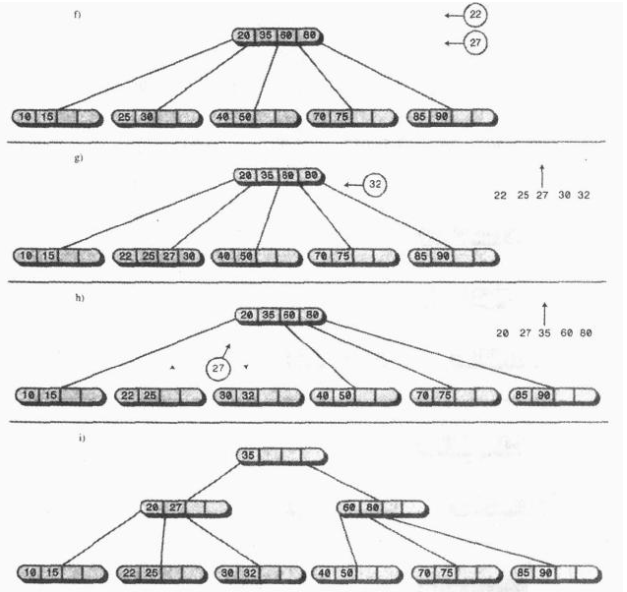</div>

**注意：** 在整个插入过程中，没有一个节点(除了根节点)的数据项少于一般，并且很多都比一半要满。这样做能够使读取一个节点时，总是能存取尽可能多的数据。

<!-- ### B-树的效率 -->

## B+ 树
[漫画：什么是 B+ 树？](https://www.sohu.com/a/156886901_479559)

B+ 树相对于 B- 树的优势：
- B+ 树中间节点没有卫星数据，所以同样大的磁盘页可以容纳更多的节点元素，因此 B+ 树更加“矮胖”，查询时 IO 次数也更少。
- B+ 树的查询必须到叶子结点，B- 树则是查到匹配元素即可，无论是在根还是在叶子结点。因此 B+ 树的每一次查找都是稳定的。
- 范围查询简便。

## B* 树
B*树是B+树的变种，相对于B+树他们的不同之处如下：

- 首先是关键字个数限制问题，B+树初始化的关键字初始化个数是`cei(m/2)`，`b*`树的初始化个数为`（cei(2/3*m)）`
- B+树节点满时就会分裂，而B*树节点满时会检查兄弟节点是否满（因为每个节点都有指向兄弟的指针），如果兄弟节点未满则向兄弟节点转移关键字，如果兄弟节点已满，则从当前节点和兄弟节点各拿出1/3的数据创建一个新的节点出来；

**特点**

在B+树的基础上因其初始化的容量变大，使得节点空间使用率更高，而又存有兄弟节点的指针，可以向兄弟节点转移关键字的特性使得B*树额分解次数变得更少；
<div align="center">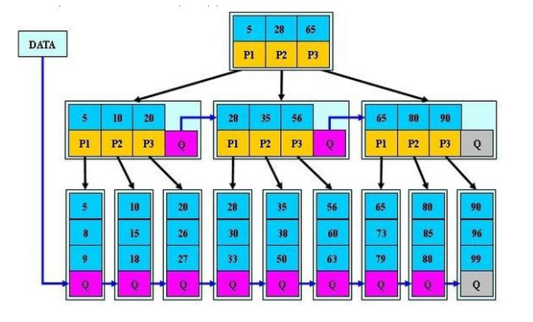</div>

[几种树的比较](https://zhuanlan.zhihu.com/p/27700617)

-----------------------------

# 哈希表
**优点：** 不论哈希表中有多少数据，插入和删除(有时候包括删除)只需要接近常量的时间O(1)

**缺点：** 基于数组，创建后难以扩展。无法简单地顺序遍历表中的数据项。

在不需要有序遍历数据，且可以预知数据量大小，哈希表能充分展现它的性能。

## 哈希化
把要存储的值，通过某种变换转化成数组下标。(类似于某种归一化)
```java
arrayIndex = key % totalKeyNum;
```

### 冲突
把巨大的数字空间压缩成较小的数字空间，怎么样保证每个数据都映射到数组的控制单元？**一般设定的数组容量是需求容量的两倍**。因此，当冲突发生时：
- 一个方法是通过系统的方法找到数组的一个空位，并把这个数据项填入，而不再使用哈希函数得到数组下标——**开放地址法**
- 创建一个存放数据链表的数组，数组内不直接存放数据。当冲突发生的时候，新的数据项直接接到这个数组下标所指的链表中——**链地址法**

## 开放地址法
### 线性探测

线性地查找空白单元，数组的下标一直递增，直到找到空位。当数据项数目占哈希表长的一半，或最多到三分之二时，哈希表的性能最好。

在哈希表中，一串连续的已填充单元叫作**填充序列**。增加越来越多数据项时，填充序列变得越来越长，这叫做**聚集**。
<div align="center">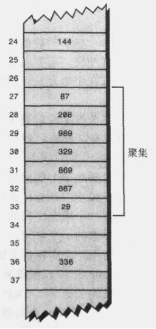</div>

当**查找哈希表**中的数据时，根据哈希函数计算出的数组下标被其它数据项占据，则查找算法沿着该索引向后一个个查找，若在找到要寻找的关键字之前遇到一个空位，说明查找失败（否则插入算法应该把冲突的数据项插入到那）。
<div align="center">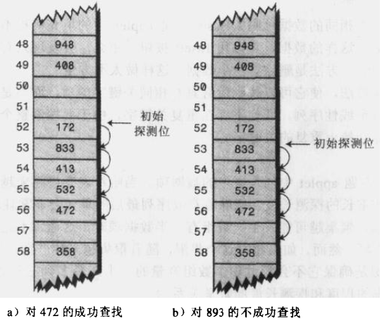</div>

查找过程代码如下：
```java
public DataItem findKey(int key) {
    int hashIndex = hashFunc(key);
    // 假设哈希表不满的情况，否则会出现死循环
    while (hashArray[hashIndex] != null) {
        if (hashArray[hashIndex].getiData() == key)
            return hashArray[hashIndex];
        hashIndex++;
        hashIndex %= arraySize;  // 在整个数组中循环找
    }
    return null;
}
```
当**删除**哈希表中一个数据项时，被删除项要用特殊的关键字(*Del*)标记。**尽可能有节制地使用删除方法**。
```java
public DataItem delete(int key){
    int hashIndex = hashFunc(key);
    while (hashArray[hashIndex] != null){
        if (hashArray[hashIndex].getiData() == key){
            DataItem temp = hashArray[hashIndex];
            hashArray[hashIndex] = nonItem;
            return temp;
        }
        hashIndex++;
        hashIndex %= arraySize;
    }
    return null;
}
```
哈希表中不允许有重复的数据项存入，目的是为了提高性能。因为查找多个具有相同关键字的数据项，需要搜索它遇到的每个线性序列。

**插入操作**中确保插入的地方为空，或者被标记为删除。
```java
public void insertKey(DataItem item) {
    int key = item.getiData();
    int hashIndex = hashFunc(key);
    // 假设哈希表不满的情况, 当该索引不是null，且上面的对象不是nonItem才插入
    while (hashArray[hashIndex] != null && hashArray[hashIndex] != nonItem) {
        hashIndex++;
        hashIndex %= arraySize;
    }
    hashArray[hashIndex] = item;
}
```

**扩展数组**

扩展后的数组容量一般是原来的两倍，实际上数组容量应该是一个 **质数(只能被1和自己整除，好处是可以使数组里面的数据更均匀得分布，避免聚集)**，所以新数组要比两倍多一点。再将原来数组里面的数据 **重新哈希化**，插入新的数组中。
```java
private int getPrime(int min) {
    for (int j = min;; j++) {
        if (isPrime(j)) {
            return j;
        }
    }
}
private boolean isPrime(int num) {
    for (int j = 2; j * j <= num; j++) {
        if (num % j == 0) {
            return false;
        }
    }
    return true;
}
```
#### 线性探测的问题
**优点：** 思路清晰，算法简单。

**缺点：** 处理溢出需另编程序。一般可另外设立一个溢出表，专门用来存放上述哈希表中放不下的记录。此溢出表最简单的结构是顺序表，查找方法可用顺序查找。

线性探测法很容易产生堆聚现象。按照线性探测法处理冲突，如果生成哈希地址的连续序列愈长，则当新的记录加入该表时，与这个序列发生冲突的可能性愈大。因此，哈希地址的较长连续序列比较短连续序列生长得快，这就意味着，一旦出现堆聚 ( 伴随着冲突 ) ，就将引起进一步的堆聚。

### 二次探测
**装填因子：** 已填入哈希表的数据项和表长的比率。

二次探测是**防止聚集产生**的一种尝试。思想是探测相隔较远的单元，而不是相邻的。探测的过程是
```
x+1, x+4, x+9, x+16, ...
```
<div align="center">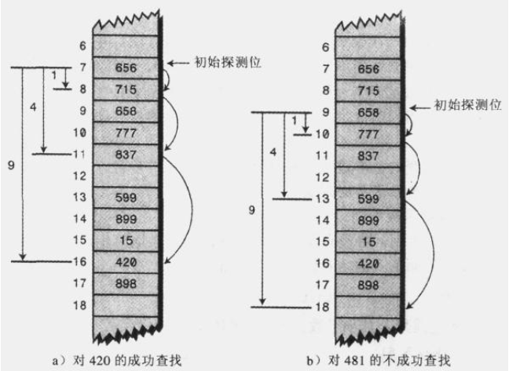</div>

#### 二次探测的问题
二次探测产生了一种更细的聚集问题。比如将184，302,420，和544依次插入到表中，他们都映射到7。那么302将以1为步长的探测，420则以4为步长的探测，544则以9为步长的探测。这种现象称为**二次聚集**。

### 再哈希法
消除原始聚集和二次聚集。把关键字用不同的哈希函数再做一遍哈希化，用这个结果作为步长。第二个哈希函数必须具备以下特点：
- 和第一个哈希函数不同；
- 不能输出0（否则步长为0，陷入死循环）

**目前已知工作得很好的哈希函数：**
```java
stepSize = constant - (key % constant);
```
其中，`constant`是质数，且小于数组容量。
<div align="center">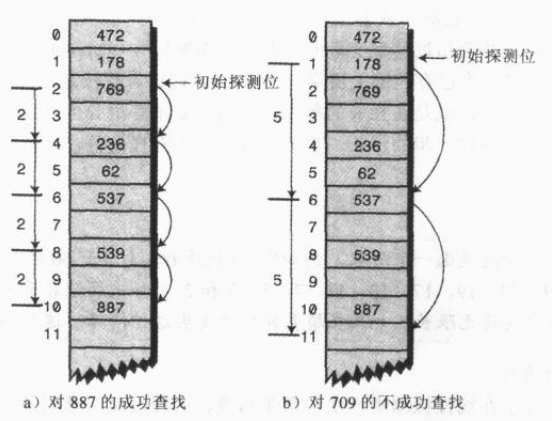</div>
对于此程序的编写，只要在线性探测的基础上将`hashIndex++`改为

```java
hashIndex += reHash(key,arraySize);
// 其中：
// 再哈希函数
public int reHash(int key, int arraySize){
    int prime = getPrime(arraySize);   // 获取小于数组容量的最大质数
    return prime - (key % prime);
}
```
重要的事情说三遍：数组容量必须是一个**质数**，这样才能保证探测序列最终会访问到所有的单元。

## 链地址法
在哈希表每个单元中设置链表，某个数据项的关键字还是像通常一样映射到哈希表的单元，而数据项本身插入到这个单元的链表中。
<div align="center">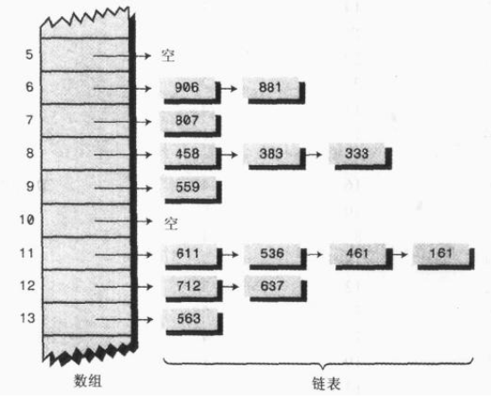</div>

**在开放地址法中，当装填因子超过二分之一或者三分之二后，性能下降很快。**

**在链地址法中，装填因子可以到1以上，且对性能的影响不大。**

以下为链地址法的相关代码：
```java
package hashChain;

public class HashChainTable {

    private SortedList[] hashArray;
    private int hashSize;

    HashChainTable(int hashSize) {
        this.hashSize = hashSize;
        hashArray = new SortedList[hashSize];
        // 在每个数组节点上装一个链表的引用
        for (int i = 0; i < hashSize; i++)
            hashArray[i] = new SortedList();
    }

    public int hashFunc(int key) {
        return key % hashSize;
    }

    public void insert(Link newLink) {
        int key = newLink.getData();
        int hashIndex = hashFunc(key);
        hashArray[hashIndex].insertLink(newLink);
    }

    public void delete(int key) {
        int hashIndex = hashFunc(key);
        hashArray[hashIndex].deleteLink(key);
    }

    public Link find(int key) {
        int hashIndex = hashFunc(key);
        return hashArray[hashIndex].findLink(key);
    }

    public void displayHashChainTable() {
        for (int i = 0; i < hashSize; i++) {
            System.out.print(i + ". ");
            hashArray[i].displayLink();
        }
    }
}
```
其中，`SortedList`是一个有序链表，哈希冲突的数据项能够有序得插入到相应位置的链表中去。

## 哈希函数
将得到的关键字范围用某种简单并能快速计算的方法，转换为数组下标。

### 哈希化字符串
把字符串cats用下面公式转化为一个数字：
```
key = 3*27^3 + 1*27^2 + 20*27^1 + 19*27^0
```
借助Horner(Horner是英国数学家，1773-1827)的数学恒等式取代乘法：
```
var4*n^4 + var3*n^3 + var2*n^2 + var1*n^1 + var0*n^0
可以写成：
(((var4*n + var3)*n + var2)*n + var1)*n + var0
```
同时在每一步中，都可以应用取模操作符(%)，代码如下：
```java
public static int hashFunc(String key){
    int hashIndex = 0;
    for (int j=0; j<key.length(); j++) {
        int letter = key.charAt(j) - 96;
        hashIndex = (hashIndex * 27 + letter) % hashSize;
    }
    return hashIndex;
}
```

-----------------------

# 堆
堆是有如下特点的二叉树：
- 它是完全二叉树。对于一个树高为h的二叉树，如果其第0层至第h-1层的节点都满。如果最下面一层节点不满，则所有的节点在左边的连续排列，空位都在右边。这样的二叉树就是一棵完全二叉树。
- 它常常用一个数组实现
- 堆中的每一个节点都满足堆的条件，也就是说每一个节点的关键字都大于(或等于)这个节点的子节点的关键字。
<div align="center">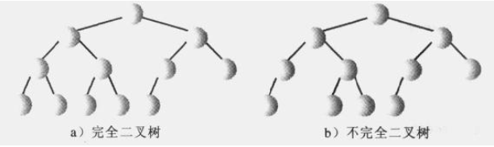</div>
下图显示了堆与实现它的数组之间的关系：
<div align="center">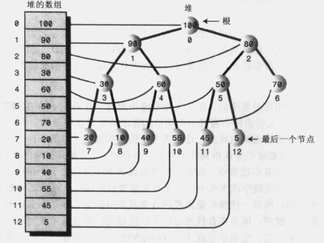</div>

## 优先级队列、堆和抽象数据类型
堆主要用于实现优先级队列。

### 弱序
堆和二叉搜索树相比是弱序的，这是因为堆的特点决定的。它不支持遍历，也不能在堆上方便地查找指定关键字。

### 移除
指删除关键字最大的节点，它在堆中总是根节点。且根在数组中的索引总是0：
```java
maxNode = heapArray[0];
```
下面是移除最大节点的步骤：
- 移走根；
- 把最后一个节点移动到根的位置；
- 一直向下筛选这个节点，直到它在一个大于它的节点之下，小于它的节点之上为止。

```java
heapArray[0] = heapArray[N-1];
N--;
```
<div align="center">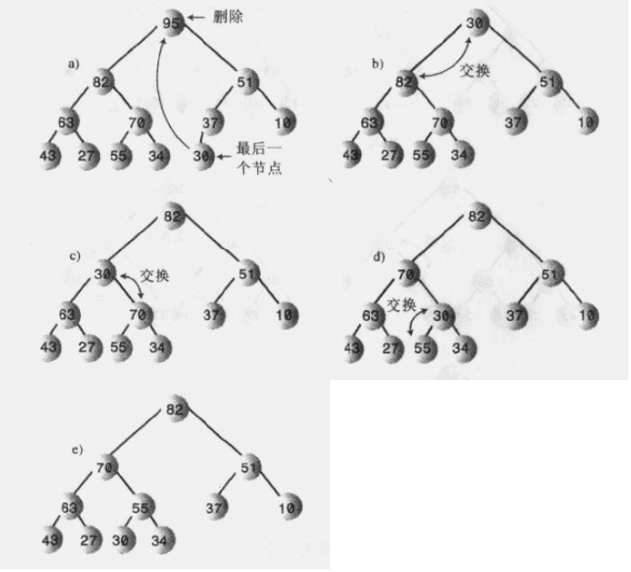</div>

### 插入
使用向上筛选，节点先插入最后，数组容量`+1`
```java
heapArray[N] = newNode;
N++;
```
<div align="center">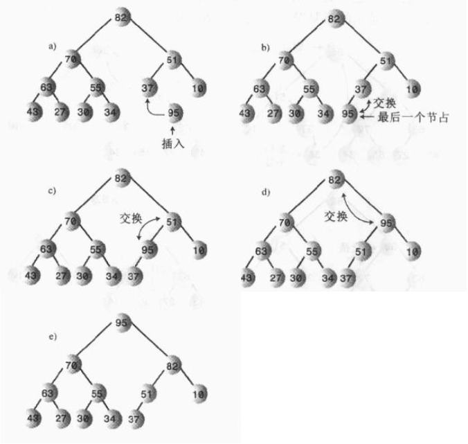</div>

用数组表示一棵树，若数组中节点的索引为`x`，则：
- 它的父节点的下标为(x-1)/2
- 它的左子节点下标为2*x+1
- 它的右子节点下标为2*x+2

其中： “/”向下取整。

完整的代码如下：
```java
package Heap;

public class Heap {

    private Node[] heapArray;
    private int maxSize;
    private int currentSize;

    Heap(int size) {
        maxSize = size;
        heapArray = new Node[maxSize];
        currentSize = 0;
    }

    public boolean insert(int key) {
        if (isFull())
            return false;
        Node newNode = new Node(key);
        heapArray[currentSize] = newNode;
        trickUp(currentSize++);
        return true;
    }

    public void trickUp(int index) {

        int parent = (index - 1) / 2;
        Node bottom = heapArray[index]; // 临时存放新插入进的节点

        while (index > 0 && heapArray[parent].getData() < bottom.getData()) {
            heapArray[index] = heapArray[parent];
            index = parent;
            parent = (index - 1) / 2;
        }
        heapArray[index] = bottom;
    }

    public Node remove() {
        if (isEmpty())
            return null;
        Node temp = heapArray[0];
        heapArray[0] = heapArray[--currentSize]; // 第N个元素的索引为N-1
        trickDown(0);
        return temp;
    }

    public void trickDown(int index) {

        Node top = heapArray[index];
        int largerChild;

        while (index < currentSize / 2) {  // 节点至少有一个孩子
            int leftChildIndex = 2 * index + 1;
            int rightChildIndex = 2 * index + 2;
            if (rightChildIndex < currentSize && // 判断右孩子是否存在
                    heapArray[rightChildIndex].getData() > heapArray[leftChildIndex].getData()) {
                largerChild = rightChildIndex;
            } else
                largerChild = leftChildIndex;
            if (top.getData() >= heapArray[largerChild].getData())  // 判断第一个节点
                break;
            heapArray[index] = heapArray[largerChild];
            index = largerChild;
        }
        heapArray[index] = top;
    }

    // 改变某个节点的值
    public boolean change(int index, int newValue) {
        if (index < 0 || index > currentSize)
            return false;
        int oldValue = heapArray[index].getData();
        heapArray[index].setData(newValue);
        if (oldValue < newValue)
            trickUp(index);
        else trickDown(index);
        return true;
    }

    public void displayHeap() {
        System.out.print("heapArray: ");    // array format
        for (int i = 0; i < currentSize; i++) {
            if (heapArray[i] != null)
                System.out.print(heapArray[i].getData() + " ");
            System.out.print("-- ");
        }
        System.out.println();

        int nBlank = 32;
        int itemPerRow = 1;
        int column = 0;
        int j = 0;
        String dots = "...................";
        System.out.println(dots + dots);

        while (currentSize > 0) {
            if (column == 0)
                for (int k = 0; k < nBlank; k++)
                    System.out.print(' ');
            System.out.print(heapArray[j].getData());
            if (++j == currentSize)
                break;
            if (++column == itemPerRow) {
                nBlank /= 2;
                itemPerRow *= 2;
                column = 0;
                System.out.println();
            } else
                for (int k = 0; k < nBlank * 2 - 2; k++)
                    System.out.print(' ');
            System.out.println("\n" + dots + dots);
        }
    }

    public boolean isEmpty() {
        return currentSize == 0;
    }

    public boolean isFull() {
        return currentSize == maxSize;
    }
}

```

### 堆操作的效率
向上筛选和向下筛选是堆操作最耗时的部分。所需的复制次数和堆的高度有关，这里讨论的堆操作时间复杂度都是`O(lonN)`。

## 堆排序
堆排序的基本思想是使用普通的`insert()`例程在堆中插入全部无序的数据项，然后重复用`remove()`，如下：
```java
for (j=0; j<size; j++) {
    heap.insert(anArray[j]);    // 未排序
}
for (j=0; j<size; j++) {
    heap.remove();  // 排序之后
}
```
因为`insert()`和`remove()`方法的操作时间复杂度都是`O(lonN)`，并且每个方法都要执行`N`次，所以整个排序的时间需要`O(N*logN)`，但是堆排序中向上筛选和向下筛选的操作比快排要多，所以整体还是不如快速排序快。
