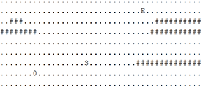

# 常见算法题 :newspaper_roll:


## 广度优先搜索(BFS)


### 例题，推箱子

有一个推箱子的游戏, 一开始的情况如下图:

<div align="center"></div>

上图中, '.' 表示可到达的位置, '#' 表示不可到达的位置，其中 S 表示你起始的位置, 0表示初始箱子的位置, E表示预期箱子的位置，你可以走到箱子的上下左右任意一侧, 将箱子向另一侧推动。如下图将箱子向右推动一格;

..S0.. -> ...S0.

注意不能将箱子推动到'#'上, 也不能将箱子推出边界;

现在, 给你游戏的初始样子, 你需要输出最少几步能够完成游戏, 如果不能完成, 则输出-1。

#### 输入描述:

```
第一行为2个数字,n, m, 表示游戏盘面大小有n 行m 列(5< n, m < 50);
后面为n行字符串,每行字符串有m字符, 表示游戏盘面;
```

#### 输出描述:

```
一个数字,表示最少几步能完成游戏,如果不能,输出-1;
```

示例1

#### 输入

复制

```
3 6
.S#..E
.#.0..
......
```

#### 输出

复制

```
11
```