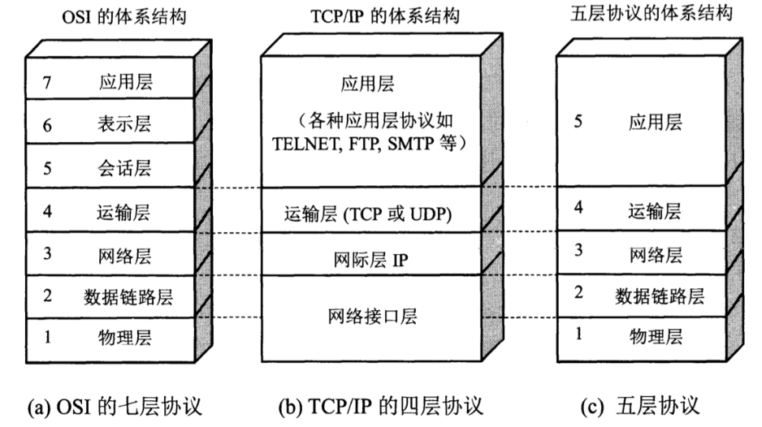
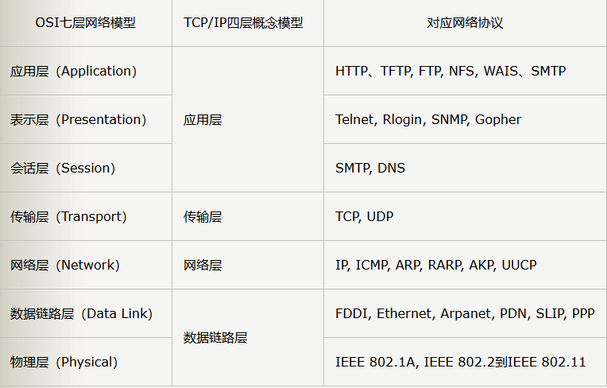
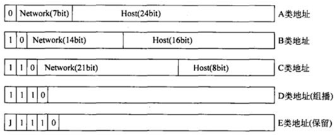
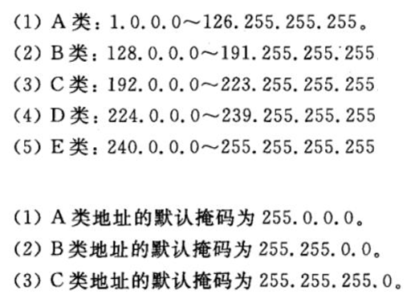
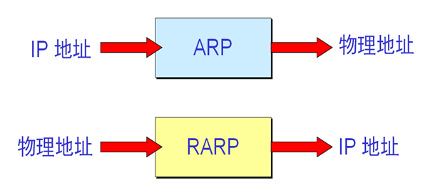

# 网络基础分层和协议总结 :do_not_litter:

- [1 OSI模型、TCP/IP体系详解](#1-OSI模型、TCP/IP体系详解)
- [2 网络层协议详解](#2-网络层协议详解)
- [3 传输层协议详解](#3-传输层协议详解)
- [4 应用层协议详解](#4-应用层协议详解)

---------------------------------------

## 1 OSI模型、TCP/IP体系详解

### 1.1 OSI模型、TCP/IP体系图示

### 1.2 模型分层 各层作用

#### 1.2.1 应用层

直接为用户的应用进程提供服务

#### 1.2.2 传输层

负责主机（或者路由）中**两个进程间的通信**，用于保证传输质量、流量控制、跟上层应用交互等

#### 1.2.3 网络层

负责多跳的**路由选择问题**。处理路径、流控、拥塞等问题。

#### 1.2.4 数据链路层

流量控制、 传输有地址的帧以及错误检测功能 。

#### 1.2.5 物理层

透明传送比特流

## 2 网络层协议详解

### 2.1 IP

#### 2.1.1 作用

IP是尽力传输的网络协议，其提供的数据传送服务是**不可靠的、无连接**的。IP协议不关心数据包的内容，不能保证数据包是否能成功地到达目的地，也不维护任何关于前后数据包的状态信息，面向连接的可靠服务有上层的TCP协议来实现。

**标识节点和链路：**

IP为每个链路分配一个全局唯一的网络号以标识每个网络；为每个节点分配一个全局唯一的32位IP地址，用以标识每一个节点。

**寻址和转发：**

IP路由器根据掌握的路由信息，确定节点所在网络的位置，进而确定节点所在的位置，并选择适当的路径将IP包转发到目的节点。

**适应各种数据链路：**

为了工作在多样化的链路和介质上，IP必须具备适应各种数据链路的能力，例如根据链路的MTU（最大传输单元）对IP包进行分片和重组，可以建立IP地址到数据链路层地址的映射以通过实际的数据链路传递信息。

#### 2.1.2 IP地址分类

#### 2.1.3 子网掩码的作用

子网掩码只有一个作用，就是将某个IP地址划分成**网络地址**和**主机地址**两部分。

用于子网掩码的位数决定于**可能的子网数目**和**每个子网的主机数目**。

### 2.2 ARP、RARP

#### 2.2.1 作用

作为网络中主机的身份标识，**IP 地址是一个逻辑地址**，但在实际进行通信时，物理网络所使用的依然是物理地址，**IP地址是不能被物理网络识别的**。**ARP 给出了将主机的网络地址动态映射为MAC地址的方法**，而 RARP 给出了一种允许工作站动态获得其协议地址的方法。

ARP就是用于动态地将IP地址解析为MAC地址的协议。主机通过ARP解析到目的MAC地址后，将在自己的ARP缓存表中增加相应的IP地址到MAC地址的映射表项，用于后续到同一目的地报文的转发。

ARP的作用如同问路一样，IP地址好比是目的地的名称，MAC地址好比是目的地的物理位置。

采用RARP获取IP地址。

ARP和RARP请求是广播方式，应答都是单播方式

#### 2.2.2 图示

****

### 2.3 ICMP

#### 2.3.1 作用

在无可靠性保证的IP通信中，IP设备需要互相交换一定的控制信息，以便互相沟通通信环境状况，报告发生的错误。

定义了错误报告和其他回送给源点的关于IP数据包处理处理情况的消息，可以用于报告IP数据包传递过程中发生的错误、失败等信息，**提供网络诊断功能**。

ICMP允许主机或路由器**报告差错情况**和**提供有关异常情况的报告**。如果在传输过程中发生某种错误，设备便会向信源端返回一条ICMP消息，告知他发生的错误类型。

#### 2.3.2 主要应用

**Ping** 

**Tracert**

----------------------------------------------------

## 3 传输层协议详解

### 3.1 TCP

#### 3.1.1 作用

TCP是传输控制协议，提供的是**面向连接、可靠的字节流服务**。通信双方彼此交换数据前，必须先通过三次握手协议建立连接，之后才能传输数据。TCP提供超时重传，丢弃重复数据，检验数据，流量控制等功能，保证数据能从一端传到另一端。

#### 3.1.2 如何保证可靠传输

**数据包校验：**

目的是检测数据在传输过程中的任何变化，若校验出包有错，则丢弃报文段并且不给出响应，这时TCP发送数据端超时后会重发数据；

**对失序数据包重排序：**

既然TCP报文段作为IP数据报来传输，而IP数据报的到达可能会失序，因此TCP报文段的到达也可能会失序。TCP将对失序数据进行重新排序，然后才交给应用层；

**丢弃重复数据：**

对于重复数据，能够丢弃重复数据；

**应答机制：**

当TCP收到发自TCP连接另一端的数据，它将发送一个确认。这个确认不是立即发送，通常将推迟几分之一秒；

**超时重发：**

当TCP发出一个段后，它启动一个定时器，等待目的端确认收到这个报文段。如果不能及时收到一个确认，将重发这个报文段；

**流量控制：**

TCP连接的每一方都有固定大小的缓冲空间。TCP的接收端只允许另一端发送接收端缓冲区所能接纳的数据，这可以防止较快主机致使较慢主机的缓冲区溢出，这就是流量控制。TCP使用的流量控制协议是可变大小的滑动窗口协议。

#### [3.1.3 三次握手](https://github.com/MinheZ/ZMH_Notes/blob/master/note/%E8%AE%A1%E7%AE%97%E6%9C%BA%E7%BD%91%E7%BB%9C.md#2-TCP%E7%9A%84%E4%B8%89%E6%AC%A1%E6%8F%A1%E6%89%8B)

#### [3.1.4 四次挥手](https://github.com/MinheZ/ZMH_Notes/blob/master/note/%E8%AE%A1%E7%AE%97%E6%9C%BA%E7%BD%91%E7%BB%9C.md#3-tcp%E7%9A%84%E5%9B%9B%E6%AC%A1%E6%8C%A5%E6%89%8B)

#### 3.1.5 TCP粘包和拆包

**TCP粘包/拆包问题说明**

假设客户端分别发送了两个数据包D1和D2给服务端，由于服务端一次读取到的字节数是不确定的，故可能存在以下4种情况。

（1）服务端分两次读取到了两个独立的数据包，分别是D1和D2，没有粘包和拆包；

（2）服务端一次接收到了两个数据包，D1和D2粘合在一起，被称为TCP粘包；

（3）服务端分两次读取到了两个数据包，第一次读取到了完整的D1包和D2包的部分内容，第二次读取到了D2包的剩余内容，这被称为TCP拆包；

（4）服务端分两次读取到了两个数据包，第一次读取到了D1包的部分内容D1_1，第二次读取到了D1包的剩余内容D1_2和D2包的整包。

如果此时服务端TCP接收滑窗非常小，而数据包D1和D2比较大，很有可能会发生第五种可能，即服务端分多次才能将D1和D2包接收完全，期间发生多次拆包。

**粘包问题产生的原因**

（1）应用程序write写入的字节大小大于套接口发送缓冲区大小；

（2）进行MSS大小的TCP分段；

（3）以太网帧的payload大于MTU进行IP分片。

**粘包问题的解决策略**

由于底层的TCP无法理解上层的业务数据，所以在底层是无法保证数据包不被拆分和重组的，这个问题只能通过上层的应用协议栈设计来解决，根据业界的主流协议的解决方案，可以归纳如下。

（1）消息定长，例如每个报文的大小为固定长度200字节，如果不够，空位补空格；

（2）在包尾增加回车换行符进行分割，例如FTP协议；

（3）将消息分为消息头和消息体，消息头中包含表示消息总长度（或者消息体长度）的字段，通常设计思路为消息头的第一个字段使用int32来表示消息的总长度；

（4）更复杂的应用层协议。

------------------------------------------------

### 3.2 UDP

#### 3.2.1 作用

UDP是用户数据报协议，是一个简单的面向无连接的协议。UDP不提供可靠的服务。在数据数据前不用建立连接故而传输速度很快。UDP主要用户流媒体传输，IP电话等对数据可靠性要求不是很高的场合。

## 4 应用层协议详解

### 4.1 HTTP与HTTPS

#### 4.1.1 HTTP和HTTPS的区别

1.https协议需要到CA申请证书，一般免费证书很少，需要交费。

2.http是超文本传输协议，信息是明文传输；https 则是具有安全性的ssl加密传输协议。

3.http和https使用的是完全不同的连接方式，用的端口也不一样，前者是80，后者是443。

4.http的连接很简单，是无状态的；HTTPS协议是由SSL+HTTP协议构建的可进行加密传输、身份认证的网络协议，比http协议安全。

#### 4.1.2 HTTPS是如何保证数据传输的安全

[也许这样理解HTTPS更容易](https://mp.weixin.qq.com/s/_b0E1EymMeq1Nq5LS22jNw)。

https实际就是在TCP层与http层之间加入了SSL/TLS来为上层的安全保驾护航，主要用到对称加密、非对称加密、证书，等技术进行客户端与服务器的数据加密传输，最终达到保证整个通信的安全性。

**SSL/TLS协议作用：**

1.认证用户和服务器，确保数据发送到正确的客户机和服务器；

2.加密数据以防止数据中途被窃取；

3.维护数据的完整性，确保数据在传输过程中不被改变。

#### 4.1.3 HTTP的长连接和短连接?

HTTP的长连接和短连接本质上是TCP长连接和短连接。HTTP属于应用层协议.

**短连接:**

浏览器和服务器每进行一次HTTP操作，就建立一次连接，但任务结束就中断连接。

**长连接:**

当一个网页打开完成后，客户端和服务器之间用于传输HTTP数据的 TCP连接不会关闭，如果客户端再次访问这个服务器上的网页，会继续使用这一条已经建立的连接。   Keep-Alive不会永久保持连接，它有一个保持时间，可以在不同的服务器软件（如Apache）中设定这个时间。实现长连接要客户端和服务端都支持长连接。

**长连接多用于**操作频繁，点对点的通讯，而且连接数不能太多情况。每个TCP连接都需要三步握手，这需要时间，如果每个操作都是先连接，再操作的话那么处理速度会降低很多，所以每个操作完后都不断开，次处理时直接发送数据包就OK了，不用建立TCP连接。例如：数据库的连接用长连接，如果用短连接频繁的通信会造成socket错误，而且频繁的socket创建也是对资源的浪费。 

而像WEB网站的http服务一般都**用短链接**，因为长连接对于服务端来说会耗费一定的资源，而像WEB网站这么频繁的成千上万甚至上亿客户端的连接用短连接会更省一些资源，如果用长连接，而且同时有成千上万的用户，如果每个用户都占用一个连接的话，那可想而知吧。所以并发量大，但每个用户无需频繁操作情况下需用短连好。

#### 4.1.4 HTTP特点

**简单快速：**

客户向服务器请求服务时，只需传送请求方法和路径。请求方法常用的有GET、HEAD、POST。每种方法规定了客户与服务器联系的类型不同。由于HTTP协议简单，使得HTTP服务器的程序规模小，因而通信速度很快。

**灵活：**

HTTP允许传输任意类型的数据对象。正在传输的类型由Content-Type加以标记。

**无连接：**

无连接的含义是限制每次连接只处理一个请求。服务器处理完客户的请求，并收到客户的应答后，即断开连接。采用这种方式可以节省传输时间。

**无状态：**

HTTP协议是无状态协议。无状态是指协议对于事务处理没有记忆能力。缺少状态意味着如果后续处理需要前面的信息，则它必须重传，这样可能导致每次连接传送的数据量增大。另一方面，在服务器不需要先前信息时它的应答就较快。

#### 4.1.5 HTTP状态码

**200 OK** //客户端请求成功

**301 Moved Permanently** //永久重定向,使用域名跳转

**302 Found** // 临时重定向,未登陆的用户访问用户中心重定向到登录页面

**400 Bad Request** //客户端请求有语法错误，不能被服务器所理解

**401 Unauthorized** //请求未经授权，这个状态代码必须和WWW-Authenticate报头域一起使用

**403 Forbidden** //服务器收到请求，但是拒绝提供服务

**404 Not Found** //请求资源不存在，eg：输入了错误的URL

**500 Internal Server Error** //服务器发生不可预期的错误

**503 Server Unavailable** //服务器当前不能处理客户端的请求，一段时间后可能恢复正常

****

#### 4.1.6 HTTP方法比较

**get:** 客户端向服务端发起请求，获得资源。请求获得URL处所在的资源。

**post:** 向服务端提交新的请求字段。请求URL的资源后添加新的数据。

**head:** 请求获取URL资源的响应报告，即获得URL资源的头部。

**patch：** 请求局部修改 URL 所在资源的数据项。

**put：** 请求修改 URL 所在资源的数据元素。

**delete：** 请求删除 url 资源的数据。

****

#### 4.1.7 HTTP的GET和POST的区别

1. GET请求一般不应产生副作用。就是说，它仅仅是获取资源信息，就像数据库查询一样， 不会修改，增加数据，不会影响资源的状态。

- GET 请求可被缓存

- GET 请求保留在浏览器历史记录中

- GET 请求可被收藏为书签

- GET 请求不应在处理敏感数据时使用

- GET 请求有长度限制

- GET 请求只应当用于取回数据

2. POST 比 GET 更安全，因为参数不会被保存在浏览器历史或 web 服务器日志中。

- POST 请求不会被缓存

- POST 请求不会保留在浏览器历史记录中

- POST 不能被收藏为书签

- POST 请求对数据长度没有要求

****

**8.               HTTP报文解析**

**1.  请求报文**

****

**请求行：请求方法、URI、HTTP协议版本**

**请求头部：用于说明请求源、连接类型、以及一些Cookie信息等。**

**请求正文：一般用于存放POST请求类型的请求正文。**

**2.  响应报文**

****

**状态码部分：响应HTTP协议版本号、响应返回状态码、响应描述**

**响应头部主要是返回一些服务器的基本信息，以及一些Cookie值等**

**响应体：请求需要得到的具体数据，可以为任何类型数据，一般网页浏览返回的为html      文件内容.。**

****

****

****

**9.                HTTP缓存机制及原理**

**1.缓存规则解析**

**在客户端第一次请求数据时，此时缓存数据库中没有对应的缓存数据，需要请求服务器，服务器返回后，将数据存储至缓存数据库中。**

****

****

**2.两大类缓存规则**

**1.强制缓存**

**1.请求数据的流程**

****

****

****

**2.如何判断缓存存在**

**缓存规则信息包含在响应header中。**

**对于强制缓存来说，响应header中会有两个字段来标明失效规则（Expires/Cache-Control）**

**HTTP 1.1 的版本，使用Cache-Control替代Expires，其中包括失效时间，客户端、代理服务器是否缓存等。**

****

****

**2.对比缓存**

**1.请求数据流程**

****

****

**2.如何判断缓存存在**

**浏览器第一次请求数据时，服务器会将缓存标识与数据一起返回给客户端，客户端将二者备份至缓存数据库中。**

**再次请求数据时，客户端将备份的缓存标识发送给服务器，服务器根据缓存标识进行判断，判断成功后，返回304状态码，通知客户端比较成功，可以使用缓存数据。**

****

****

****

****

****

****

****

****

**10.            URL，URI，URN**

**参考地址：<https://blog.csdn.net/Xanthin/article/details/52278147>**

****

**URI：“http://bitpoetry.io/posts/hello.html#intro”** 

**“http://”是定义如何访问资源的方式。** 

**“bitpoetry.io/posts/hello.html”是资源存放的位置。** 

**“#intro”是资源。** 

**URL是URI的一个子集，告诉我们访问网络位置的方式。在我们的例子中，URL应该如下所示：** 

**“http://bitpoetry.io/posts/hello.html”** 

**URN是URI的子集，包括名字（给定的命名空间内），但是不包括访问方式，如下所示： “bitpoetry.io/posts/hello.html#intro”** 

****

****

**2.  DNS**

**参考地址：<https://blog.csdn.net/root_robot/article/details/53872812>**

**1.DNS是什么**

**万维网上作为域名和IP地址相互映射的一个分布式数据库，能够使用户更方便的访问[互联网](https://baike.baidu.com/item/互联网)，而不用去记住能够被机器直接读取的IP数串。**

****

**2.DNS域名空间结构**

**域名系统作为一个层次结构和分布式[数据库](http://lib.csdn.net/base/mysql)，包含各种类型的数据，包括主机名和域名。DNS数据库中的名称形成一个分层树状结构称为域命名空间。**

****

****

**3.DNS为什么不采用单点的集中式的设计方式，而是使用分布式集群的工作方式？**

**DNS的一种简单的设计模式就是在因特网上只使用一个DNS服务器，该服务器包含所有的映射，在这种集中式的设计中，客户机直接将所有查询请求发往单一的DNS服务器，同时该DNS服务器直接对所有查询客户机做出响应。尽管这种设计方式非常诱人，但它不适用当前的互联网。因为当今的因特网有着数量巨大并且在持续增长的主机，这种集中式设计会有单点故障，通信容量（上亿台主机发送的查询DNS报文请求，包括但不限于所有的HTTP请求，电子邮件报文服务器，TCP长连接服务），远距离的时间延迟，维护开销大（因为所有的主机名-IP映射都要在一个服务站点更新）等问题。**

****

**4.DNS服务的工作过程**

****

**1、在浏览器中输入www . qq .com 域名，[操作系统](http://lib.csdn.net/base/operatingsystem)会先检查自己本地的hosts文件是否有这个网址映射关系，如果有，就先调用这个IP地址映射，完成域名解析。**
        **2、如果hosts里没有这个域名的映射，则查找本地DNS解析器缓存，是否有这个网址映射关系，如果有，直接返回，完成域名解析。**
        **3、如果hosts与本地DNS解析器缓存都没有相应的网址映射关系，首先会找TCP/IP参数中设置的首选DNS服务器，在此我们叫它本地DNS服务器，此服务器收到查询时，如果要查询的域名，包含在本地配置区域资源中，则返回解析结果给客户机，完成域名解析，此解析具有权威性。**
        **4、如果要查询的域名，不由本地DNS服务器区域解析，但该服务器已缓存了此网址映射关系，则调用这个IP地址映射，完成域名解析，此解析不具有权威性。**
        **5、如果本地DNS服务器本地区域文件与缓存解析都失效，则根据本地DNS服务器的设置（是否设置转发器）进行查询，如果未用转发模式，本地DNS就把请求发至13台根DNS，根DNS服务器收到请求后会判断这个域名(.com)是谁来授权管理，并会返回一个负责该顶级域名服务器的一个IP。本地DNS服务器收到IP信息后，将会联系负责.com域的这台服务器。这台负责.com域的服务器收到请求后，如果自己无法解析，它就会找一个管理.com域的下一级DNS服务器地址(http://qq.com)给本地DNS服务器。当本地DNS服务器收到这个地址后，就会找http://qq.com域服务器，重复上面的动作，进行查询，直至找到www.qq.com主机。**
        **6、如果用的是转发模式，此DNS服务器就会把请求转发至上一级DNS服务器，由上一级服务器进行解析，上一级服务器如果不能解析，或找根DNS或把转请求转至上上级，以此循环。不管是本地DNS服务器用是是转发，还是根提示，最后都是把结果返回给本地DNS服务器，由此DNS服务器再返回给客户机。**
 **从客户端到本地DNS服务器是属于递归查询，而DNS服务器之间就是的交互查询就是迭代查询。**

****

****

****

****

****

****

****

****

****

****

****

****

****

****

****

****

****

****

****

****

****

****

****

****

****

****

****

****

**5. 其他互联网概念详解**

**参考地址：<https://blog.csdn.net/u013200864/article/details/53118037>**

**1.      代理**

**代理是一种有转发功能的应用程序，它扮演了位于服务器和客户端中间人的角色。它不改变请求的URL,代理服务器分为缓存代理，透明代理和非透明代理。缓存代理会预先把资源的副本保存在代理服务器上。转发请求或响应的时候，不对报文做任何加工的代理被称为透明代理反之为非透明代理 .**

****

****

**2.      网关**

**网关用来转发其他服务器通信数据的服务器，网关能使通信线路上的服务器提供非HTTP协议服务，网关可在客户端与网关的通信线路上的加密确保连接安全，可连接数据库，缓存是有有效期限的，缓存不止在服务器端也可以在客户端。** 

****

****

**3.      隧道**

**隧道是在相隔很远的客户端和服务器端两者之间进行中转并保持双方连接的应用程序，使用ssl加密手段进行通信，隧道的目的是确保客户端能与服务器端进行安全的通信。**

****

**4.      网桥**

**略**

****

**5.      中继**

**略**

****

**6.      防火墙**

**所谓防火墙指的是一个由软件和硬件设备组合而成、在内部网和外部网之间、专用网与公共网之间的界面上构造的保护屏障.是一种获取安全性方法的形象说法，它是一种计算机硬件和软件的结合，使Internet与Intranet之间建立起一个安全网关（Security Gateway），从而保护内部网免受非法用户的侵入，防火墙主要由服务访问规则、验证工具、包过滤和应用网关4个部分组成，防火墙就是一个位于计算机和它所连接的网络之间的软件或硬件。该计算机流入流出的所有网络通信和数据包均要经过此防火墙。**

****

**7.      WEB SERVICE**

**参考地址：<https://blog.csdn.net/u011983531/article/details/49681055>**

**1.     概述**

**WebService是一种跨编程语言和跨操作系统平台的远程调用技术。**

**WebService使用soap协议：基于http的应用层协议，http也是应用层协议，基于socket的传输数据。所以soap也是跨平台的。soap是在http的基础上，一个基于xml的协议。soap=http+xml。   因为webservice在传输数据的时候，先依据XSD(WebService数据类型标准)将java对象序列化成soap协议，在服务端，再把soap协议反序列化成java对象，正因为如此，他的传输速度不快。** 

****

**2.     优点：**

**实现面向对象开发，soap是一个标准协议，方便跨平台，跨公司接口开发，适用于不用考虑传输速度的传输。**

****

**3.     WEB SERVICE三大技术**

**1、SOAP协议**

**Web Service是基于SOAP协议的。**

**SOAP协议是基于HTTP协议的，但增加了一些特定的HTTP消息头，发送的请求和返回的结果都采用XML格式封装。打个比喻：HTTP就是普通公路，XML就是中间的绿色隔离带和两边的防护栏，SOAP就是普通公路经过加隔离带和防护栏改造过的高速公路。**

**2、XML+XSD**

**XML是WebService平台中表示数据的格式。除了易于建立和易于分析外，XML主要的优点在于它既是平台无关的，又是厂商无关的。**

**XML解决了数据表示的问题，但它没有定义一套标准的数据类型，更没有说如何扩展这套数据类型。例如，整型数到底代表什么？16位，32位，64位？这些细节对实现互操作性很重要。XML Schema(XSD)就是专门解决这个问题的一套标准。它定义了一套标准的数据类型，并给出了一种语言来扩展这套数据类型。WebService平台就是用XSD来作为其数据类型系统的。当你用某种语言(如Java、.NET或C#)来构造一个Web service时，为了符合WebService标准，所有你使用的数据类型都必须被转换为XSD类型。你用的工具可能已经自动帮你完成了这个转换，但你很可能会根据你的需要修改一下转换过程。**

****

****

**3、WSDL**

**WSDL(Web Services Description Language)就是这样一个基于XML的语言，用于描述Web Service及其函数、参数和返回值。它是WebService客户端和服务器端都能理解的标准格式。因为是基于XML的，所以WSDL既是机器可阅读的，又是人可阅读的，这将是一个很大的好处。一些最新的开发工具既能根据你的Web service生成WSDL文档，又能导入WSDL文档，生成调用相应WebService的代理类代码。**

****

**4.     适用场景和理由**

**1.                跨越防火墙通信**

 **客户端和服务器端之间通信都会有防火墙或者代理服务器。传统的实现互相通信的方法是在分布式对象，如DCOM、CORBA之间进行相互的远程过程调用（TCP/IP），但在这种场合下HTTP协议的特性没有得到应用，因此在Internet环境下的远程过程调用不是一件容易的事情，同时在Internet上使用远程过程调用还存在安全问题，防火墙和代理服务器还有可能阻挡这种类型的数据传输。HTTP是在Internet上发送消息的标准协议。Web服务使用基于XML消息处理作为基本的数据通信方式，应用程序可以使用HTTP和XML消息等标准在基于Web的应用程序之间交换信息，从而跨越防火墙。**

**2.                应用程序集成**

**企业里经常要把不同语言写成的在不同平台上运行的各种程序集成起来。大型公司常常有很多部门，每个部门都使用最适合自己特定需要的应用程序和平台。为了能够让公司各部门之间进行通信，首先应该将公司内部的应用程序和商业过程集成在一起。Web服务的开放标准使组织创建可重用的应用程序接口。当被包装成一个或一组Web服务之后，任何应用程序理论上都可以通过SOAP消息与任何其他应用程序进行通信。**

**3.                软件复用**

**软件复用是在软件开发中避免重复劳动的解决方案。Web服务实现了业务级别的软件复用，例如在B2B的集成中，各企业之间通过互相调用Web服务，实现了Web服务的共享，Web服务的使用企业不需要再重新开发其他企业中已经存在的服务。**

****

**8.      httpClient**

**1.概述**

**HttpClient用来调用服务，它是模拟一个浏览器，发送Http的请求，服务器会返回请求的一个响应结果,Httpclient然后把响应的结果取出来。HttpClinet相当于一个客户端.**

**HttpClient 是 Apache Jakarta Common 下的子项目，用来提供高效的、最新的、功能丰富的支持 HTTP 协议的客户端编程工具包，并且它支持 HTTP协议最新的版本和建议。**

****

**9.      Socket**

**1.     概述**

**Socket是一种传输层的协议，常用tcp,udp。Socket是操作系统提供的一套网络接口，不同的编程语言都可以实现，Socket是跨平台的，传输数据时需要程序员自己解析数据流。** 

**2.     优点：**

**传输速度很快，所以适用于考虑传输速度的场景。**

****

****

****

****

**10.    Restful是什么**

**1.rest概念**

**REST其实是一种组织Web服务的架构，而并不是我们想象的那样是实现Web服务的一种新的技术，更没有要求一定要使用HTTP。其目标是为了创建具有良好扩展性的分布式系统。**

****

**2.rest的架构级约束**

**使用客户/服务器模型。客户和服务器之间通过一个统一的接口来互相通讯。**

**层次化的系统。在一个REST系统中，客户端并不会固定地与一个服务器打交道。**

**无状态。在一个REST系统中，服务端并不会保存有关客户的任何状态。也就是说，客户端自身负责用户状态的维持，并在每次发送请求时都需要提供足够的信息。**

**可缓存。REST系统需要能够恰当地缓存请求，以尽量减少服务端和客户端之间的信息传输，以提高性能。**

**统一的接口。一个REST系统需要使用一个统一的接口来完成子系统之间以及服务与用户之间的交互。这使得REST系统中的各个子系统可以独自完成演化。**

****

**3.     restful的概念**

**遵守了rest 原则 的web服务。**

****

**4.     soap和rest的区别**

**因为SOAP并不假定传输数据的下层协议，因此必须设计为能在各种协议上运行。即使绝大多数SOAP是运行在HTTP上，使用URI标识服务，SOAP也仅仅使用POST方法发送请求，用一个唯一的URI标识服务的入口。**

**REST正是这样设计的，REST为每一个资源指定一个唯一的URI，而用HTTP的4种方法GET、POST、PUT、DELETE直观地表示获取、创建、更新和删除资源。**

**安全性：SOAP会好于restful**

**效率和易用性(REST更胜一筹)**    

**成熟度(总的来说SOAP在成熟度上优于REST)**

****

****