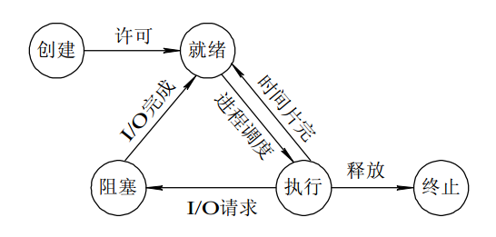
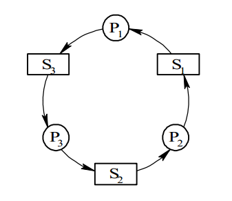

* [一、进程的描述与控制](#一、进程的描述与控制)
    * [1 进程的定义和特征](#1-进程的定义和特征和特征)
    * [2 进程调度算法](#2-进程调度算法)
    * [3 进程同步](#3-进程同步)
    * [4 进程通信](#4-进程通信)
* [二、死锁](#二、死锁)
    * [1 死锁的必要条件](#1-死锁的必要条件)
    * [2 处理死锁的方法](#2-处理死锁的方法)
* [参考资料](#参考资料)

----------------

# 一、进程的描述与控制

## 1 进程的定义和特征

### 1.1 进程的定义
进程是具有独立功能的程序在一个数据集合上运行的过程，它是系统进行资源分配和调度的一个独立单位。

为了能使参与并发执行的每个程序(含数据)都能独立运行，在操作系统中必须为之配置 **进程控制块(Process Control Block, PCB)** 的数据结构。

### 1.2 进程的特征

- **动态性**。由创建而生，由调度而执行，由撤销而死亡。
- **并发性**。多个进程实体存在于内存中。
- **独立性**。能独立运行、获得资源和接受调度的基本单位。
- **异步性**。各自按独立的、不可预知的速度向前推进。

### 1.3 进程的基本状态及转换

- 就绪(Ready)状态。
- 执行(Running)状态。
- 阻塞(Block)状态。

<div align="center"></div>

## 2 进程调度算法

调度算法与当前所处的环境不同，因此需要分别讨论调度算法。

### 2.1 批处理系统

批处理系统中没有太多的用户操作，在该系统中，调度算法是保证吞吐量和运转时间（从提交到终止的时间）。

- **先来先服务(First-come first-servered, FCFS)**

  按照请求的先来后到进行调度。

  有利于长作业，但不利于短作业，因为短作业必须一直等待前面的长作业执行完毕才能执行，而长作业又需要              执行很长时间，造成了短作业等待时间过长。

- **短作业优先(Shortest job first, SJF)**

  估计各进程运行时间，最短的优先。

  如果一直有短作业到达，则长作业可能会“饥饿”。

- **最短剩余时间优先(Shortest remaining time next, SRTN)**

  按估计剩余时间最短的优先。

### 2.2 交互式系统

交互式系统中包含大量的交互性操作，需要系统给予快速的响应。

- **时间片轮转**

  将所有就绪进程按 FCFS 的原则排成一个队列，每次调度时，把 CPU 时间分配给队首进程，该进程可以执行一个时间片。当时间片用完时，由计时器发出时钟中断，调度程序便停止该进程的执行，并将它送往就绪队列的末尾，同时继续把 CPU 时间分配给队首的进程。

  时间片轮转算法的效率和时间片的大小有很大关系：

  - 时间片太小，进程间切换频繁，吞吐量下降。
  - 时间片太大，实时性差。

  <div align="center"></div>

- **优先级调度**

  将进程装进一个优先级队列中，且为不同的进程提供不同的优先级。

  为了防止“饥饿”进程出现，可以随时间推移增加进程的优先级。

- **多级反馈队列**

  一个进程需要执行 100 个时间片，如果采用时间片轮转调度算法，那么需要交换 100 次。

  多级队列是为这种需要连续执行多个时间片的进程考虑，它设置了多个队列，每个队列时间片大小都不同，例如 1,2,4,8,..。进程在第一个队列没执行完，就会被移到下一个队列。这种方式下，之前的进程只需要交换 7 次。

  **每个队列优先权也不同**，最上面的优先权最高。因此只有上一个队列没有进程在排队，才能调度当前队列上的进程。

  可以将这种调度算法看成是时间片轮转调度算法和优先级调度算法的结合。

  <div align="center"></div>

### 2.3 实时系统

实时系统要求一个请求在一定时间内必须得到相应。

- **硬实时：** 满足绝对的截止时间。
- **软实时：** 可以容忍一定程度的超时。

## 3 进程同步

进程同步的主要任务，是对多个相关进程在执行次序上进行协调，是并发执行的进程之间能按照一定得时序共享计算机资源。

### 3.1 临界区

对临界资源进行访问的那段代码称为临界区。

为了互斥访问临界资源，每个进程在进入临界区之前，需要先进行检查。

```
// entry section
// critical section;
// exit section
```

### 3.2 同步机制应遵守的规则

- **空闲让进。** 当临界资源处于空闲状态，应该允许一个请求进入临界区的进程进入。
- **忙则等待。** 保证临界资源互斥访问。
- **有限等待。** 保证等待进程在有限时间进入临界区，避免“死等”状态。
- **让权等待。** 当进程不能进入自己临界区时，应立即释放处理机制。

### 3.3 同步与互斥

- 同步：多个进程按一定顺序执行。
- 互斥：多个进程在同一时刻只能有一个进入临界区。

## 4 进程通信

进程通信是指进程之间的信息交换。

### 4.1 管道

用于连接一个读进程和一个写进程以实现它们之间通信的一个共享文件。

管道机制必须提供以下三方面的协调能力：

- 互斥。
- 同步。
- 确定对方是否存在。

管道通过 pipe 函数创建，`fd[0]` 用于读 `fd[1]` 用于写。

```c
#include <unistd.h>
int pipe(int fd[2]);
```

具有以下限制：

- 半双工通信（单向交替传输）。
- 只能在父子进程间使用。

<div align="center"></div>

### 4.2 FIFO

也叫做命名管道，可以在非亲缘关系进程中使用。

<div align="center"></div>

### 4.3 消息队列

相比于 FIFO，消息队列具有以下优点：

- 消息队列可以独立于读写进程存在，从而避免了 FIFO 中同步管道的打开和关闭时可能产生的困难；
- 避免了 FIFO 的同步阻塞问题，不需要进程自己提供同步方法；
- 读进程可以根据消息类型有选择地接收消息，而不像 FIFO 那样只能默认地接收。

### 4.4 信号量

它是一个计数器，用于为多个进程提供对共享数据对象的访问。

### 4.5 共享存储

允许多个进程共享一个给定的存储区。因为数据不需要在进程之间复制，所以这是最快的一种 IPC。

需要使用信号量用来同步对共享存储的访问。

多个进程可以将同一个文件映射到它们的地址空间从而实现共享内存。另外 XSI 共享内存不是使用文件，而是使用使用内存的匿名段。

### 4.6 套接字

与其它通信机制不同的是，它可用于不同机器间的进程通信。

-----------------------------------

# 二、死锁

<div align="center"></div>

## 1 死锁的必要条件

四个条件，缺一不可：

- **互斥**。某资源只能被一个进程占用。
- **请求和保持**。进程已经保持了至少一个资源，但是又提出了新的资源请求。
- **不可抢占**。进程已获得的资源在未使用完之前不能被抢占。
- **循环等待**。有 2 个或者 2 个以上的进程组成一条环路，该环路中的每个进程都在等待下一个进程所占用的资源。

## 2 处理死锁的方法

- **预防死锁**。破坏死锁必要条件中的一个或者多个。
- **避免死锁**。资源动态分配过程中，用某种方法防止系统进入不安全状态。
- **检测死锁**。允许进程间发生死锁，但可以通过检测机构及时检测出死锁，然后采取适当措施。
- **解除死锁**。检测到死锁发生，然后采取适当措施，将进程从死锁状态解脱出来。

从上到下防范程度逐渐减弱，但是对应的资源利用率提高，以及并发程度提高。


-------------------

# 参考资料

* [CyC2018-CS-Note-计算机操作系统](https://github.com/CyC2018/CS-Notes/blob/master/docs/notes/%E8%AE%A1%E7%AE%97%E6%9C%BA%E6%93%8D%E4%BD%9C%E7%B3%BB%E7%BB%9F%20-%20%E7%9B%AE%E5%BD%95.md#%E7%9B%AE%E5%BD%95)
* 汤子瀛, 哲凤屏, 汤小丹. 计算机操作系统第四版[M]. 西安电子科技大学出版社, 2014.