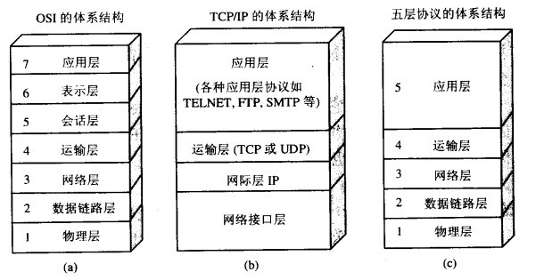
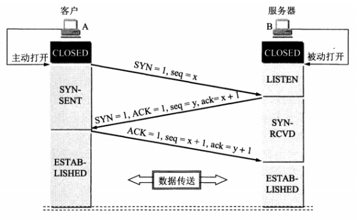
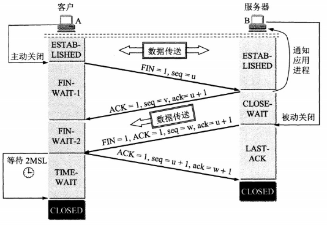
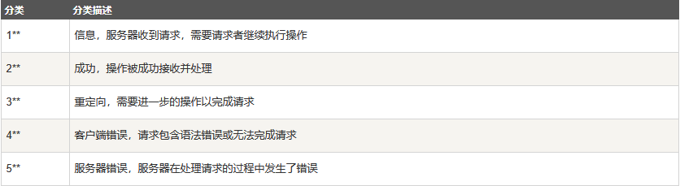
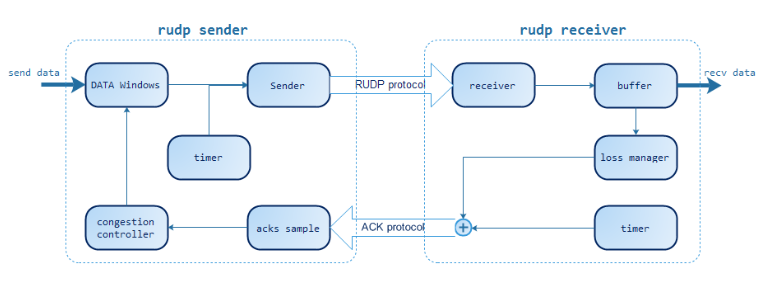
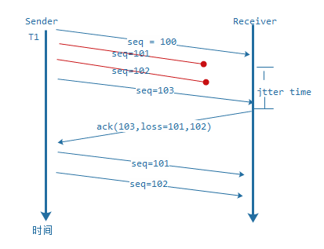
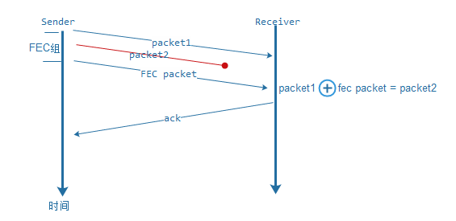

# 计算机网络 :cloud:

* [1 OSI 与 TCP/IP 各层的结构和功能](#1-OSI -与-TCP/IP-各层的结构和功能)
* [2 TCP的三次握手](#2-TCP的三次握手)
* [3 TCP的四次挥手](#3-TCP的四次挥手)
* [4 TCP 协议如何保证可靠传输](#4-TCP-协议如何保证可靠传输)
* [5 TCP和UDP的区别](#5-TCP和UDP的区别)
* [6 TCP流量控制](#6-TCP流量控制)
* [7 TCP拥塞控制](#7-TCP拥塞控制)
* [8 cookie, session, token](#8-cookie,-session,-token)
* [9 HTTP 状态码](#9-HTTP-状态码)
* [10 从输入URL到页面加载发生了什么](#10-从输入URL到页面加载发生了什么)
* [11 HTTP长连接、短连接](#11-HTTP长连接、短连接)
* [12 怎么让不可靠的 UDP 可靠](#12-怎么让不可靠的-UDP-可靠)

-----------------------

## 1 OSI 与 TCP/IP 各层的结构和功能

### 五层协议的体系结构

<div align="center"></div>

### 应用层

应用层的任务是通过应用进程间的交互来完成特定网络应用。

应用层协议定义的是应用进程间的通信和交互规则。如域名系统（Domain Name System, DNS）、超文本传输协议（HyperText Transfer Protocol, HTTP）等。

### 运输层

为主机进程间通信提供数据传输服务。主要使用以下两种协议：

- **传输控制协议（Transmission Control Protocol, TCP）**:
  - 面向连接。
  - 点对点通信。
  - 提供可靠交付的服务，传送的数据无差错、不丢失、不重复、按顺序到达。
  - 全双工通信，连接的两端都有发送缓存和接收缓存。
  - 面向字节流。
- **用户数据协议（User Datagram Prtocol, UDP）**：
  - 面向无连接。
  - 一对多，多对一，一对一通信。
  - 最大努力交付，不保证可靠性，主机不需要维持复杂的连接状态。
  - 没有拥塞控制，因此网络拥塞不会导致主机的发送速率降低（实时性好）。
  - 面向报文。

### 网络层

两台主机进行通信，可能会经过多个数据链路，也可能需要经过多个通信子网。网络层的作用就是选择合适的网间路由和交换节点，保证数据及时传输。

### 数据链路层

**两台主机之间的数据传输，总是在一段一段的链路上传送的，这就需要使用专门的链路层的协议。** 在两个相邻节点之间传送数据时，**数据链路层将网络层交下来的 IP 数据报组装程帧**，在两个相邻节点间的链路上传送帧。每一帧包括数据和必要的控制信息（如同步信息，地址信息，差错控制等）。

### 物理层

在物理层上所传送的数据单位是比特。 **物理层(physical layer)的作用是实现相邻计算机节点之间比特流的透明传送，尽可能屏蔽掉具体传输介质和物理设备的差异。**

------------------------

## 2 TCP的三次握手

<div align="center"></div>

假设A为客户端，B为服务器端。
- 首先B处于LISTEN(监听)状态，等待客户端的连接请求。
- A向B发送连接请求报文，`SYN=1, ACK=0`，选择一个初始的序号x。
- B收到A的连接请求报文，如果同意建立连接，则向 A 发送连接确认报文，`SYN=1，ACK=1`，确认号为 `x+1`，同时也选择一个初始的序号 y。
- A 收到 B 的连接确认报文后，还要向 B 发出确认，确认号为 `y+1`，序号为 `x+1`。
- B 收到 A 的确认后，连接建立。

### 为什么需要三次握手

第三次握手是为了防止失效的连接请求到达服务器，让服务器错误打开连接。

客户端发送的连接请求如果在网络中滞留，那么就会隔很长一段时间才能收到服务器端发回的连接确认。客户端等待一个超时重传时间之后，就会重新请求连接。但是这个滞留的连接请求最后还是会到达服务器，如果不进行三次握手，那么服务器就会打开两个连接。如果有第三次握手，客户端会忽略服务器之后发送的对滞留连接请求的连接确认，不进行第三次握手，因此就不会再次打开连接。

### 为什么需要回传 SYN

服务器传回客户端发送的 SYN 是为了告诉客户端，服务器接收到的信息确实是客户端发来的信号。

### 传了 SYN,为什么还要传 ACK

双方通信无误必须是两者互相发送信息都无误。传了 SYN，证明客户端到服务器的通道没有问题，但是服务器到客户端的通道还需要 ACK 信号来进行验证。

------------------------

## 3 TCP的四次挥手

<div align="center"></div>

以下描述不讨论序号和确认号，因为序号和确认号的规则比较简单。并且不讨论 ACK，因为 ACK 在连接建立之后都为 1。

- A 发送连接释放报文，FIN=1。
- B 收到之后发出确认，此时 TCP 属于半关闭状态，B 能向 A 发送数据但是 A 不能向 B 发送数据。
- 当 B 不再需要连接时，发送连接释放报文，FIN=1。
- A 收到后发出确认，进入 TIME-WAIT 状态，等待 2 MSL（最大报文存活时间）后释放连接。
- B 收到 A 的确认后释放连接。

### 四次挥手的原因
客户端发送了 FIN 连接释放报文之后，服务器收到了这个报文，就进入了 CLOSE-WAIT 状态。这个状态是为了让服务器端发送还未传送完毕的数据，传送完毕之后，服务器会发送 FIN 连接释放报文。

**TIME_WAIT**

客户端接收到服务器端的 FIN 报文后进入此状态，此时并不是直接进入 CLOSED 状态，还需要等待一个时间计时器设置的时间 2MSL。这么做有两个理由：

确保最后一个确认报文能够到达。如果 B 没收到 A 发送来的确认报文，那么就会重新发送连接释放请求报文，A 等待一段时间就是为了处理这种情况的发生。

等待一段时间是为了让本连接持续时间内所产生的所有报文都从网络中消失，使得下一个新的连接不会出现旧的连接请求报文。

### 常见问题
1. 为什么连接的时候是三次握手，关闭的时候却是四次握手？

    因为当Server端收到Client端的SYN连接请求报文后，可以直接发送SYN+ACK报文。其中ACK报文是用来应答的，SYN报文是用来同步的。但是关闭连接时，当Server端收到FIN报文时，很可能并不会立即关闭SOCKET，所以只能先回复一个ACK报文，告诉Client端，"你发的FIN报文我收到了"。只有等到我Server端所有的报文都发送完了，我才能发送FIN报文，因此不能一起发送。故需要四步握手。

## 4 TCP和UDP的区别

[TCP 和 UDP 的区别.](https://zhuanlan.zhihu.com/p/24860273)

## 5 TCP 协议如何保证可靠传输

1. 应用数据被分割成 TCP 认为最适合发送的数据块。
2. TCP 给发送的每一个包进行编号，接收方对数据包进行排序，把有序数据传送给应用层。
3. **校验和：** TCP 将保持它首部和数据的检验和。这是一个端到端的检验和，目的是检测数据在传输过程中的任何变化。如果收到段的检验和有差错，TCP 将丢弃这个报文段和不确认收到此报文段。
4. TCP 的接收端会丢弃重复的数据。
5. **流量控制：** TCP 连接的每一方都有固定大小的缓冲空间，TCP的接收端只允许发送端发送接收端缓冲区能接纳的数据。当接收方来不及处理发送方的数据，能提示发送方降低发送的速率，防止包丢失。TCP 使用的流量控制协议是可变大小的滑动窗口协议。 （TCP 利用滑动窗口实现流量控制）
6. **拥塞控制：** 当网络拥塞时，减少数据的发送。
7. **停止等待协议** 也是为了实现可靠传输的，它的基本原理就是每发完一个分组就停止发送，等待对方确认。在收到确认后再发下一个分组。
8. **超时重传：** 当 TCP 发出一个段后，它启动一个定时器，等待目的端确认收到这个报文段。如果不能及时收到一个确认，将重发这个报文段。

### 停止等待协议


## 6 TCP流量控制

所谓流量控制，就是让发送方的发送速率不要太快，要让接收方来得及接收。

### 滑动窗口机制实现流量控制

窗口是缓存的一部分，用来暂时存放字节流。发送方和接收方各有一个窗口，接收方通过 TCP 报文段中的窗口字段告诉发送方自己的窗口大小，发送方根据这个值和其它信息设置自己的窗口大小。

发送窗口内的字节都允许被发送，接收窗口内的字节都允许被接收。如果发送窗口左部的字节已经发送并且收到了确认，那么就将发送窗口向右滑动一定距离，直到左部第一个字节不是已发送并且已确认的状态；接收窗口的滑动类似，接收窗口左部字节已经发送确认并交付主机，就向右滑动接收窗口。

接收窗口只会对窗口内最后一个按序到达的字节进行确认，例如接收窗口已经收到的字节为 {31, 34, 35}，其中 {31} 按序到达，而 {34, 35} 就不是，因此只对字节 31 进行确认。发送方得到一个字节的确认之后，就知道这个字节之前的所有字节都已经被接收。

<div align="center"></div>

## 7 TCP拥塞控制

在网络吞吐量还未到达饱和时，就已经有一部分输入分组被丢弃。当网络的吞吐量明显小于理想吞吐量时，网络就进入了**轻度拥塞**状态。
<div align="center"></div>

TCP 主要通过四个算法来进行拥塞控制：
- 慢开始
- 拥塞避免
- 快重传
- 快恢复

基于窗口的拥塞控制，发送方维持一个叫 **拥塞窗口 cwnd(congestion window)** 的状态变量，注意拥塞窗口与发送方窗口的区别：拥塞窗口只是一个状态变量，实际决定发送方能发送多少数据的是发送方窗口。

为了方便讨论，作如下假设：
- 数据是单向传输的，对方只传送确认报文
- 接收方有足够大的缓存空间，发送窗口的大小由网络的拥塞程度控制。

<div align="center"></div>

### 慢开始和拥塞避免
发送的最初执行慢开始，令 `cwnd = 1`，发送方只能发送 1 个报文段；当收到确认后，将 `cwnd` 加倍，因此之后发送方能够发送的报文段数量为：2、4、8 ...

注意到慢开始每个轮次都将 `cwnd` 加倍，这样会让 `cwnd` 增长速度非常快，从而使得发送方发送的速度增长速度过快，网络拥塞的可能性也就更高。设置一个**慢开始门限** `ssthresh，当` `cwnd >= ssthresh` 时，进入拥塞避免，每个轮次只将 `cwnd` 加 `1。`

如果出现了超时，则令 `ssthresh = cwnd / 2`，然后重新执行慢开始。

### 快重传与快恢复
在接收方，要求每次接收到报文段都应该对最后一个已收到的有序报文段进行确认。例如已经接收到 M1 和 M2，此时收到 M4，应当发送对 M2 的确认。

在发送方，如果收到三个重复确认，那么可以知道下一个报文段丢失，此时执行快重传，立即重传下一个报文段。例如收到三个 M2，则 M3 丢失，立即重传 M3。

在这种情况下，只是丢失个别报文段，而不是网络拥塞。因此执行快恢复，令 `ssthresh = cwnd / 2` ，`cwnd = ssthresh`，注意到此时直接进入拥塞避免。

慢开始和快恢复的快慢指的是 `cwnd` 的设定值，而不是 `cwnd` 的增长速率。慢开始 `cwnd` 设定为 `1`，而快恢复 `cwnd` 设定为 `ssthresh`。

<div align="center"></div>

## 8 cookie, session, token

[彻底理解cookie，session，token](https://mp.weixin.qq.com/s?__biz=MzI4Njc5NjM1NQ==&mid=2247488056&idx=1&sn=6137b4a15f5be31eb503415c16239ba5&chksm=ebd62d14dca1a4025dd66901e8bb35914981582d0416070a0b830f94baab34c2335a5a203539&scene=0&xtrack=1&key=fba4f05adcd5d82628cec47546297e8c8131cdcfa1c459d530681c71e4f78044cb80780c091a121bd09baed34f5060b9c3431147387617753c44f60e66e4508e89ed055cded718b07ded9b7148755c50&ascene=14&uin=MjA1MDM0MTIzNg%3D%3D&devicetype=Windows+10&version=62060739&lang=zh_CN&pass_ticket=pDQLsacGFBXFiOCQmrZ4BnVqNszXS3SrzHNw9QhxsuzveBqlVTP5EEov8PKvFaAt)

## 9 HTTP 状态码

当浏览者访问一个网页时，浏览者的浏览器会向网页所在服务器发出请求。当浏览器接收并显示网页前，此网页所在的服务器会返回一个包含HTTP状态码的信息头（server header）用以响应浏览器的请求。

HTTP状态码的英文为HTTP Status Code。

下面是常见的HTTP状态码：

- 200 - 请求成功
- 301 - 资源（网页等）被永久转移到其它URL
- 404 - 请求的资源（网页等）不存在
- 500 - 内部服务器错误

### HTTP状态码分类

HTTP状态码由三个十进制数字组成，第一个十进制数字定义了状态码的类型，后两个数字没有分类的作用。HTTP状态码共分为5种类型：

<div align="center"></div>

## 10 从输入URL到页面加载发生了什么

[前端经典面试题: 从输入URL到页面加载发生了什么?](https://segmentfault.com/a/1190000006879700)

## 11 HTTP长连接、短连接

在HTTP/1.0中默认使用短连接。也就是说，客户端和服务器每进行一次HTTP操作，就建立一次连接，任务结束就中断连接。当客户端浏览器访问的某个HTML或其他类型的Web页中包含有其他的Web资源（如JavaScript文件、图像文件、CSS文件等），每遇到这样一个Web资源，浏览器就会重新建立一个HTTP会话。

而从HTTP/1.1起，默认使用长连接，用以保持连接特性。使用长连接的HTTP协议，会在响应头加入这行代码：

```
Connection:keep-alive
```

在使用长连接的情况下，当一个网页打开完成后，客户端和服务器之间用于传输HTTP数据的TCP连接不会关闭，客户端再次访问这个服务器时，会继续使用这一条已经建立的连接。Keep-Alive不会永久保持连接，它有一个保持时间，可以在不同的服务器软件（如Apache）中设定这个时间。实现长连接需要客户端和服务端都支持长连接。

**HTTP协议的长连接和短连接，实质上是TCP协议的长连接和短连接。**

## 12 怎么让不可靠的 UDP 可靠

依靠重传模式使得 UDP 可靠。RUDP基本框架：

<div align="center"></div>


RUDP 分为发送端和接收端，每一种 RUDP 在设计的时候会做不一样的选择和精简，概括起来就是图中的单元。RUDP 的重传是发送端通过接收端 ACK 的丢包信息反馈来进行数据重传，发送端会根据场景来设计自己的重传方式，重传方式分为三类：**定时重传**、**请求重传**和 **FEC 选择重传**。

### 定时重传

定时重传很好理解，就是发送端如果在发出数据包（T1）时刻一个**重传超时时间**（Retransmission TimeOut, RTO）之后还未收到这个数据包的 ACK 消息，那么发送端就重传这个数据包。这种方式依赖于接收端的 ACK 和 RTO，容易产生误判，主要有两种情况：

- 对方收到了数据包，但是 ACK 发送途中丢失。
- ACK 在途中，但是发送端的时间已经超过了一个 RTO。

所以超时重传的方式主要集中在 RTO 的计算上，如果你的场景是一个对延迟敏感但对流量成本要求不高的场景，就可以将 RTO 的计算设计得比较小，这样能尽最大可能保证你的延时足够小。

例如：实时操作类网游、教育领域的书写同步，是典型的用 expense 换 latency 和 quality 的场景，适合用于小带宽低延迟传输。如果是大带宽实时传输，定时重传对带宽的消耗是很大的，极端情况会有 20% 的重传率，所以在大带宽模式下一般会采用请求重传模式。

### 请求重传

请求重传就是接收端在发送 ACK 的时候携带自己丢失报文的信息反馈，发送端接收到 ACK 信息时根据丢包反馈进行报文重传。如下图：

<div align="center">

这个反馈过程最关键的步骤就是回送 ACK 的时候应该携带哪些丢失报文的信息，因为 UDP 在网络传输过程中会乱序会抖动，接收端在通信的过程中要评估网络的 jitter time，也就是 rtt_var（**连接往返时间**（Round Trip Time, RTT）方差值），当发现丢包的时候记录一个时刻 t1，当 t1 + rtt_var < curr_t(当前时刻)，我们就认为它丢失了。

这个时候后续的 ACK 就需要携带这个丢包信息并更新丢包时刻 t2，后续持续扫描丢包队列，如果 t2 + RTO <curr_t，则再次在 ACK 携带这个丢包信息，以此类推，直到收到报文为止。

这种方式是由丢包请求引起的重发，如果网络很不好，接收端会不断发起重传请求，造成发送端不停的重传，引起网络风暴，通信质量会下降，所以我们在发送端设计一个拥塞控制模块来限流，这个后面我们重点分析。

整个请求重传机制依赖于 jitter time 和 RTO 这个两个时间参数，评估和调整这两个参数和对应的传输场景也息息相关。请求重传这种方式比定时重传方式的延迟会大，一般适合于带宽较大的传输场景，例如：视频、文件传输、数据同步等。

### FEC 选择重传

除了定时重传和请求重传模式以外，还有一种方式就是以 FEC 分组方式选择重传，FEC（Forward Error Correction）是一种**前向纠错技术**，一般通过异或（XOR）类似的算法来实现，也有多层的 EC 算法和 raptor 涌泉码技术，其实是一个解方程的过程。应用到 RUDP 上示意图如下：

<div align="center">

在发送方发送报文的时候，会根据 FEC 方式把几个报文进行 FEC 分组，通过 XOR 的方式得到若干个冗余包，然后一起发往接收端，如果接收端发现丢包但能通过 FEC 分组算法还原，就不向发送端请求重传，如果分组内包是不能进行 FEC 恢复的，就向发送端请求原始的数据包。

FEC 分组方式适合解决要求延时敏感且随机丢包的传输场景，在一个带宽不是很充裕的传输条件下，FEC 会增加多余的包，可能会使得网络更加不好。FEC 方式不仅可以配合请求重传模式，也可以配合定时重传模式。

[怎么让不可靠的 UDP 可靠？](https://www.infoq.cn/article/how-to-make-udp-reliable)

