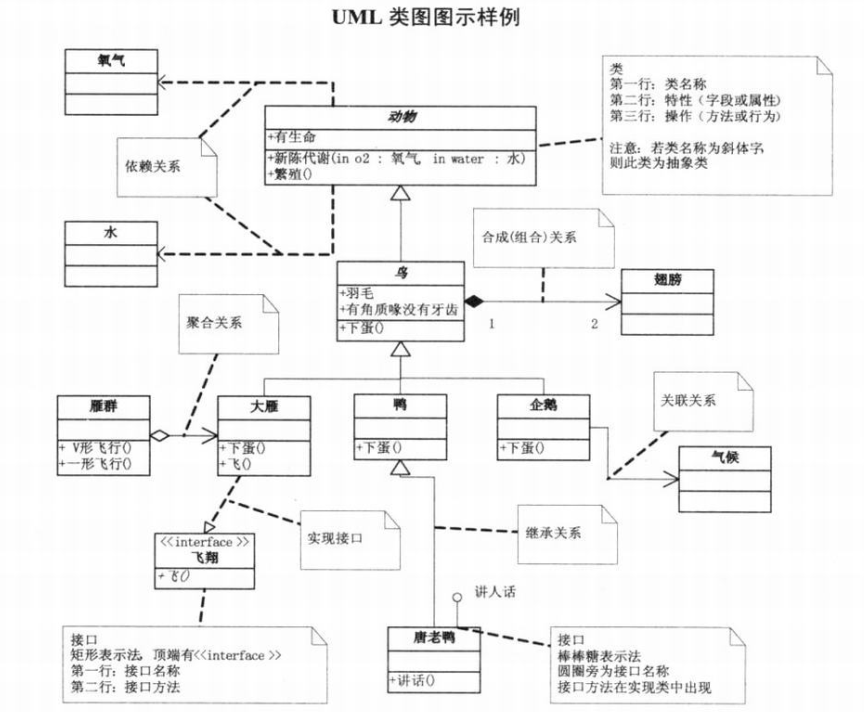

# 设计模式 :blue_book:

- [一、简单工厂模式](#一、简单工厂模式)
- [二、策略模式](#二、策略模式)
- [参考资料](#参考资料)


-------------------------------

## 一、简单工厂模式

**面向对象：** 通过封装、继承、多台把程序的耦合度降低。使得程序容易维护、扩展、复用。

根据输入的参数，工厂实例化出合适的对象，通过多态返回父类。

```java
public class Factory {
    public static Operation createOperation(String operate) {
        Operation oper = null;
        ...	// 根据不同的操作，初始化不同的 oper
    }
    return oper;
}
```

### UML 类图

<div align="center"></div>

-----------------------------------

## 二、策略模式

它定义了算法家族，分别封装起来，让它们之间可以互相替换，此模式让算法的变化，不会影响到使用算法的客户。


## 原型模式

用原型实例指定创建对象的种类，并且通过拷贝这些原型创建新的对象。

原型模式其实就是从一个对象再创建另一个可定制的对象，而且不需要任何创建的细节。

----------------------------

## 参考资料

程杰. 大话设计模式 [M]. 清华大学出版社.