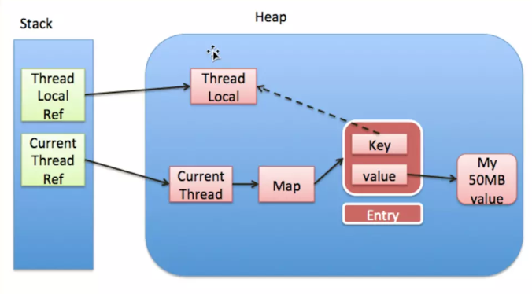

* [1 并行和并发有什么区别](#1-并行和并发有什么区别)
* [2 线程和进程的区别](#2-线程和进程的区别)
* [3 守护线程](#3-守护线程)
* [4 创建线程有哪几种方式](#4-创建线程有哪几种方式)
* [5 runnable 和 callable 有什么区别](#5-runnable-和-callable-有什么区别)
* [6 wait 和 sleep 的区别](#6-wait-和-sleep-的区别)
* [7 notify 和 notifyAll](#7-notify-和-notifyAll)
* [8 在静态方法和非静态方法上加 Synchronized 的区别](#在静态方法和非静态方法上加-Synchronized-的区别)
* [9 Synchronized 和 ReentrantLock 的异同](9-Synchronized-和-ReentrantLock-的异同)

* [10 Threadlocal内存泄漏问题](#Threadlocal内存泄漏问题)

---------------

## 1 并行和并发有什么区别
- 并发是指有处理多个任务的能力
- 并行是指有**同时**处理多个任务的能力

## 2 线程和进程的区别
计算机中**进程就是包括上下文切换的程序执行时间总和 = CPU加载上下文 + CPU执行 + CPU保存上下文**。

假设一个进程 `A` 比喻为运行在电脑上的软件，那么这个软件可能有 `a`, `b`, `c`三个块组成，那么当进程 `A`得到 `CPU` 时，再加载完上下文之后，开始执行`a, b, c`三个小块，最后保存上下文。

这里`a, b, c`就是线程，它们共享了进程 `A` 的上下文。简而言之，**线程共享了进程的上下文环境，占用更细小的CPU时间段**。

## 3 守护线程
线程分为2种：普通线程和守护线程。在 JVM 启动时创建的所有线程中，除了主线程以外，其它的全是守护线程(例如垃圾回收器以及执行辅助工作的线程)。**当创建一个新的线程时，新线程将继承创建它的线程的守护状态**，因此在默认情况下，主线程创建的所有线程都是普通线程。

**尽可能少使用守护线程！**。 当一个线程退出时，JVM 会检查其它正在运行的线程，如果这些线程都是守护线程，则 JVM 会正常退出操作。 当 JVM 停止时，所有仍然存在的线程都将被抛弃——既不会执行 finally 块，也不会执行回卷栈。

守护线程最好用于执行“内部”任务，例如周期性得从内存的缓存中移除过期的数据。

**[讲讲volatile](https://github.com/MinheZ/Notes/blob/master/note/Java%E5%B9%B6%E5%8F%91.md#volatile%E5%8F%98%E9%87%8F)**

### 指令重排序
```java
package reordering;

public class NoVisibility {
    private static boolean ready;
    private static int number;

    private static class ReaderThread extends Thread{
        public void run(){
            while (!ready)
                Thread.yield();
            System.out.println(number);
        }
    }
    public static void main(String[] args){
        // coding here
        new ReaderThread().start();
        number = 42;
        ready = true;
    }
}
```
上述代码中，NoVisibility可能会持续循环下去，因为读线程可能永远都看不到ready的值。或者读线程看到ready的值，却没有看到number的值，输出为0.这种现状称为“重排序”。

### 怎么用32位jvm对64位的数据进行原子操作？
使用volatile关键字修饰，或者加锁。

### Java并发计数
AtomicInteger。

### [CAS算法](https://github.com/MinheZ/Notes/blob/master/note/Java%E5%B9%B6%E5%8F%91.md#%E6%AF%94%E8%BE%83%E5%B9%B6%E4%BA%A4%E6%8D%A2compare-and-swap-cas)、[ABA问题](https://github.com/MinheZ/Notes/blob/master/note/Java%E5%B9%B6%E5%8F%91.md#aba%E9%97%AE%E9%A2%98)

### [如果存储线程的阻塞队列满了，那么线程池的submit方法会阻塞在那里吗？](https://github.com/MinheZ/Notes/blob/master/note/Java%E5%B9%B6%E5%8F%91.md#%E9%A5%B1%E5%92%8C%E7%AD%96%E7%95%A5)

看具体饱和策略如何设置的。

## Threadlocal内存泄漏问题
`ThreadLocal` 对象通常用于防止对可变的单实例变量(Singleton)或全局变量进行共享。**线程私有的存储结构**。

<div align="center"></div>

主要原因就是在于TreadLocal中用到的自己定义的Map(和常用的Map接口不同)中，使用的Key值是一个WeakReference类型的值（弱引用会在下一次GC时马上释放而不管是否被引用）。

那么如果这个Key在GC时被释放了，就会导致Value永远都不会被调用到，但是如果线程不结束，又一直存在。因此，这个问题主要出现在线程池上面。

由于 `ThreadLocalMap` 的生命周期和 `Thread` 一样长，如果没有手动删除对应的 `key`，都会导致**内存泄漏**。使用**弱引用**可以多一层保障：弱引用 `ThreadLocal` 不会内存泄漏，`key == null` 上面的 `value` 在下一次 `ThreadLocalMap` 调用 `set, get, remove` 的时候会被清除。

## 4 创建线程有哪几种方式
- 继承 Thread 类
    - 定义一个类继承 Thread
    - 重写 run 方法
    - 创建子类对象，也就是创建线程对象
    - 调用 start 方法，之后虚拟机将调用该线程的 run 方法。
```java
public class Demo01 {
	public static void main(String[] args) {
		//创建自定义线程对象
		MyThread mt = new MyThread("新的线程！");
		//开启新线程
		mt.start();
		//在主方法中执行for循环
		for (int i = 0; i < 10; i++) {
			System.out.println("main线程！"+i);
		}
	}
}
public class MyThread extends Thread {
	//定义指定线程名称的构造方法
	public MyThread(String name) {
		//调用父类的String参数的构造方法，指定线程的名称
		super(name);
	}
	/**
	 * 重写run方法，完成该线程执行的逻辑
	 */
	@Override
	public void run() {
		for (int i = 0; i < 10; i++) {
			System.out.println(getName()+"：正在执行！"+i);
		}
	}
}
```
**手动调用 run 方法能开启线程吗**

不可以，手动调用仅是对象调用方法。线程对象调用start开启线程，并让jvm调用run方法在开启的线程中执行。

- 实现 Runnable 接口
    - 定义类实现 Runnable 接口
    - 覆盖接口中的 run 方法
    - 创建 Thread 类的对象
    - 将 Runnable 接口的子类对象作为参数传递给 Thread 类的构造函数
    - 调用 Thread 类的 start 方法开启线程
```java
public class Demo2 {
    public static void main(String[] args) {
        //创建线程执行目标类对象
        Runnable runn = new MyRunnable();
        //将Runnable接口的子类对象作为参数传递给Thread类的构造函数
        Thread thread = new Thread(runn);
        Thread thread2 = new Thread(runn);
        //开启线程
        thread.start();
        thread2.start();
        for (int i = 0; i < 10; i++) {
            System.out.println("main线程：正在执行！" + i);
        }
    }
}
public class MyRunnable implements Runnable {

    @Override
    public void run() {
        for (int i = 0; i < 10; i++) {
            System.out.println("我的线程：正在执行！" + i);
        }
    }
}
```
**为什么需要定一个类去实现Runnable接口呢？继承Thread类和实现Runnable接口有啥区别呢？**

实现Runnable接口，**避免了继承Thread类的单继承局限性**。覆盖Runnable接口中的run方法，将线程任务代码定义到run方法中。

创建Thread类的对象，只有创建Thread类的对象才可以创建线程。线程任务已被封装到Runnable接口的run方法中，而这个run方法所属于Runnable接口的子类对象，所以将这个子类对象作为参数传递给Thread的构造函数，这样，线程对象创建时就可以明确要运行的线程的任务。

**Runnable接口对线程对象和线程任务进行解耦。**

线程的匿名内部类使用：
```java
new Thread() {
	public void run() {
		for (int x = 0; x < 40; x++) {
			System.out.println(Thread.currentThread().getName()
					+ "...X...." + x);
		}
	}
}.start();
```
```java
Runnable r = new Runnable() {
	public void run() {
		for (int x = 0; x < 40; x++) {
			System.out.println(Thread.currentThread().getName()
					+ "...Y...." + x);
		}
	}
};
new Thread(r).start();
```
## 5 runnable 和 callable 有什么区别
**Runnable:** 它只有一个`run()`函数，**该函数没有返回值**。
```java
public interface Runnable {
    /**
     * When an object implementing interface <code>Runnable</code> is used
     * to create a thread, starting the thread causes the object's
     * <code>run</code> method to be called in that separately executing
     * thread.
     * <p>
     *
     * @see     java.lang.Thread#run()
     */
    public abstract void run();
}
```
**Callable:** 有一个`call()`函数，**有返回值**。
```java
public interface Callable<V> {
    /**
     * Computes a result, or throws an exception if unable to do so.
     *
     * @return computed result
     * @throws Exception if unable to compute a result
     */
    V call() throws Exception;
}
```
**[Future](https://github.com/MinheZ/Notes/blob/master/note/Java%E5%B9%B6%E5%8F%91.md#future)：**`Excutor`是`Runnable`和`Callable`的调度容器，`Future`则是堆具体任务执行结果进行操作

**FutureTask：** `FutureTask`则是一个`RunnableFuture<V>`，而`RunnableFuture`实现了`Runnbale`又实现了`Futrue<V>`这两个接口。
```java
public class FutureTask<V> implements RunnableFuture<V> {}
```
**RunnableFuture**
```java
public interface RunnableFuture<V> extends Runnable, Future<V> {
    /**
     * Sets this Future to the result of its computation
     * unless it has been cancelled.
     */
    void run();
}
```
另外它还可以包装`Runnable`和`Callable<V>`， 由构造函数注入依赖。
```java
public FutureTask(Callable<V> callable) {
    if (callable == null)
        throw new NullPointerException();
    this.callable = callable;
    this.state = NEW;       // ensure visibility of callable
}
public FutureTask(Runnable runnable, V result) {
    this.callable = Executors.callable(runnable, result);
    this.state = NEW;       // ensure visibility of callable
}
```
可以看到，`Runnable`注入会被`Executors.callable()`函数转换为`Callable`类型，即`FutureTask`最终都是执行`Callable`类型的任务。该适配函数的实现如下 ：
```java
public static <T> Callable<T> callable(Runnable task, T result) {
    if (task == null)
        throw new NullPointerException();
    return new RunnableAdapter<T>(task, result);
}
```
RunnableAdapter适配器
```java
/**
 * A callable that runs given task and returns given result
 */
static final class RunnableAdapter<T> implements Callable<T> {
    final Runnable task;
    final T result;
    RunnableAdapter(Runnable task, T result) {
        this.task = task;
        this.result = result;
    }
    public T call() {
        task.run();
        return result;
    }
}
```
由于`FutureTask`实现了`Runnable`，因此它既可以通过Thread包装来直接执行，也可以提交给`ExecuteService`来执行。
并且还可以直接通过`get()`函数获取执行结果，该函数会阻塞，直到结果返回。因此`FutureTask`既是`Future`、
`Runnable`，又是包装了`Callable`( 如果是`Runnable`最终也会被转换为`Callable` )，它是这两者的合体。

## 6 wait 和 sleep 的区别
`wait()` 可以使你在等待某个条件发生变化时，将任务挂起，并**释放锁**，并且只有在 `notify()` 或 `notifyAll()` 或时间到期时，任务才会被唤醒。

前面这 3 种方法都是继承自 `Object` 类。这样方便把 `wait()` 放进任何同步控制方法中，而不用考虑这个类是否继承了 `Thread` 或者是实现了 `Runnable()` 接口。

调用 `sleep()` 的时候并没有释放锁

## 7 notify 和 notifyAll
使用 `notify()` 时，所有等待的线程只有一个会被唤醒，因此就要确保：
- 被唤醒的是恰当任务；
- 所有的任务必须具有相同的等待条件。

如果任意一条不满足，就必须使用 `notifyAll()`。当 `notifyAll()` 因某个特定的锁而被调用时，只有等待这个锁的任务才会被唤醒。

## 在静态方法和非静态方法上加 Synchronized 的区别
Synchronized 修饰非静态方法，实际上是对调用该方法的对象加锁，俗称“对象锁”。

Synchronzied 修饰静态方法,其实是类锁，因为是静态方法，它把整个类锁起来了。

## [9 Synchronized 和 ReentrantLock 的异同](https://github.com/MinheZ/Notes/blob/master/note/Java%E5%B9%B6%E5%8F%91.md#%E5%9C%A8synchronized%E5%92%8Creentrantlock%E4%B9%8B%E9%97%B4%E8%BF%9B%E8%A1%8C%E9%80%89%E6%8B%A9)

### 为什么还要保留 Synchronized
因为 JVM 对 synchronized 做了很多优化，在一些不需要其它特定功能的场景下，性能跟 ReentrantLock 差别很小。

待完善....
