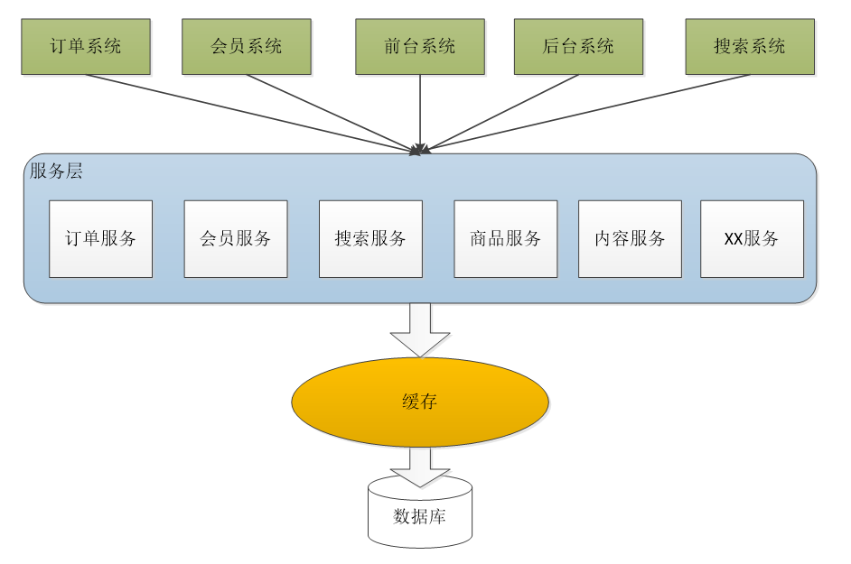
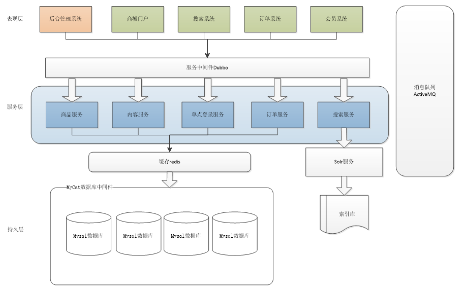
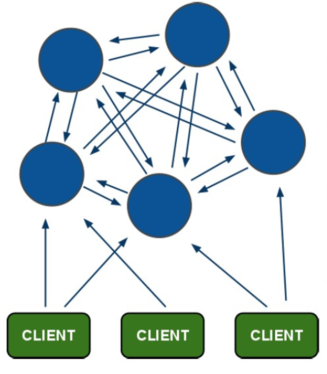
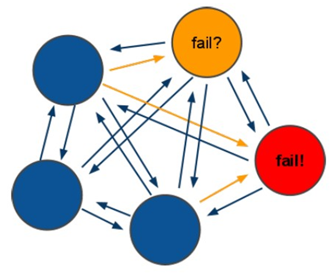
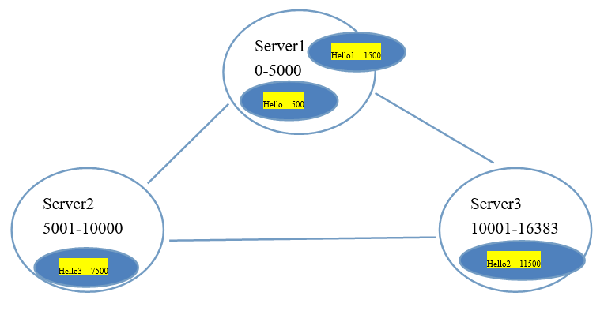

* [Java基础](https://github.com/MinheZ/Notes/blob/master/note/面试题总结-Java基础.md)
* [Java虚拟机](#Java虚拟机)
* [Java并发-多线程](https://github.com/MinheZ/Notes/blob/master/note/面试题总结-多线程.md)
    <!-- * [讲讲volatile](#讲讲volatile) -->
* [容器](https://github.com/MinheZ/Notes/blob/master/note/面试题总结-Java容器.md)
* [计算机网络](#计算机网络)
* [框架](#框架)
    * [Servlet](#Servlet)
    * [SpringMVC](#SpringMVC)
* [商城项目](#商城项目)

----------------------------

# Java虚拟机

## 可达性算法中，哪些对象可以作为GCRoot对象？
- 虚拟机栈用引用的对象
- 方法区静态成员引用的对象。
- 方法区常量引用的对象。
- 本地方法栈JNI引用的对象。

## 什么时候进行

------------------------------

# 容器
[HashMap在JDK1.7和在1.8有哪些区别？](https://blog.csdn.net/qq_36520235/article/details/82417949)

利用`LinkedHashMap`实现自定义策略的LRU缓存。比如我们可以根据节点数量判断是否移除最近最少被访问的节点，或者根据节点的存活时间判断是否移除该节点等。本节所实现的缓存是基于判断节点数量是否超限的策略。在构造缓存对象时，传入最大节点数。当插入的节点数超过最大节点数时，移除最近最少被访问的节点。实现代码如下：
```java
public class SimpleCache<K, V> extends LinkedHashMap<K, V> {

    private static final int MAX_NODE_NUM = 100;

    private int limit;

    public SimpleCache() {
        this(MAX_NODE_NUM);
    }

    public SimpleCache(int limit) {
        super(limit, 0.75f, true);
        this.limit = limit;
    }

    public V save(K key, V val) {
        return put(key, val);
    }

    public V getOne(K key) {
        return get(key);
    }

    public boolean exists(K key) {
        return containsKey(key);
    }

    /**
     * 判断节点数是否超限
     * @param eldest
     * @return 超限返回 true，否则返回 false
     */
    @Override
    protected boolean removeEldestEntry(Map.Entry<K, V> eldest) {
        return size() > limit;
    }
}
```


------------------------------
# 计算机网络

**[TCP三次握手，四次挥手](https://github.com/MinheZ/Notes/blob/master/note/%E8%AE%A1%E7%AE%97%E6%9C%BA%E7%BD%91%E7%BB%9C.md#tcp%E7%9A%84%E4%B8%89%E6%AC%A1%E6%8F%A1%E6%89%8B)**

**[TCP和UDP的区别](https://zhuanlan.zhihu.com/p/24860273)**

----------------------------

# 框架
## Servlet
### Servlet的生命周期
客户端第一次访问该Servlet的时候才会创建一个Servlet的对象，那么Servlet中的init方法就会执行。任何一次从客户端发送的请，那么服务器创建一个新的线程执行Servlet中service方法为这次请求服务。
service方法的内部根据请求的方式的不同调用不同doXXX的方法。当Servlet从服务器中移除或者关闭服务器的时候Servlet对象就会被销毁.destroy的方法就会执行。

### Servlet 3.0 新特性
- 异步处理支持：有了该特性，Servlet 线程不再需要一直阻塞，直到业务处理完毕才能再输出响应，最后才结束该 Servlet 线程。在接收到请求之后，Servlet 线程可以将耗时的操作委派给另一个线程来完成，自己在不生成响应的情况下返回至容器。针对业务处理较耗时的情况，这将大大减少服务器资源的占用，并且提高并发处理速度。
- 新增的注解支持：该版本新增了若干注解，用于简化 Servlet、过滤器（Filter）和监听器（Listener）的声明，这使得 web.xml 部署描述文件从该版本开始不再是必选的了。
- 可插性支持：开发者可以通过插件的方式很方便的扩充已有 Web 应用的功能，而不需要修改原有的应用。

## SpringMVC
[SpringMVC处理请求的流程](https://github.com/MinheZ/Notes/blob/master/note/%E5%B8%B8%E8%A7%81%E7%9A%84Web%E6%A1%86%E6%9E%B6%E4%BB%A5%E5%8F%8A%E4%B8%AD%E9%97%B4%E4%BB%B6.md#springmvc%E5%A4%84%E7%90%86%E8%AF%B7%E6%B1%82%E7%9A%84%E6%B5%81%E7%A8%8B)

### 适配器的作用
SpringMVC涉及的映射器，视图解析器的作用不难理解，映射器负责将前端请求的url映射到配置的处理器，视图解析器将最终的结果进行解析，但中间为什么要经过一层处理器适配器呢，为什么不经映射器找到controller后直接执行返回呢？

那是因为SpringMVC为业务处理器提供了多种接口实现（例如实现了Controller接口），而适配器就是用来根据处理器实现了什么接口，最终选择与已经注册好的不同类型的Handler Adapter进行匹配，并最终执行，例如，SimpleControllerHandlerAdapter是支持实现了controller接口的控制器，如果自己写的控制器实现了controller接口，那么SimpleControllerHandlerAdapter就会去执行自己写的控制器中的具体方法来完成请求。

----------------------

# 商城项目

### 为什么需要单点登录？
在 Tomcat 集群增大之后，解决 session 共享的问题。

### 什么是分布式？
需要按照功能点把系统拆分，拆分成独立的功能。单独为某一个节点添加服务器。需要系统之间配合才能完成整个业务逻辑。
#### 分布式架构的优缺点
- **优点：**
    1. 把模块拆分，使用接口通信，降低模块之间的耦合度。
    2. 把项目拆分成若干个子项目，不同的团队负责不同的子项目。
    3. 增加功能时只需要再增加一个子项目，调用其他系统的接口就可以。
    4. 可以灵活的进行分布式部署。

- **缺点：**
    1. 系统之间交互需要使用远程通信，接口开发增加工作量。
    2. 各个模块有一些通用的业务逻辑无法共用。

### 基于SOA的架构
SOA：Service Oriented Architecture面向服务的架构。也就是把工程拆分成服务层、表现层两个工程。服务层中包含业务逻辑，只需要对外提供服务即可。表现层只需要处理和页面的交互，业务逻辑都是调用服务层的服务来实现。
<div align="center"></div>

## 淘淘商城系统架构
<div align="center"></div>

### 系统间通信
由于淘淘商城是基于soa的架构，表现层和服务层是不同的工程。所以要实现商品列表查询需要两个系统之间进行通信。

**如何实现远程通信？**

- Webservice：效率不高基于soap协议。项目中不推荐使用。
- 使用restful形式的服务：http+json。很多项目中应用。如果服务太多，服务之间调用关系混乱，需要治疗服务。
- 使用dubbo。使用rpc协议进行远程调用，直接使用socket通信。传输效率高，并且可以统计出系统之间的调用关系、调用次数。

### [dubbo的架构](https://github.com/MinheZ/Notes/blob/master/note/%E5%B8%B8%E8%A7%81%E7%9A%84Web%E6%A1%86%E6%9E%B6%E4%BB%A5%E5%8F%8A%E4%B8%AD%E9%97%B4%E4%BB%B6.md#dubbo%E6%9E%B6%E6%9E%84)

### Redis-cluster
Redis-cluster架构图
<div align="center"></div>

redis-cluster 投票：容错
<div align="center"></div>

**架构细节:**

- 所有的redis节点彼此互联(PING-PONG机制),内部使用二进制协议优化传输速度和带宽.
- 节点的fail是通过集群中超过半数的节点检测失效时才生效.
- 客户端与redis节点直连,不需要中间proxy层.客户端不需要连接集群所有节点,连接集群中任何一个可用节点即可
- redis-cluster把所有的物理节点映射到`[0-16383]slot`上,cluster 负责维护`node<->slot<->value`


Redis 集群中内置了 16384 个哈希槽，当需要在 Redis 集群中放置一个 key-value 时，redis 先对 key 使用 crc16(循环冗余校验码) 算法算出一个结果，然后把结果对 16384 求余数，这样每个 key 都会对应一个编号在 0-16383 之间的哈希槽，redis 会根据节点数量大致均等的将哈希槽映射到不同的节点
<div align="center"></div>

如果某一个主节点和他所有的从节点都下线的话，redis集群就会停止工作了。**redis集群不保证数据的强一致性**，在特定的情况下，redis集群会丢失已经被执行过的写命令。

### [一致性Hash算法原理](https://www.cnblogs.com/lpfuture/p/5796398.html)

-------------------
[Java岗 面试考点精讲](https://mp.weixin.qq.com/s?__biz=MzI4Njc5NjM1NQ==&mid=2247487745&idx=1&sn=29e33490f20a38f65059b03aaceed3cf&chksm=ebd62e2ddca1a73b1c662cc4fa3a5b651cb271d2601063db190e0fded8144fc054990da8ef0b&mpshare=1&scene=1&srcid=03072GKzb54RG8Ly9eaKjLpc&key=71c3a279be58f2287a7dec49999e5a5a7f83bfec7b9b678a7a667cba5777891ca2e18b5a4edd5058db187dce65635ff4edf403259b6515f74c5385274e8eb1243f6a762e701ff59083fd2f813f1fd41b&ascene=1&uin=MjA1MDM0MTIzNg%3D%3D&devicetype=Windows+10&version=62060728&lang=zh_CN&pass_ticket=gLarxv6zniwpOEynO9%2BnHLxXE1bpf8Jl5Nn5goWm0%2FqEW3IYdwu0k320%2B%2FcApYqc)
